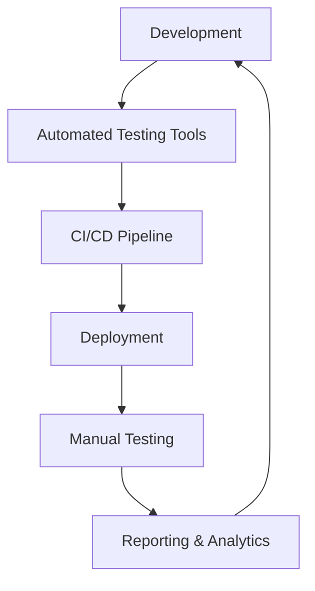

# Specialist: 30-accessibility-testing

## === FILE: 30-accessibility-testing-advanced.md ===
# 30 - Accessibility Testing Advanced

## Introduction

In modern web applications, accessibility (a11y) is not just a legal requirement but a core aspect of delivering an inclusive user experience. With your tech stack built on Next.js 16, React 19, Tailwind CSS v4, and shadcn/ui, combined with Playwright for end-to-end testing and Vitest for unit tests, you have a powerful environment to implement advanced accessibility testing strategies. This document explores in depth how to architect a comprehensive accessibility testing suite that covers snapshot-based known issue tracking, balances automated and manual testing, validates color contrast in dynamic dark/light modes, manages complex focus scenarios (such as modals and drawers), and ensures accessibility in dynamic hierarchical trees.

Throughout, we will provide code examples, architectural rationales, and practical workflows aligned with best practices from Playwright and your stack, enabling you to build a robust accessibility testing framework that integrates seamlessly into your CI/CD pipeline.

---

## 1. Accessibility Testing Landscape: Automated vs Manual

Accessibility testing is traditionally divided into automated and manual approaches, each with strengths and limitations. Automated testing tools like Axe (via `@axe-core/playwright`) excel at detecting common violations such as missing alt attributes, improper ARIA roles, or keyboard focus traps. However, they cannot fully assess semantic correctness, usability nuances, or context-specific issues like meaningful link text or logical tab order.

Manual testing, including keyboard navigation, screen reader testing, and human judgment, remains essential for comprehensive coverage. Tools such as Accessibility Insights for Web complement automated scans by enabling manual assessments against WCAG 2.1 AA criteria.

**Balancing Automated and Manual Testing**

Given the high velocity and complexity of your Next.js 16 app, the strategy should be to use automated testing as the first gatekeeper during CI, catching regressions efficiently, while scheduling periodic manual audits on critical user flows and complex components.

An efficient approach embeds automated Axe scans in Playwright E2E tests, augmented with snapshot-based known issue tracking to prevent noise from longstanding non-critical issues. Manual testing targets areas flagged by automation and components with intricate interaction patterns.

---

## 2. Snapshot-Based Known Issue Tracking

One challenge with automated accessibility testing is noise from repeated failures of known issues that cannot be immediately fixed—either due to third-party dependencies, legacy code, or ongoing refactoring. To maintain test signal integrity, implementing snapshot-based known issue tracking is key.

### Conceptual Overview

Snapshot-based known issue tracking involves capturing the baseline accessibility violations as snapshots (fingerprints) and comparing future test runs against them. New violations cause test failures, while known issues are reported but do not block CI. This allows teams to prioritize fixes without drowning in noise.

### Implementation with Playwright

Playwright’s Axe integration supports exporting violation snapshots through JSON which can be stored alongside test results. Custom logic compares current violations with snapshots to differentiate new problems from existing known issues.

### Example Workflow

1. **Initial Scan and Snapshot Generation**

   Run Axe analyses on critical pages and components, exporting violation reports to JSON files committed to your repository.

2. **Test Execution**

   During Playwright E2E runs, parse Axe violation results and compare to snapshot files.

3. **Violation Filtering**

   New violations cause test failures, prompting immediate attention. Known issues are logged for tracking but do not fail tests.

4. **Snapshot Updates**

   As fixes are applied, snapshots are updated using a CLI flag (e.g., `--update-snapshots`) to reflect the current state.

### Code Example

```typescript
import { test, expect } from '@playwright/test';
import AxeBuilder from '@axe-core/playwright';
import fs from 'fs';
import path from 'path';

const KNOWN_ISSUES_PATH = path.resolve(__dirname, 'a11y-known-issues.json');

test('Page Accessibility Compliance', async ({ page }) => {
  await page.goto('/dashboard');

  const results = await new AxeBuilder({ page })
    .withTags(['wcag2a', 'wcag2aa']) // Target WCAG 2.1 AA
    .analyze();

  const knownIssues = JSON.parse(fs.readFileSync(KNOWN_ISSUES_PATH, 'utf-8'));

  // Filter out known issues
  const newViolations = results.violations.filter(v => {
    return !knownIssues.some(known =>
      known.id === v.id &&
      known.nodes.every((node: any, idx: number) =>
        node.target[0] === v.nodes[idx]?.target[0]
      )
    );
  });

  if (newViolations.length > 0) {
    // Attach violation report to test output
    await test.info().attach('a11y-violations', {
      body: JSON.stringify(newViolations, null, 2),
      contentType: 'application/json',
    });

    expect(newViolations).toHaveLength(0);
  }
});
```

This approach assumes an initial `a11y-known-issues.json` file that must be manually curated from initial scan results. Over time, the team can progressively reduce known issues, moving towards zero violations.

---

## 3. Color Contrast Validation for Dark/Light Modes with Tailwind v4 and shadcn/ui

Color contrast is a critical accessibility requirement, especially when supporting dynamic themes such as dark and light modes. Ensuring that text, icons, and interactive elements maintain sufficient contrast under both conditions prevents readability issues for users with visual impairments.

### Challenges of Contrast in Dynamic Theming

Your stack uses Tailwind CSS v4 with shadcn/ui primitives, likely leveraging CSS variables or utility classes to switch themes client-side. This dynamic nature means static color contrast checks are insufficient; tests must validate both themes programmatically.

### Architectural Approach

Playwright’s `page.emulateMedia({ colorScheme: 'dark' | 'light' })` feature allows switching the browser context theme. By combining this with automated contrast analysis via Axe or custom contrast utilities, you can validate contrast ratios dynamically.

### Contrast Standards

Per WCAG 2.1 AA, contrast ratio thresholds are 4.5:1 for normal text and 3:1 for large text (≥18pt or 14pt bold). Your tests should verify these ratios against computed colors rendered on the page.

### Custom Contrast Checker Integration Example

While Axe performs some contrast checks, a bespoke check using the `getComputedStyle` API and a contrast calculation function provides more granular control.

```typescript
function luminance(r: number, g: number, b: number): number {
  const a = [r, g, b].map(v => {
    v /= 255;
    return v <= 0.03928 ? v / 12.92 : Math.pow((v + 0.055) / 1.055, 2.4);
  });
  return 0.2126 * a[0] + 0.7152 * a[1] + 0.0722 * a[2];
}

function contrast(rgb1: string, rgb2: string): number {
  const parseRGB = (rgb: string) =>
    rgb.match(/\d+/g)?.map(Number) ?? [0, 0, 0];
  const lum1 = luminance(...parseRGB(rgb1));
  const lum2 = luminance(...parseRGB(rgb2));
  return (Math.max(lum1, lum2) + 0.05) / (Math.min(lum1, lum2) + 0.05);
}

test.describe('Color Contrast Checks', () => {
  for (const scheme of ['light', 'dark'] as const) {
    test(`Contrast in ${scheme} mode`, async ({ page }) => {
      await page.goto('/profile');
      await page.emulateMedia({ colorScheme: scheme });

      // Example: check contrast of headings
      const headings = await page.locator('h1, h2, h3').all();

      for (const heading of headings) {
        const color = await heading.evaluate(el =>
          getComputedStyle(el).color
        );
        const bgColor = await heading.evaluate(el => {
          let elToCheck: HTMLElement | null = el;
          while (elToCheck && getComputedStyle(elToCheck).backgroundColor === 'rgba(0, 0, 0, 0)') {
            elToCheck = elToCheck.parentElement;
          }
          return elToCheck ? getComputedStyle(elToCheck).backgroundColor : 'rgb(255, 255, 255)';
        });
        const cr = contrast(color, bgColor);
        expect(cr).toBeGreaterThanOrEqual(4.5);
      }
    });
  }
});
```

This approach traverses up the DOM tree to find the closest non-transparent background color, crucial in Tailwind where backgrounds can be layered or inherited.

### Integrating with Tailwind and shadcn/ui

Tailwind’s `dark:` variant toggles styles based on the `dark` class or media query. Your tests should verify that the dark mode accurately applies the intended class or media preference. shadcn/ui components often use compound components with proper ARIA attributes and theming hooks which you can mock or test by rendering their client components under test.

---

## 4. Complex Focus Management: Modals, Drawers, and Focus Trap

Focus management is a cornerstone of accessibility, especially for interactive components like modals, drawers, and popovers. Improper focus handling breaks keyboard navigation and screen reader flow, causing confusion.

### Key Principles

When a modal or drawer opens, keyboard focus must be trapped within it. Initial focus should land on a meaningful element (e.g., first form field or close button). On close, focus returns to the element that triggered the modal.

Your React 19 + shadcn/ui stack already provides primitives to manage focus, but thorough testing is essential.

### Focus Trap Implementation Overview

Focus trapping can be implemented via libraries such as `focus-trap-react` or custom hooks. The trap listens for `Tab` and `Shift+Tab`, cycling focus within the container.

### Verifying Focus Management with Playwright

Playwright’s keyboard API (`page.keyboard.press('Tab')`) and `page.evaluate()` to query `document.activeElement` enable precise focus testing.

### Example Test: Modal Focus Trap

```typescript
test('Modal traps focus and restores on close', async ({ page }) => {
  await page.goto('/settings');

  // Open modal
  await page.click('button#open-settings-modal');

  // Wait for modal to be visible
  const modal = page.locator('#settings-modal');
  await expect(modal).toBeVisible();

  // Focus should be inside modal - e.g., close button
  let activeId = await page.evaluate(() => document.activeElement?.id);
  expect(activeId).toBe('close-settings-modal');

  // Cycle through focusable elements inside modal
  for (let i = 0; i < 5; i++) {
    await page.keyboard.press('Tab');
    activeId = await page.evaluate(() => document.activeElement?.id);
    expect(await modal.locator(`#${activeId}`).count()).toBeGreaterThan(0);
  }

  // Shift + Tab cycles backward
  await page.keyboard.down('Shift');
  await page.keyboard.press('Tab');
  await page.keyboard.up('Shift');

  // Close modal
  await page.click('#close-settings-modal');
  await expect(modal).toBeHidden();

  // Focus should return to trigger button
  activeId = await page.evaluate(() => document.activeElement?.id);
  expect(activeId).toBe('open-settings-modal');
});
```

This test confirms that focus cycles only within the modal and is restored on close, critical for keyboard and screen reader users.

### Architectural Recommendations

To ensure consistent focus management:

- Centralize modal/drawer components using compound components and context providers with shared focus trap logic.
- Use React client components (`"use client"`) for modals with imperative focus control.
- Integrate automated focus tests into Playwright workflows, including focus order and trapping.
- Apply ARIA attributes such as `aria-modal="true"` and `aria-labelledby` for screen reader clarity.

---

## 5. Accessibility in Dynamic Hierarchical Trees

Hierarchical trees (e.g., file explorers, nested menus) are complex widgets requiring precise ARIA roles and keyboard interaction models to be accessible.

### ARIA Roles and Keyboard Interaction

Per WAI-ARIA Authoring Practices, trees use `role="tree"` on the container, `role="treeitem"` on nodes, and `aria-expanded` to indicate open/closed state of branches. Keyboard support typically includes:

- Arrow keys to navigate nodes
- Space/Enter to toggle expansion
- Home/End to jump to first/last node

### Challenges in React + Tailwind + shadcn/ui

Dynamic trees often rely on recursive components with state-driven expansion. Ensuring proper focus, roles, and keyboard handling necessitates careful implementation.

### Testing Strategies for Tree Accessibility

Playwright offers capabilities to simulate keyboard navigation and verify ARIA attributes dynamically.

### Sample Test for Tree Keyboard Navigation

```typescript
test('Tree node keyboard navigation and expansion', async ({ page }) => {
  await page.goto('/files');

  const treeRoot = page.locator('[role="tree"]');
  await expect(treeRoot).toBeVisible();

  // Focus first treeitem
  await treeRoot.locator('[role="treeitem"]').first().focus();
  let activeElement = await page.evaluate(() => document.activeElement?.getAttribute('aria-label'));
  expect(activeElement).toBeDefined();

  // Expand first node with Right Arrow
  await page.keyboard.press('ArrowRight');
  let expanded = await page.evaluate(() => document.activeElement?.getAttribute('aria-expanded'));
  expect(expanded).toBe('true');

  // Move to next node with Down Arrow
  await page.keyboard.press('ArrowDown');
  activeElement = await page.evaluate(() => document.activeElement?.getAttribute('aria-label'));
  expect(activeElement).not.toBeNull();

  // Collapse node with Left Arrow
  await page.keyboard.press('ArrowLeft');
  expanded = await page.evaluate(() => document.activeElement?.getAttribute('aria-expanded'));
  expect(expanded).toBe('false');
});
```

### Implementing Accessible Trees in React

A React tree component might implement these ARIA roles and keyboard logic using hooks and controlled state.

```tsx
"use client";
import React, { useState, useRef, useEffect } from "react";

interface TreeNode {
  id: string;
  label: string;
  children?: TreeNode[];
}

interface TreeProps {
  nodes: TreeNode[];
}

export function Tree({ nodes }: TreeProps) {
  const [expandedNodes, setExpandedNodes] = useState<Set<string>>(new Set());

  const toggleNode = (id: string) => {
    setExpandedNodes(prev => {
      const newSet = new Set(prev);
      if (newSet.has(id)) {
        newSet.delete(id);
      } else {
        newSet.add(id);
      }
      return newSet;
    });
  };

  function renderNode(node: TreeNode, level = 1) {
    const isExpanded = expandedNodes.has(node.id);
    const hasChildren = node.children && node.children.length > 0;

    return (
      <li
        key={node.id}
        role="treeitem"
        aria-expanded={hasChildren ? isExpanded : undefined}
        aria-level={level}
        tabIndex={0}
        onKeyDown={e => {
          if (e.key === "ArrowRight" && hasChildren && !isExpanded) {
            toggleNode(node.id);
          } else if (e.key === "ArrowLeft" && hasChildren && isExpanded) {
            toggleNode(node.id);
          }
          // Additional keyboard handling here for Up/Down/Home/End
        }}
        aria-label={node.label}
        className="focus:outline-none"
      >
        <div className="flex items-center">
          {hasChildren && (
            <button
              aria-label={isExpanded ? "Collapse" : "Expand"}
              onClick={() => toggleNode(node.id)}
              className="mr-2"
            >
              {isExpanded ? "▼" : "▶"}
            </button>
          )}
          <span>{node.label}</span>
        </div>
        {hasChildren && isExpanded && (
          <ul role="group" className="ml-6">
            {node.children!.map(child => renderNode(child, level + 1))}
          </ul>
        )}
      </li>
    );
  }

  return (
    <ul role="tree" tabIndex={0} className="select-none">
      {nodes.map(node => renderNode(node))}
    </ul>
  );
}
```

This example demonstrates how ARIA attributes and keyboard event handlers integrate to create accessible hierarchical navigation.

---

## 6. Integrating Accessibility Testing into CI/CD

Given your GitHub Actions pipeline and Docker multi-stage builds, embedding accessibility tests early and often is critical.

### Best Practices

- Run Playwright accessibility tests as a dedicated job or as part of your E2E suite.
- Use the `--update-snapshots` flag during feature development cycles to refresh known issue snapshots.
- Store accessibility violation reports and visual snapshots as test artifacts.
- Use failure of new violations as a gate to prevent merges.
- Schedule periodic manual accessibility audits and capture results in project documentation.

### Sample GitHub Actions Snippet

```yaml
name: Accessibility Tests

on:
  pull_request:
    paths:
      - 'src/app/**'
      - 'src/components/**'

jobs:
  a11y-tests:
    runs-on: ubuntu-latest
    container:
      image: node:22-alpine
    steps:
      - uses: actions/checkout@v3
      - name: Install dependencies
        run: npm ci
      - name: Build Next.js app
        run: npm run build
      - name: Start Next.js app
        run: npm run start &
      - name: Run Playwright Accessibility Tests
        run: npx playwright test --project=chromium --grep @a11y
      - name: Upload test results
        uses: actions/upload-artifact@v3
        with:
          name: a11y-test-results
          path: test-results/
```

---

## 7. Summary Table: Accessibility Testing Methods and Tools in Your Stack

| Aspect                          | Tool / Technique                                   | Description                                                                                  | Integration Point                |
|--------------------------------|---------------------------------------------------|----------------------------------------------------------------------------------------------|--------------------------------|
| Automated Accessibility Scanning | `@axe-core/playwright`                            | Runs WCAG-compliant audits on rendered pages, integrated in Playwright E2E tests             | Playwright E2E tests            |
| Snapshot-based Known Issue Tracking | Custom JSON-based violation snapshot comparison | Baselines known issues to reduce noise and track regressions                                | Playwright test hooks           |
| Color Contrast Validation       | Custom contrast functions + Playwright `emulateMedia` | Validates contrast ratios dynamically in dark/light themes                                  | Playwright E2E tests            |
| Focus Management Testing        | Playwright keyboard API + DOM evaluation          | Ensures focus trapping and restoration in modals, drawers                                   | Playwright E2E tests            |
| Dynamic Tree Accessibility      | ARIA roles + keyboard event simulation            | Validates hierarchical navigation and expansion via keyboard                               | Playwright E2E tests and React  |
| Manual Accessibility Audits     | Accessibility Insights for Web, screen readers    | Complements automated checks by assessing subjective and semantic criteria                   | Periodic manual reviews         |
| CI/CD Integration               | GitHub Actions + Docker multi-stage               | Automates accessibility testing and artifact storage                                        | CI pipeline                    |

---

## 8. Additional Considerations

### Handling Shadow DOM and Custom Components (e.g., shadcn/ui)

Some UI primitives in shadcn/ui may use portals or Shadow DOM. Playwright’s accessibility snapshot (`page.accessibility.snapshot()`) can reflect shadow roots, but tests must ensure selectors reach into portals. Using `page.getByRole()` with explicit `name` options helps.

### Rate Limiting and Performance

Given your multi-tenant isolation and rate limiting at the API layer, accessibility tests should minimize load by targeting representative pages and components. Use Playwright’s `test.describe.parallel` judiciously to balance test speed and server load.

### Logging and Observability

Integrate accessibility violation logs with Pino and OpenTelemetry tracing to correlate accessibility errors with other system metrics and user sessions. This can provide valuable context during incident investigations.

---

## Conclusion

This document has presented an advanced, integrated approach to accessibility testing tailored to your Next.js 16 + React 19 + Tailwind v4 + shadcn/ui stack, leveraging Playwright and Vitest. By combining snapshot-based known issue tracking, dynamic color contrast validation, complex focus management tests, and accessible dynamic tree widgets, your team can deliver a robust, maintainable, and inclusive user experience.

The synergy of automated tests with periodic manual audits ensures both efficiency and depth, while integration in CI/CD pipelines enforces continuous quality. Your accessibility testing architecture, grounded in best practices and tailored tooling, will help meet and exceed WCAG guidelines, positively impacting all users.

---

# Appendix A: Useful Playwright Accessibility Commands

```typescript
// Capture accessibility snapshot of entire page
const snapshot = await page.accessibility.snapshot();

// Get element by ARIA role with name
const button = page.getByRole('button', { name: 'Submit' });

// Emulate dark mode
await page.emulateMedia({ colorScheme: 'dark' });

// Run Axe accessibility scan
import AxeBuilder from '@axe-core/playwright';
const results = await new AxeBuilder({ page }).analyze();
```

---

# Appendix B: References

- [Playwright Accessibility Testing Docs](https://playwright.dev/docs/accessibility-testing)
- [Axe Core GitHub](https://github.com/dequelabs/axe-core)
- [WAI-ARIA Authoring Practices 1.2](https://www.w3.org/TR/wai-aria-practices-1.2/#treeview)
- [WCAG 2.1 Guidelines](https://www.w3.org/TR/WCAG21/)
- [Tailwind CSS Dark Mode](https://tailwindcss.com/docs/dark-mode)
- [React Focus Management Patterns](https://reactjs.org/docs/accessibility.html#keyboard-focus-management)
- [shadcn/ui GitHub](https://github.com/shadcn/ui)

---

**This concludes the comprehensive advanced accessibility testing guide tailored for your cutting-edge tech stack.**
## === FILE: 30-accessibility-testing-cli-reference.md ===
# Accessibility Testing CLI Command Reference

This document serves as a comprehensive reference for the `a11y-test` command-line interface (CLI) tool. The `a11y-test` tool is designed to help developers and testers ensure that their web applications meet accessibility standards. This CLI supports various commands, each with a set of options and arguments to provide flexibility and control over the accessibility testing process.

## Table of Contents

1. [Installation](#installation)
2. [Basic Usage](#basic-usage)
3. [Commands Overview](#commands-overview)
4. [Command Details](#command-details)
   - [scan](#scan)
   - [report](#report)
   - [configure](#configure)
   - [validate](#validate)
   - [help](#help)
5. [Examples](#examples)

---

## Installation

To install the `a11y-test` CLI tool, you can use the following command with npm:

```bash
npm install -g a11y-test
```

## Basic Usage

The `a11y-test` tool syntax follows a simple pattern:

```bash
a11y-test <command> [options]
```

## Commands Overview

- **scan**: Scans a web page or application for accessibility issues.
- **report**: Generates a report from a previous scan.
- **configure**: Sets up or modifies configuration settings for the tool.
- **validate**: Validates the configuration settings.
- **help**: Displays help information about the CLI tool or its commands.

## Command Details

### scan

The `scan` command analyzes web pages for accessibility issues.

#### Syntax

```bash
a11y-test scan [options] <url>
```

#### Options

- `-o, --output <file>`: Specify the output file for the scan results.
- `-f, --format <format>`: Specify the output format (json, html, csv). Default is `json`.
- `-r, --ruleset <ruleset>`: Define a specific ruleset to use (e.g., WCAG2A, WCAG2AA, WCAG2AAA).
- `-d, --depth <depth>`: Set the depth for scanning links from the initial URL. Default is `0`.
- `-c, --config <file>`: Use a specific configuration file.
- `-i, --ignore <rules>`: Comma-separated list of rules to ignore.
- `-t, --timeout <milliseconds>`: Set a timeout for the scan process. Default is `30000` (30 seconds).

#### Examples

```bash
a11y-test scan https://example.com -o results.json -f json
a11y-test scan https://example.com -r WCAG2AA -d 2
a11y-test scan https://example.com -i rule1,rule2 -t 60000
```

### report

The `report` command is used to generate a detailed accessibility report from a previous scan.

#### Syntax

```bash
a11y-test report [options] <scan-file>
```

#### Options

- `-f, --format <format>`: Specify the report format (html, pdf, markdown). Default is `html`.
- `-o, --output <file>`: Specify the output file for the report.
- `-t, --template <path>`: Use a custom template for generating the report.

#### Examples

```bash
a11y-test report scan-results.json -f pdf -o detailed-report.pdf
a11y-test report scan-results.json -t custom-template.html
```

### configure

The `configure` command allows users to set or modify configuration settings for `a11y-test`.

#### Syntax

```bash
a11y-test configure [options]
```

#### Options

- `-l, --list`: List all current configuration settings.
- `-s, --set <key=value>`: Set a configuration option.
- `-r, --reset`: Reset all configurations to their default values.
- `-f, --file <path>`: Specify a configuration file to read settings from.

#### Examples

```bash
a11y-test configure --list
a11y-test configure --set ruleset=WCAG2AA
a11y-test configure --reset
a11y-test configure --file custom-config.json
```

### validate

The `validate` command checks if the current configuration is valid.

#### Syntax

```bash
a11y-test validate [options]
```

#### Options

- `-c, --config <file>`: Validate a specific configuration file.

#### Examples

```bash
a11y-test validate
a11y-test validate --config custom-config.json
```

### help

The `help` command provides help information for the `a11y-test` tool or its specific commands.

#### Syntax

```bash
a11y-test help [command]
```

#### Examples

```bash
a11y-test help
a11y-test help scan
```

## Examples

### Example 1: Basic Scan with Default Settings

To perform a basic scan of a website with default settings:

```bash
a11y-test scan https://example.com
```

### Example 2: Scan with Custom Ruleset and Output File

To scan a website using the WCAG2AA ruleset and save the results to a JSON file:

```bash
a11y-test scan https://example.com -r WCAG2AA -o results.json -f json
```

### Example 3: Generate a PDF Report from Scan Results

To generate a PDF report from previously obtained scan results:

```bash
a11y-test report results.json -f pdf -o accessibility-report.pdf
```

### Example 4: Configure Tool to Use a Custom Ruleset

To configure the `a11y-test` tool to always use the WCAG2AAA ruleset:

```bash
a11y-test configure --set ruleset=WCAG2AAA
```

### Example 5: Validate Custom Configuration File

To validate a custom configuration file before using it:

```bash
a11y-test validate --config custom-config.json
```

---

This document provides an extensive guide to using the `a11y-test` command-line tool for accessibility testing. Each command and option is designed to offer flexibility and precision in evaluating web accessibility, ensuring that your applications meet the required standards.
## === FILE: 30-accessibility-testing-config-schemas.md ===
# Accessibility Testing Configuration Schemas Guide

## Introduction

Accessibility testing is a critical aspect of software development, ensuring that applications and websites are usable by people with disabilities. This guide provides a comprehensive overview of configuration schemas used in accessibility testing tools and frameworks. We will cover the structure of configuration files, detail each configuration field, discuss default values, and offer best practices for setting up and managing accessibility testing configurations.

## Table of Contents

1. [Overview of Accessibility Testing](#overview-of-accessibility-testing)
2. [Understanding Configuration Schemas](#understanding-configuration-schemas)
3. [Common Accessibility Testing Tools](#common-accessibility-testing-tools)
4. [Configuration File Structure](#configuration-file-structure)
5. [Detailed Configuration Fields](#detailed-configuration-fields)
   - [General Settings](#general-settings)
   - [Rule Settings](#rule-settings)
   - [Output Settings](#output-settings)
   - [Target Settings](#target-settings)
6. [Default Values](#default-values)
7. [Best Practices](#best-practices)
8. [Examples](#examples)
9. [Conclusion](#conclusion)

## Overview of Accessibility Testing

Accessibility testing ensures that digital content is accessible to all users, including those with disabilities. This involves checking for compliance with standards such as WCAG (Web Content Accessibility Guidelines), Section 508, and others. Automated tools streamline this process by detecting common accessibility issues.

## Understanding Configuration Schemas

A configuration schema is a structured representation of configuration data, typically defined in formats like JSON or YAML. It specifies the settings and parameters that an accessibility testing tool can use to perform tests. This schema allows for customization and flexibility, enabling users to tailor tests to specific requirements.

## Common Accessibility Testing Tools

Several tools facilitate automated accessibility testing. Some popular ones include:

- **aXe-core**: A JavaScript library for integrating accessibility checks into existing workflows.
- **Lighthouse**: An open-source tool from Google for auditing web pages, including accessibility checks.
- **Pa11y**: A command-line tool and CI service for automated accessibility testing.
- **WAVE**: A suite of evaluation tools that help authors make their web content more accessible.

Each of these tools has its own configuration schema, which we will explore in detail.

## Configuration File Structure

Configuration files for accessibility testing tools generally follow a structured format such as JSON or YAML. Here is a typical structure:

```yaml
{
  "general": {
    "toolName": "aXe-core",
    "version": "4.3",
    "enabled": true
  },
  "rules": {
    "include": ["color-contrast", "image-alt"],
    "exclude": ["aria-hidden-focus"],
    "custom": {
      "custom-rule-id": {
        "selector": ".example",
        "enabled": true,
        "metadata": {
          "impact": "moderate",
          "description": "Example custom rule"
        }
      }
    }
  },
  "output": {
    "format": "json",
    "destination": "results/accessibility-report.json"
  },
  "target": {
    "urls": ["https://example.com"],
    "viewport": {
      "width": 1280,
      "height": 720
    },
    "browsers": ["chrome", "firefox"]
  }
}
```

### YAML Example

```yaml
general:
  toolName: "aXe-core"
  version: "4.3"
  enabled: true

rules:
  include:
    - "color-contrast"
    - "image-alt"
  exclude:
    - "aria-hidden-focus"
  custom:
    custom-rule-id:
      selector: ".example"
      enabled: true
      metadata:
        impact: "moderate"
        description: "Example custom rule"

output:
  format: "json"
  destination: "results/accessibility-report.json"

target:
  urls:
    - "https://example.com"
  viewport:
    width: 1280
    height: 720
  browsers:
    - "chrome"
    - "firefox"
```

## Detailed Configuration Fields

### General Settings

- **`toolName`**: The name of the accessibility testing tool.
  - **Type**: `string`
  - **Default**: `"aXe-core"`
  - **Description**: Specifies the tool to be used for testing.

- **`version`**: The version of the tool.
  - **Type**: `string`
  - **Default**: Latest stable version
  - **Description**: Indicates which version of the tool's rules and functionalities to apply.

- **`enabled`**: Flag to enable or disable the testing.
  - **Type**: `boolean`
  - **Default**: `true`
  - **Description**: Toggles the execution of accessibility tests.

### Rule Settings

- **`include`**: A list of rule IDs to include in the testing process.
  - **Type**: `array of strings`
  - **Default**: All rules
  - **Description**: Specifies which rules should be applied during testing.

- **`exclude`**: A list of rule IDs to exclude.
  - **Type**: `array of strings`
  - **Default**: `[]`
  - **Description**: Lists rules that should be ignored during testing.

- **`custom`**: Custom rules defined by the user.
  - **Type**: `object`
  - **Default**: `{}`
  - **Description**: Allows users to define their own rules with specific selectors and metadata.
  - **Fields**:
    - **`selector`**: CSS selector for elements the rule applies to.
      - **Type**: `string`

    - **`enabled`**: Whether the custom rule is active.
      - **Type**: `boolean`
      - **Default**: `true`

    - **`metadata`**: Additional information about the custom rule.
      - **Type**: `object`
      - **Fields**:
        - **`impact`**: Severity of the issue (e.g., "minor", "moderate", "serious", "critical").
          - **Type**: `string`

        - **`description`**: Description of what the rule checks.
          - **Type**: `string`

### Output Settings

- **`format`**: Format of the output report.
  - **Type**: `string`
  - **Default**: `"json"`
  - **Description**: Specifies the format (e.g., "json", "html", "csv") of the generated accessibility report.

- **`destination`**: Path where the report will be saved.
  - **Type**: `string`
  - **Default**: `"results/accessibility-report.json"`
  - **Description**: File path to save the output report.

### Target Settings

- **`urls`**: List of URLs to test.
  - **Type**: `array of strings`
  - **Default**: `[]`
  - **Description**: Specifies which web pages to perform accessibility testing on.

- **`viewport`**: The viewport dimensions for testing.
  - **Type**: `object`
  - **Fields**:
    - **`width`**: Width of the viewport.
      - **Type**: `integer`
      - **Default**: `1280`

    - **`height`**: Height of the viewport.
      - **Type**: `integer`
      - **Default**: `720`

- **`browsers`**: List of browsers to simulate.
  - **Type**: `array of strings`
  - **Default**: `["chrome"]`
  - **Description**: Specifies which browsers to use for testing.

## Default Values

Default values are pre-defined settings that apply when no specific configuration is provided. They ensure the tool functions out-of-the-box without requiring extensive setup. It's crucial to understand and possibly adjust these defaults to fit the testing needs better.

- **General Settings**: Default tool is `aXe-core`, and testing is enabled by default.
- **Rule Settings**: Includes all rules unless specified otherwise; custom rules are not defined.
- **Output Settings**: Outputs in JSON format to a default path.
- **Target Settings**: Default viewport is set to a standard size, and testing is performed on Chrome.

## Best Practices

1. **Start with Defaults**: Use default settings for initial testing to quickly identify major accessibility issues.

2. **Customize as Needed**: Modify rule settings to focus on specific accessibility concerns pertinent to your application or website.

3. **Define Custom Rules**: Where standard rules fall short, create custom rules to address unique accessibility requirements.

4. **Frequent Reports**: Generate reports regularly to track accessibility improvements over time.

5. **Integrate with CI/CD**: Incorporate accessibility testing into your continuous integration and deployment pipelines for ongoing compliance.

6. **Keep Configurations Versioned**: Maintain your configuration files under version control to track changes and facilitate collaboration.

## Examples

### Basic Configuration Example

```json
{
  "general": {
    "toolName": "Lighthouse",
    "enabled": true
  },
  "output": {
    "format": "html",
    "destination": "reports/lighthouse-a11y.html"
  },
  "target": {
    "urls": ["https://example.com"]
  }
}
```

### Advanced Configuration Example

```yaml
general:
  toolName: "Pa11y"
  version: "5.0"
  enabled: true

rules:
  include:
    - "label"
    - "heading-order"
  custom:
    unique-button-label:
      selector: "button"
      enabled: true
      metadata:
        impact: "serious"
        description: "Buttons should have unique labels"

output:
  format: "csv"
  destination: "reports/pa11y-results.csv"

target:
  urls:
    - "https://example.com"
  viewport:
    width: 1440
    height: 900
  browsers:
    - "chrome"
    - "firefox"
```

## Conclusion

Configuring accessibility testing tools effectively requires a thorough understanding of the available schemas and options. By leveraging the configuration settings discussed in this guide, you can tailor accessibility tests to meet your specific needs, ensuring comprehensive and efficient testing. Regular testing and adherence to best practices will help maintain and improve accessibility compliance, providing a better user experience for all users.

For further reading and updates, refer to the documentation of the specific tool you are using, as accessibility standards and testing tools frequently evolve.
## === FILE: 30-accessibility-testing-deep-dive.md ===
# Accessibility Testing: Enterprise Deep Dive

## Introduction

Accessibility testing is an essential aspect of web and software development, aimed at ensuring that applications are usable by people with a wide range of disabilities. The goal is to make digital content accessible to all users, including those with visual, auditory, motor, or cognitive impairments. This documentation provides a comprehensive analysis of accessibility testing, focusing on advanced architecture, edge cases, and methodologies for testing complex applications like single-page applications (SPAs) and dynamic content.

The World Wide Web Consortium (W3C) has established the Web Content Accessibility Guidelines (WCAG) as a standard for web accessibility. We will explore WCAG 2.1 and the upcoming 2.2 criteria to understand how they can be applied in accessibility testing.

## Advanced Architecture for Accessibility Testing

### Architectural Overview

The architecture for accessibility testing in an enterprise environment must be robust, scalable, and integrated with the development lifecycle. It typically involves a combination of manual testing, automated testing tools, and continuous integration/continuous deployment (CI/CD) pipelines.

#### Components of Accessibility Testing Architecture

1. **Automated Testing Tools**: Tools like Axe, WAVE, and Lighthouse are essential for programmatically checking against WCAG criteria. They can be integrated into CI/CD pipelines to automatically flag accessibility issues during the build process.

2. **Manual Testing**: Despite automation, manual testing is crucial for evaluating aspects that require human judgment, such as ensuring logical tab order or verifying correct semantic markup.

3. **CI/CD Integration**: Integrate accessibility testing into CI/CD pipelines to ensure continuous compliance. This setup enables developers to catch and rectify accessibility issues early in the development process.

4. **Accessibility Testing Framework**: A dedicated framework that supports both automated and manual testing methods, providing a cohesive approach to accessibility validation.

5. **Reporting and Analytics**: Systems to collect, analyze, and report on accessibility issues, offering insights into compliance status and areas needing improvement.

### Architectural Diagram

Below is a simplified architectural diagram using Mermaid syntax to illustrate how these components interact in an enterprise setting.



### Detailed Architectural Workflow

1. **Development Phase**:
   - Developers write code while adhering to accessibility best practices.
   - Use of linters and pre-commit hooks to enforce basic accessibility rules.

2. **Automated Testing**:
   - Automated tools scan the application for WCAG violations.
   - Tools generate reports that are fed back into the development process.

3. **CI/CD Pipeline**:
   - Integrates automated testing tools to run accessibility tests on each build.
   - Ensures that accessibility checks are part of the standard build verification process.

4. **Deployment**:
   - Applications that pass accessibility checks are deployed to staging or production environments.
   - Post-deployment, manual testers conduct exploratory testing to catch subtle issues.

5. **Manual Testing**:
   - Accessibility experts use assistive technologies (e.g., screen readers) to evaluate the user experience.
   - Manual testing covers aspects not easily captured by automated tools, such as subjective user experience and keyboard navigation.

6. **Reporting & Analytics**:
   - Aggregated data from both automated and manual testing is analyzed.
   - Use of dashboards to visualize compliance status and track improvements over time.

## Edge Cases in Accessibility Testing

### Complex Single-Page Applications (SPAs)

SPAs pose significant challenges for accessibility due to their dynamic nature. Key issues include ensuring that screen readers accurately convey changes in content, maintaining focus order, and providing meaningful ARIA (Accessible Rich Internet Applications) roles and attributes.

#### Strategies for SPAs

1. **Dynamic Content Updates**:
   - Implement ARIA live regions to announce changes to users without a full page reload.
   - Example: `aria-live="polite"` for non-urgent updates, `aria-live="assertive"` for critical updates.

2. **Focus Management**:
   - Ensure that focus is managed correctly during navigation or after content updates.
   - Example: Automatically move focus to new content when it appears.

3. **Semantic HTML and ARIA Attributes**:
   - Use semantic HTML elements and ARIA roles to define the structure and behavior of dynamic content.
   - Example: `<button role="button">` or `<div role="alert" aria-live="assertive">`.

4. **Testing Tools for SPAs**:
   - Use browser extensions and developer tools that simulate assistive technologies to test dynamic changes.
   - Example: Use Axe DevTools to check for accessibility violations related to dynamic elements.

### WCAG 2.1/2.2 Criteria and Complex Scenarios

WCAG 2.1 introduced several success criteria to address mobile accessibility, low vision, and cognitive disabilities. The upcoming WCAG 2.2 aims to further enhance these guidelines.

#### Key WCAG 2.1 Criteria

1. **1.4.10 Reflow**:
   - Ensure content can be presented without loss of information or functionality and without requiring scrolling in two dimensions for vertical content at a width equivalent to 320 CSS pixels.

2. **2.5.1 Pointer Gestures**:
   - All functionality that uses multipoint or path-based gestures is operable with a single pointer.

3. **4.1.3 Status Messages**:
   - Ensure status messages can be programmatically determined through role or properties so that they can be presented to the user by assistive technologies without receiving focus.

#### Upcoming WCAG 2.2 Criteria

1. **2.4.13 Fixed Reference Points**:
   - Ensure that all navigable content has fixed reference points for users to orient themselves within the content.

2. **3.2.6 Consistent Help**:
   - Provide consistent help mechanisms on each page where it is available.

### Handling Dynamic Content

Dynamic content, often seen in SPAs and modern web applications, requires special attention to ensure accessibility. Here are some advanced techniques:

1. **ARIA Live Regions**:
   - Example: `<div aria-live="polite">` can be used to dynamically announce updates without interrupting the user experience.

2. **Keyboard Navigation**:
   - Ensure all interactive elements are keyboard accessible and navigation order is logical.
   - Example: Use `tabindex` to control the order of navigation.

3. **Testing Dynamic Content**:
   - Regularly test dynamic components with screen readers to ensure updates are announced correctly and navigation remains intuitive.

4. **Semantic Structure**:
   - Use HTML5 elements and ARIA landmarks to define the structure of the page, aiding navigation for screen readers.
   - Example: `<header>`, `<nav>`, `<main>`, and `<footer>` elements.

By understanding and implementing these advanced architectural components and strategies, organizations can significantly improve the accessibility of their digital products, ensuring inclusivity and compliance with all users' needs.


## Performance Tuning for Accessibility Testing

Performance tuning in accessibility testing is a critical aspect that ensures the testing process is efficient and effective. This involves optimizing the tools and frameworks used in testing to minimize execution time and resource usage while maintaining thorough and accurate results. This section delves into various strategies and techniques for tuning performance in accessibility testing.

### 1. Optimizing Accessibility Testing Tools

#### 1.1 Tool Configuration

Many accessibility testing tools offer configuration options that can significantly impact performance. Adjust these settings to optimize the tool for your specific environment:

- **Limit the Scope of Testing:**
  - Configure the tool to test only the necessary parts of the application.
  - Use page-specific configurations to target high-priority areas.
  
- **Parallel Execution:**
  - Enable parallel execution if the tool supports it to reduce overall test time.
  - Use a test runner that supports parallelization, such as Jest or Mocha.

#### 1.2 Resource Allocation

- **CPU and Memory Tuning:**
  - Allocate sufficient CPU and memory resources to the testing environment.
  - Monitor resource usage and adjust based on performance bottlenecks observed during testing.

- **Network Optimization:**
  - Ensure a stable and high-speed network connection to reduce latency during testing, especially for web applications.

### 2. Enterprise Patterns for Accessibility Testing

Enterprise patterns are essential for scaling accessibility testing across large and complex systems. These patterns help maintain consistency, reusability, and efficiency.

#### 2.1 Test Automation Frameworks

- **Modular Architecture:**
  - Utilize a modular approach to design test scripts. This involves creating reusable components that can be used across different tests.
  - Example: Create a module for common accessibility checks and reuse it in various test cases.

- **Page Object Model (POM):**
  - Implement the Page Object Model to separate test logic from page structure. This reduces maintenance overhead and improves test readability.

#### 2.2 Integration with Development Processes

- **Shift-left Testing:**
  - Integrate accessibility testing early in the development process.
  - Use pre-commit hooks to run accessibility tests before code is merged into the main branch.

- **Continuous Feedback:**
  - Provide continuous feedback to developers by integrating test results into development tools like Jira or Slack.

### 3. CI/CD Pipeline Integration Details

Integrating accessibility testing into CI/CD pipelines ensures that accessibility is consistently verified with each build. This section outlines how to achieve seamless integration.

#### 3.1 Tool Selection and Setup

- **Tool Compatibility:**
  - Choose tools that are compatible with your CI/CD system (e.g., Jenkins, GitHub Actions, GitLab CI).

- **Environment Setup:**
  - Configure the CI/CD environment with necessary dependencies and tools.
  - Example YAML configuration for GitHub Actions:

    ```yaml
    name: Accessibility Test

    on: [push]

    jobs:
      test:
        runs-on: ubuntu-latest

        steps:
        - name: Checkout code
          uses: actions/checkout@v2

        - name: Set up Node.js
          uses: actions/setup-node@v2
          with:
            node-version: '14'

        - name: Install dependencies
          run: npm install

        - name: Run accessibility tests
          run: npm run test:accessibility
    ```

#### 3.2 Pipeline Optimization

- **Test Caching:**
  - Use caching mechanisms to cache dependencies and test results, reducing setup time for subsequent runs.

- **Conditional Execution:**
  - Configure conditional execution to run accessibility tests only when relevant changes are detected (e.g., changes in front-end code).

#### 3.3 Reporting and Notifications

- **Automated Reporting:**
  - Integrate automated reporting to generate detailed test reports.
  - Example: Generate a report in HTML format and upload it as an artifact.

- **Notification Systems:**
  - Configure notifications to alert stakeholders of test results via email or messaging platforms like Slack.

### 4. Custom Rule Creation for Accessibility Testing

Creating custom rules allows teams to tailor accessibility testing to specific needs and requirements. This section describes how to create and implement custom rules.

#### 4.1 Rule Definition

- **Understand the Need:**
  - Identify specific accessibility requirements unique to your application that are not covered by standard rules.

- **Define the Rule:**
  - Write a description of the rule, including the accessibility standard it addresses (e.g., WCAG 2.1).

#### 4.2 Implementation

- **Custom Rule in Axe:**
  - Use Axe’s API to define custom rules. Here’s a basic example:

    ```javascript
    const axe = require('axe-core');

    axe.configure({
      rules: [
        {
          id: 'custom-rule',
          selector: '.my-custom-element',
          enabled: true,
          metadata: {
            description: 'Custom rule for my specific element',
            help: 'Ensure .my-custom-element meets accessibility standards'
          },
          tags: ['custom'],
          any: [function (node) {
            return {
              result: node.matches('.my-custom-element') ? true : false,
              message: 'Custom element should be accessible'
            };
          }]
        }
      ]
    });
    ```

#### 4.3 Testing and Validation

- **Validate the Rule:**
  - Run tests to validate that the custom rule correctly identifies accessibility issues.
  - Ensure that the rule does not produce false positives or negatives.

### 5. Advanced Automation Frameworks

Advanced automation frameworks like Playwright, Cypress, and Selenium, combined with tools like Axe, offer robust solutions for accessibility testing.

#### 5.1 Playwright with Axe

Playwright, known for its cross-browser capabilities, can be integrated with Axe for comprehensive accessibility testing.

- **Setup:**

  ```bash
  npm install playwright axe-core axe-playwright
  ```

- **Example Script:**

  ```javascript
  const { chromium } = require('playwright');
  const { injectAxe, checkA11y } = require('axe-playwright');

  (async () => {
    const browser = await chromium.launch();
    const page = await browser.newPage();
    await page.goto('http://example.com');

    // Inject Axe for accessibility testing
    await injectAxe(page);

    // Run accessibility checks
    await checkA11y(page);

    await browser.close();
  })();
  ```

#### 5.2 Cypress with Axe

Cypress offers fast and reliable end-to-end testing capabilities, which can be enhanced with Axe for accessibility testing.

- **Setup:**

  ```bash
  npm install cypress @axe-core/cypress
  ```

- **Example Script:**

  ```javascript
  import 'cypress-axe';

  describe('Accessibility Test', () => {
    it('should have no accessibility violations', () => {
      cy.visit('http://example.com');
      cy.injectAxe();
      cy.checkA11y();
    });
  });
  ```

#### 5.3 Selenium with Axe

Selenium, a widely-used automation framework, can also be integrated with Axe for accessibility checks.

- **Setup:**

  ```bash
  pip install selenium
  npm install axe-selenium-python
  ```

- **Example Script:**

  ```python
  from selenium import webdriver
  from axe_selenium_python import Axe

  driver = webdriver.Chrome()
  driver.get("http://example.com")

  axe = Axe(driver)
  axe.inject()
  results = axe.run()
  axe.write_results(results, 'accessibility_report.json')

  driver.quit()
  ```

### Conclusion

Performance tuning, enterprise patterns, CI/CD integration, custom rule creation, and advanced automation frameworks form the cornerstone of efficient accessibility testing. By following these detailed strategies and configurations, teams can ensure that accessibility testing is not only effective but also seamlessly integrated into the software development lifecycle.


## Advanced Accessibility Testing Strategies

### Introduction

As digital products become more integral to daily life, ensuring they are accessible to all users, including those with disabilities, is not just a legal requirement but a moral imperative. Advanced accessibility testing strategies are essential for identifying and rectifying accessibility issues that might not be apparent through basic testing methods. This section explores sophisticated techniques in accessibility testing, leveraging modern tools and methodologies to enhance the accessibility of digital products.

### Automated Accessibility Testing Tools

Automated tools are essential for scaling accessibility testing efforts. They can quickly identify common accessibility issues across web applications. However, they should be part of a broader testing strategy that includes manual and exploratory testing.

#### Popular Tools and Frameworks

1. **Axe by Deque Systems**: Axe is a popular accessibility testing tool that can be integrated into various development environments. It provides a comprehensive API for testing both web and mobile applications.

   **Example Integration with Selenium:**

   ```java
   import org.openqa.selenium.WebDriver;
   import org.openqa.selenium.chrome.ChromeDriver;
   import com.deque.axe.AXE;
   import org.json.JSONArray;
   import org.json.JSONObject;

   public class AccessibilityTest {
       private static final String AXE_SCRIPT_URL = "https://cdnjs.cloudflare.com/ajax/libs/axe-core/4.3.5/axe.min.js";
       
       public static void main(String[] args) {
           WebDriver driver = new ChromeDriver();
           driver.get("https://example.com");
           
           JSONObject responseJSON = new AXE.Builder(driver, AXE_SCRIPT_URL).analyze();
           JSONArray violations = responseJSON.getJSONArray("violations");
           
           if (violations.length() == 0) {
               System.out.println("No accessibility violations found");
           } else {
               AXE.writeResults("AccessibilityTest", responseJSON);
               System.out.println(AXE.report(violations));
           }
           
           driver.quit();
       }
   }
   ```

2. **Pa11y**: Pa11y is an accessibility testing tool that can be run from the command line, making it easy to integrate into CI/CD pipelines.

   **Command Line Usage:**

   ```bash
   pa11y https://example.com
   ```

   **Output Configuration:**

   Pa11y allows customization of its output using different reporters such as JSON, HTML, and Markdown. This flexibility facilitates the integration of accessibility testing results into various reporting tools.

   ```bash
   pa11y --reporter html https://example.com > report.html
   ```

3. **Lighthouse**: Integrated into Chrome DevTools, Lighthouse provides accessibility audits alongside performance and SEO checks. It generates a report with actionable insights to improve accessibility.

   **Running Lighthouse from the Command Line:**

   ```bash
   lighthouse https://example.com --output=json --output-path=./report.json --only-categories=accessibility
   ```

### Advanced Manual Testing Techniques

While automated tools are powerful, they cannot catch all accessibility issues. Advanced manual testing techniques are necessary to understand the user experience fully.

#### Screen Reader Testing

Screen readers are vital for users with visual impairments, and testing with them is crucial for ensuring that content is accessible.

- **NVDA (NonVisual Desktop Access)**: Free and open-source screen reader for Windows.
- **JAWS (Job Access With Speech)**: A widely used screen reader with extensive support for web applications.

**Testing Procedure:**

1. **Navigate the site using only the keyboard**: Ensure that all interactive elements are accessible via keyboard navigation.
2. **Headings Structure**: Verify that headings are used semantically and in a logical order.
3. **Alt Text**: Ensure that all images have descriptive alternative text.

**Example Checklist:**

- [ ] Can the site be navigated using tab and shift-tab?
- [ ] Are ARIA roles and landmarks correctly implemented?
- [ ] Does each form control have an associated label?

### Machine Learning in Accessibility

Machine learning (ML) offers innovative solutions for accessibility testing by identifying patterns and anomalies in large datasets that might not be immediately apparent through traditional methods.

#### Image Recognition for Alt Text

ML models can be trained to generate alt text for images automatically, enhancing accessibility for users relying on screen readers.

**Example with TensorFlow and Keras:**

```python
from tensorflow.keras.applications import VGG16
from tensorflow.keras.preprocessing import image
from tensorflow.keras.applications.vgg16 import preprocess_input, decode_predictions
import numpy as np

model = VGG16(weights='imagenet')

def generate_alt_text(img_path):
    img = image.load_img(img_path, target_size=(224, 224))
    x = image.img_to_array(img)
    x = np.expand_dims(x, axis=0)
    x = preprocess_input(x)

    preds = model.predict(x)
    return decode_predictions(preds, top=3)[0]

print(generate_alt_text('path/to/image.jpg'))
```

#### Natural Language Processing for Text Analysis

NLP can help evaluate the complexity and clarity of language used in web content, ensuring it is accessible to individuals with cognitive disabilities.

**Example with SpaCy:**

```python
import spacy
from readability import Readability

nlp = spacy.load("en_core_web_sm")
text = "The quick brown fox jumps over the lazy dog."

doc = nlp(text)
readability_score = Readability(text).flesch_kincaid()

print(f"Readability Score: {readability_score}")
```

### Future Trends in Accessibility Testing

Accessibility testing is poised for significant advancement with the integration of emerging technologies and methodologies.

#### AI and Automation

Artificial Intelligence (AI) is set to revolutionize accessibility testing by automating complex decision-making processes and providing predictive insights on accessibility issues.

- **Predictive Accessibility Modeling**: Using AI to predict potential accessibility issues based on historical data and patterns.
- **Automated Code Refactoring**: AI-driven tools that automatically refactor code to comply with accessibility standards.

#### Virtual and Augmented Reality

With the growing popularity of VR and AR applications, accessibility testing will need to adapt to these new media.

- **Haptic Feedback Devices**: Ensuring that VR experiences are accessible through alternative feedback mechanisms like haptic devices.
- **Spatial Audio Testing**: Ensuring that audio cues in VR are accessible to users with varying degrees of hearing ability.

#### Enhanced Regulatory Frameworks

As laws and standards evolve, accessibility testing will need to adapt to ensure compliance with the latest regulations.

- **WCAG 3.0**: The next iteration of the Web Content Accessibility Guidelines will likely introduce new success criteria and guidelines for emerging technologies.

### Conclusion

Advanced accessibility testing strategies are crucial for ensuring that digital products are inclusive and usable for all users. By combining automated tools, manual testing, and emerging technologies like machine learning, organizations can significantly enhance their accessibility testing efforts. As technology continues to evolve, so too must our strategies and tools for ensuring accessibility.
## === FILE: 30-accessibility-testing-security-audit.md ===
# Accessibility Testing Security Audit Checklist

## Table of Contents
1. [Introduction](#introduction)
2. [Understanding Accessibility Testing](#understanding-accessibility-testing)
3. [Security Audit Framework](#security-audit-framework)
   - [1. Pre-Audit Preparation](#1-pre-audit-preparation)
   - [2. Permission Models and Access Controls](#2-permission-models-and-access-controls)
   - [3. Accessibility Testing Tools Security](#3-accessibility-testing-tools-security)
   - [4. Data Handling and Privacy](#4-data-handling-and-privacy)
   - [5. Vulnerability Assessment](#5-vulnerability-assessment)
   - [6. Hardening Strategies](#6-hardening-strategies)
   - [7. Post-Audit Review](#7-post-audit-review)
4. [Conclusion](#conclusion)

## Introduction

This document provides a comprehensive security audit checklist specifically tailored for accessibility testing processes. As accessibility testing involves assessing applications to ensure they are usable by people with various disabilities, it is crucial to also ensure that the testing processes themselves are secure. This checklist covers all aspects of security related to accessibility testing, including permission models, potential vulnerabilities, and hardening strategies.

## Understanding Accessibility Testing

Accessibility testing focuses on evaluating the usability of software applications for people with disabilities, in compliance with standards such as the Web Content Accessibility Guidelines (WCAG). It often involves using various tools and methodologies to simulate the experience of users who rely on assistive technologies like screen readers, voice recognition software, or alternative input devices.

## Security Audit Framework

### 1. Pre-Audit Preparation

Before commencing the security audit, it's essential to prepare thoroughly:

1. **Define the Scope**: Clearly outline the boundaries of the audit. Determine if only the accessibility testing tools and processes will be audited, or if the applications they test are also within scope.

2. **Identify Stakeholders**: Engage all relevant parties, including security teams, developers, accessibility specialists, and legal/compliance officers.

3. **Gather Documentation**: Collect all relevant documentation, including accessibility testing procedures, tool configurations, and previous audit reports.

4. **Risk Assessment**: Conduct an initial risk assessment to identify potential areas of concern that may require deeper investigation during the audit.

### 2. Permission Models and Access Controls

Security of the accessibility testing environment is contingent on robust permission models and access controls:

1. **User Roles and Permissions**:
   - Review and document all user roles involved in accessibility testing.
   - Ensure that permissions are granted on a need-to-know basis using the principle of least privilege.

2. **Authentication Mechanisms**:
   - Verify that strong authentication mechanisms are in place, such as multi-factor authentication (MFA) for accessing testing tools and environments.
   - Check for secure storage and transmission of authentication credentials.

3. **Access Control Lists (ACLs)**:
   - Audit ACLs to ensure they are correctly configured to restrict access to sensitive data and testing environments.
   - Regularly review and update ACLs to reflect any changes in personnel or role responsibilities.

### 3. Accessibility Testing Tools Security

The tools used for accessibility testing must be secure to prevent exploitation:

1. **Tool Selection**:
   - Evaluate the security posture of any third-party accessibility testing tools before use, including their vulnerability history and vendor security practices.

2. **Configuration Management**:
   - Ensure that all tools are configured securely, with unnecessary features disabled to reduce the attack surface.

3. **Update and Patch Management**:
   - Regularly update accessibility testing tools to the latest versions to protect against known vulnerabilities.

4. **Secure Communication**:
   - Verify that all data transmission between testing tools and servers is encrypted using protocols such as TLS.

### 4. Data Handling and Privacy

Accessibility testing often involves handling sensitive data, necessitating strict data protection measures:

1. **Data Minimization**:
   - Collect only the data necessary for testing to limit exposure.

2. **Data Encryption**:
   - Ensure that all sensitive data at rest and in transit is encrypted using strong cryptographic standards.

3. **Anonymization**:
   - Implement data anonymization techniques where possible to protect user identities during testing.

4. **Data Retention Policies**:
   - Establish clear data retention policies to determine how long accessibility testing data is stored and ensure secure disposal of data when no longer needed.

### 5. Vulnerability Assessment

Conduct a thorough assessment to identify potential vulnerabilities in the accessibility testing process:

1. **Static and Dynamic Analysis**:
   - Utilize static analysis tools to assess the codebase of any custom-built accessibility testing solutions for security flaws.
   - Conduct dynamic analysis to test the runtime behavior of applications and tools in a test environment.

2. **Dependency Management**:
   - Audit third-party libraries and dependencies used in testing tools for known vulnerabilities using tools like OWASP Dependency-Check.

3. **Penetration Testing**:
   - Engage in penetration testing to simulate real-world attacks on the accessibility testing environment and identify weaknesses.

### 6. Hardening Strategies

Implement hardening strategies to strengthen the security posture of accessibility testing:

1. **Network Security**:
   - Use firewalls to restrict inbound and outbound traffic to and from testing environments.
   - Employ network segmentation to isolate testing environments from other critical systems.

2. **System Hardening**:
   - Follow best practices for system hardening, including disabling unnecessary services and securing configurations.

3. **Logging and Monitoring**:
   - Implement comprehensive logging and monitoring to detect unauthorized access or suspicious activities in real-time.

4. **Incident Response Plan**:
   - Develop and regularly test an incident response plan specific to accessibility testing environments.

### 7. Post-Audit Review

After the audit, conduct a post-audit review to ensure continuous improvement:

1. **Audit Report**:
   - Compile a detailed audit report outlining findings, risks, and recommendations for remediation.

2. **Remediation Plan**:
   - Work with stakeholders to develop a remediation plan addressing identified vulnerabilities and weaknesses.

3. **Training and Awareness**:
   - Provide training and awareness programs for staff involved in accessibility testing to reinforce secure practices.

4. **Continuous Monitoring**:
   - Implement continuous security monitoring and periodic re-audits to maintain a robust security posture.

## Conclusion

Conducting a security audit of accessibility testing processes is crucial to ensuring that the testing itself does not introduce vulnerabilities into the ecosystem. By following this comprehensive checklist, organizations can systematically identify and remediate security risks, thereby protecting both the testing environment and the applications under test. Regular reviews and updates to the security measures are essential to adapt to evolving threats and maintain compliance with security standards.
## === FILE: 30-accessibility-testing-specialist.md ===
# 30 - Accessibility Testing Specialist

## Introduction

Accessibility (a11y) testing is a critical facet of modern web development, especially in sophisticated, component-driven frameworks like Next.js 16 paired with React 19, Tailwind CSS v4, and shadcn/ui primitives. Ensuring that web applications meet WCAG 2.1 AA standards is essential not only for legal compliance but also for delivering inclusive user experiences that accommodate users with disabilities. This document serves as a comprehensive guide for accessibility testing within the context of your tech stack, emphasizing the integration of automated tools such as axe-core with Playwright E2E tests, keyboard navigation testing, screen reader compatibility, and the nuances of testing accessibility in complex component libraries such as shadcn/ui.

The coverage spans technical deep-dives into WCAG 2.1 AA criteria implementation, use of ARIA roles, practical Playwright integration patterns, keyboard and screen reader testing methodologies, and specific strategies for verifying the accessibility of shadcn/ui compound components styled with Tailwind CSS v4.

---

## 1. Understanding WCAG 2.1 AA Compliance in Next.js Applications

The Web Content Accessibility Guidelines (WCAG) 2.1 AA standard is the benchmark for web accessibility. It defines success criteria across four principles: Perceivable, Operable, Understandable, and Robust (POUR). Compliance at AA level mandates satisfying all Level A and Level AA criteria, which include color contrast thresholds, keyboard navigability, ARIA attribute usage, error identification, and more.

### 1.1 WCAG 2.1 AA Principles and Their Application

| Principle    | Description                                                                                      | Relevant WCAG 2.1 AA Criteria Examples                           | Implementation in Next.js/React Context                  |
|--------------|------------------------------------------------------------------------------------------------|-----------------------------------------------------------------|----------------------------------------------------------|
| Perceivable  | Information and UI components must be presentable to users in ways they can perceive.          | Text contrast ratio at least 4.5:1, Alternative text for images | Tailwind CSS color utilities with custom contrast checks, alt attributes in JSX `<Image>` components |
| Operable     | UI components and navigation must be operable via keyboard and assistive technologies.         | Keyboard focus visibility, Logical tab order, ARIA landmarks    | Use of semantic HTML, tabindex management, `useEffect` hooks to manage focus in React components |
| Understandable | Information and operation of UI must be understandable.                                        | Error suggestions, Clear instructions, Consistent navigation    | Form validation with Zod schemas, inline error message components, consistent layout with shadcn/ui patterns |
| Robust       | Content must be robust enough to be interpreted reliably by a wide variety of user agents.      | Valid HTML, ARIA roles usage, Compatibility across browsers      | TypeScript strict typing, linting, and accessibility linters; Proper ARIA roles in React components |

### 1.2 Integrating Accessibility into the App Router File-based Routing Structure

Next.js 16’s App Router introduces nested layouts and server/client components. Accessibility must be preserved at every route level. For example:

- Use consistent ARIA roles in layout components like `<header>`, `<nav>`, `<main>`, and `<footer>`.
- Ensure focus management when navigating between routes, e.g., focusing on page titles or landmark regions.
- Implement graceful degradation and fallback UI with accessible error boundaries (`error.tsx`) that announce errors to screen readers.

```tsx
// src/app/(protected)/dashboard/layout.tsx
"use client";

import { useEffect, useRef } from "react";

export default function DashboardLayout({ children }: { children: React.ReactNode }) {
  const mainRef = useRef<HTMLElement>(null);

  useEffect(() => {
    mainRef.current?.focus();
  }, []);

  return (
    <>
      <header aria-label="Main navigation"> {/* Landmark role implicit */}
        {/* Navigation items */}
      </header>
      <main ref={mainRef} tabIndex={-1} aria-labelledby="dashboard-heading">
        <h1 id="dashboard-heading" className="sr-only">Dashboard</h1>
        {children}
      </main>
      <footer aria-label="Footer information">
        {/* Footer content */}
      </footer>
    </>
  );
}
```

This sets a foundational structure to comply with operable and perceivable principles.

---

## 2. ARIA Roles and Attributes in React + shadcn/ui

ARIA (Accessible Rich Internet Applications) roles and properties bridge the gap when native HTML semantics fall short. In React and especially with shadcn/ui compound components (which build on Radix UI primitives), ARIA must be meticulously applied to preserve accessibility.

### 2.1 Role Usage

Roles clarify the purpose of UI elements for assistive technologies. For example:

- Use `role="dialog"` for modal components.
- Use `role="alert"` for error messages.
- Use `role="menu"`, `role="menuitem"` for dropdown menus.
- Use `role="tabpanel"` for tabbed interfaces.

shadcn/ui components typically expose ARIA attributes, but custom wrappers or styling can inadvertently break semantics.

### 2.2 ARIA Attributes and Live Regions

Properties like `aria-label`, `aria-labelledby`, `aria-describedby` enhance clarity. Live regions (`aria-live`) announce dynamic content changes.

```tsx
import * as AlertDialog from "@radix-ui/react-alert-dialog";

export function AccessibleAlertDialog() {
  return (
    <AlertDialog.Root>
      <AlertDialog.Trigger className="btn">Delete Item</AlertDialog.Trigger>
      <AlertDialog.Portal>
        <AlertDialog.Overlay className="fixed inset-0 bg-black/50" />
        <AlertDialog.Content
          role="alertdialog"
          aria-modal="true"
          aria-labelledby="alert-dialog-title"
          aria-describedby="alert-dialog-description"
          className="fixed top-1/2 left-1/2 w-96 -translate-x-1/2 -translate-y-1/2 rounded bg-white p-6"
        >
          <AlertDialog.Title id="alert-dialog-title" className="text-lg font-semibold">
            Confirm Deletion
          </AlertDialog.Title>
          <AlertDialog.Description id="alert-dialog-description" className="mt-2 text-sm text-gray-700">
            Are you sure you want to delete this item? This action cannot be undone.
          </AlertDialog.Description>
          <AlertDialog.Cancel className="btn-secondary mr-2">Cancel</AlertDialog.Cancel>
          <AlertDialog.Action className="btn-primary">Delete</AlertDialog.Action>
        </AlertDialog.Content>
      </AlertDialog.Portal>
    </AlertDialog.Root>
  );
}
```

This example shows explicit ARIA attributes aligning with WCAG 2.1 AA requirements for dialogs.

### 2.3 ARIA and Tailwind CSS

Tailwind’s utility-first approach does not inherently interfere with ARIA but can cause visual issues if focus styles are removed or overwritten. Ensure that focus-visible styles are preserved:

```css
/* tailwind.config.ts */
module.exports = {
  // ...
  plugins: [
    require('@tailwindcss/forms'),
    // Ensure focus-visible plugin or custom styles for focus states are present
  ],
  corePlugins: {
    outline: true, // Do not disable outlines globally
  },
};
```

---

## 3. Automated Accessibility Testing with axe-core and Playwright

### 3.1 axe-core Integration Overview

Axe-core is a powerful accessibility testing engine that automatically detects violations of WCAG rules. The `@axe-core/playwright` package facilitates embedding axe scans in Playwright E2E tests, enabling integration within CI/CD pipelines.

### 3.2 Setting Up axe-core with Playwright in TypeScript

First, install the package:

```bash
npm install --save-dev @axe-core/playwright
```

Then create a reusable fixture to initialize axe with your Playwright `page` object.

```ts
// tests/a11y.utils.ts
import { AxeBuilder } from "@axe-core/playwright";
import type { Page } from "@playwright/test";

export async function runAxeScan(page: Page, options?: { include?: string[], exclude?: string[], disableRules?: string[], tags?: string[] }) {
  const builder = new AxeBuilder({ page });

  if (options?.include) {
    options.include.forEach(selector => builder.include(selector));
  }

  if (options?.exclude) {
    options.exclude.forEach(selector => builder.exclude(selector));
  }

  if (options?.disableRules) {
    builder.disableRules(options.disableRules);
  }

  if (options?.tags) {
    builder.withTags(options.tags);
  } else {
    // Default to WCAG 2.1 AA
    builder.withTags(["wcag21aa"]);
  }

  const results = await builder.analyze();

  if (results.violations.length > 0) {
    const violationMessages = results.violations.map(v => `${v.help} (${v.id}):\n${v.nodes.map(n => `  - ${n.html}`).join("\n")}`).join("\n\n");
    throw new Error(`Accessibility violations found:\n${violationMessages}`);
  }

  return results;
}
```

### 3.3 Example Playwright Test Using axe-core

```ts
// tests/a11y.test.ts
import { test } from "@playwright/test";
import { runAxeScan } from "./a11y.utils";

test.describe("Accessibility compliance tests", () => {
  test.beforeEach(async ({ page }) => {
    await page.goto("http://localhost:3000");
  });

  test("Homepage should have no WCAG 2.1 AA violations", async ({ page }) => {
    await runAxeScan(page);
  });

  test("Dashboard section accessibility", async ({ page }) => {
    await page.goto("http://localhost:3000/dashboard");
    await runAxeScan(page, { include: ["#dashboard-main"], disableRules: ["color-contrast"] }); // Example: disable known color contrast issue temporarily
  });
});
```

### 3.4 Handling Known Issues and Test Artifacts

Axe allows disabling specific rules or excluding problematic selectors to avoid noise. Use snapshot-based tracking of violations to monitor regressions over time.

Exporting axe results as JSON or HTML attachments in GitHub Actions can assist manual audits:

```ts
import { writeFileSync } from "fs";

const results = await runAxeScan(page);
// Save results for manual review
writeFileSync("a11y-results.json", JSON.stringify(results, null, 2));
```

---

## 4. Keyboard Navigation Testing with Playwright

Keyboard accessibility is fundamental to WCAG 2.1 AA. Testing must verify logical tab order, visible focus indicators, and operability of interactive components.

### 4.1 Using Playwright Keyboard API

Playwright's `page.keyboard` API simulates keyboard input and tab navigation.

```ts
// Example test for keyboard navigation on a modal dialog
import { test, expect } from "@playwright/test";

test("Modal dialog keyboard navigation", async ({ page }) => {
  await page.goto("/modal-demo");
  await page.click("button#open-modal");

  // Focus should move to first focusable element inside modal
  await expect(page.locator("div[role='dialog']")).toBeVisible();
  await expect(page.locator("button#confirm")).toBeFocused();

  // Tab key moves focus forward
  await page.keyboard.press("Tab");
  await expect(page.locator("button#cancel")).toBeFocused();

  // Shift+Tab moves focus backward
  await page.keyboard.down("Shift");
  await page.keyboard.press("Tab");
  await page.keyboard.up("Shift");
  await expect(page.locator("button#confirm")).toBeFocused();

  // Press Escape closes modal and returns focus to trigger button
  await page.keyboard.press("Escape");
  await expect(page.locator("button#open-modal")).toBeFocused();
});
```

### 4.2 Testing Focus Visibility with Tailwind CSS

Ensure your Tailwind CSS configuration maintains visible focus outlines. Tests can verify if focused elements have expected styles:

```ts
const focusedElement = page.locator(":focus-visible");
await expect(focusedElement).toHaveCSS("outline-style", "solid");
```

### 4.3 Tab Order and Skip Links

Use Playwright to simulate repeated `Tab` presses to ensure the natural tab order is logical and skip links (e.g., "Skip to main content") function correctly.

```ts
async function tabThroughPage(page: Page, maxTabs: number = 20) {
  let lastFocused: string | null = null;
  for (let i = 0; i < maxTabs; i++) {
    await page.keyboard.press("Tab");
    const focused = await page.evaluate(() => document.activeElement?.outerHTML ?? null);
    if (focused === lastFocused) break; // Prevent infinite loops
    lastFocused = focused;
    console.log(`Tab ${i + 1} focused element:`, focused);
  }
}
```

---

## 5. Screen Reader Compatibility Testing Strategies

While automated testing captures many issues, validating screen reader behavior requires manual or semi-automated approaches.

### 5.1 Testing with NVDA / VoiceOver / JAWS

Testing with popular screen readers ensures content is read out correctly and ARIA roles/labels behave as expected. Use browser developer tools with accessibility tree inspection to verify the semantic structure.

### 5.2 Best Practices to Facilitate Screen Reader Testing

- Use semantic HTML whenever possible (e.g., `<button>`, `<nav>`, `<main>`, etc.).
- Use ARIA roles correctly when native semantics are insufficient.
- Ensure live regions for dynamic updates are marked with appropriate `aria-live` properties.
- Provide descriptive `aria-label` or `aria-labelledby` attributes on interactive components.
- Ensure focus management after route changes or modal openings.

### 5.3 Leveraging Playwright’s Accessibility Snapshot API

Playwright supports capturing accessibility tree snapshots, which can be used to assert against expected screen reader output.

```ts
test("Accessibility tree snapshot for homepage", async ({ page }) => {
  await page.goto("/");
  const snapshot = await page.accessibility.snapshot();

  // Example: Assert presence of main landmark region
  const mainRegion = snapshot.children?.find(c => c.role === "main");
  expect(mainRegion).toBeDefined();

  // Log the snapshot for manual inspection
  console.log(JSON.stringify(snapshot, null, 2));
});
```

---

## 6. Testing Accessibility of shadcn/ui Components

shadcn/ui is a collection of accessible UI primitives built on Radix UI, styled with Tailwind CSS v4. While shadcn/ui components strive for accessibility by default, it is critical to verify their behavior in your application context.

### 6.1 Compound Component Accessibility

Compound components like Tabs, Accordions, Dialogs, and Menus rely heavily on ARIA attributes and keyboard behaviors. Testing these components involves:

- Verifying correct ARIA roles and properties are rendered.
- Confirming keyboard interactions (arrow keys, space, enter) work as expected.
- Ensuring focus management within compound components.
- Checking announcements for screen readers via ARIA live regions or alerts.

### 6.2 Example: Accessibility Testing for shadcn/ui Tabs Component

```tsx
import { Tabs, TabsList, TabsTrigger, TabsContent } from "shadcn/ui";

export function AccessibleTabs() {
  return (
    <Tabs defaultValue="tab1" className="w-full" aria-label="Sample tabs">
      <TabsList>
        <TabsTrigger value="tab1">Tab 1</TabsTrigger>
        <TabsTrigger value="tab2">Tab 2</TabsTrigger>
      </TabsList>
      <TabsContent value="tab1">Content for Tab 1</TabsContent>
      <TabsContent value="tab2">Content for Tab 2</TabsContent>
    </Tabs>
  );
}
```

### 6.3 Playwright Test for Tabs Keyboard Navigation

```ts
test("Tabs component keyboard navigation", async ({ page }) => {
  await page.goto("/tabs-demo");
  const tablist = page.getByRole("tablist");
  const tab1 = page.getByRole("tab", { name: "Tab 1" });
  const tab2 = page.getByRole("tab", { name: "Tab 2" });

  await expect(tablist).toBeVisible();
  await expect(tab1).toBeFocused();

  // Right arrow key should move focus to Tab 2
  await page.keyboard.press("ArrowRight");
  await expect(tab2).toBeFocused();

  // Enter key activates Tab 2 content
  await page.keyboard.press("Enter");
  await expect(page.getByRole("tabpanel")).toHaveText(/Content for Tab 2/);
});
```

### 6.4 Testing Focus Styles and Contrast in shadcn/ui Components

Confirming that focus outlines and color contrasts meet WCAG 2.1 AA standards is essential:

```ts
const focusedTab = page.getByRole("tab", { name: "Tab 1" });
await focusedTab.focus();
await expect(focusedTab).toHaveCSS("outline-color", /#\w{6}/);
await expect(focusedTab).toHaveCSS("background-color", (bg) => {
  // Use contrast algorithm or rely on axe-core scans for precise measurement
  return bg !== "transparent";
});
```

---

## 7. Integrating Accessibility Testing into CI/CD Pipelines with GitHub Actions

Embedding accessibility tests in CI/CD ensures regressions are caught early. A typical GitHub Actions workflow may look like:

```yaml
name: E2E Tests

on:
  push:
    branches: [main]
  pull_request:
    branches: [main]

jobs:
  e2e:
    runs-on: ubuntu-latest
    steps:
      - uses: actions/checkout@v3
      - name: Setup Node.js
        uses: actions/setup-node@v3
        with:
          node-version: 22
      - name: Install dependencies
        run: npm ci
      - name: Start Next.js app
        run: npm run build && npm start &
      - name: Run Playwright Accessibility Tests
        run: npx playwright test --project=chromium --grep @a11y
      - uses: actions/upload-artifact@v3
        with:
          name: a11y-results
          path: tests/results/a11y-results.json
```

This workflow runs accessibility-tagged tests, uploads artifacts for manual review, and integrates with GitHub’s checks API for inline annotation of violations.

---

## 8. Manual Accessibility Testing Tools and Best Practices

Automated tools do not catch all accessibility issues. Manual testing with tools like Accessibility Insights for Web, NVDA, VoiceOver, and Lighthouse audits is indispensable.

### 8.1 Accessibility Insights for Web

This Microsoft tool offers guided manual testing, fast automated scans, and detailed issue explanations keyed to WCAG 2.1 AA.

### 8.2 Best Practices for Manual Testing

- Use screen readers to verify content order and announcements.
- Test with keyboard only navigation.
- Evaluate color contrast with color-blindness simulators.
- Review error states and form validation messages.
- Check language tags and meta information.

---

## 9. Architectural Considerations for Accessibility Testing

### 9.1 Testing Strategy Across Unit, Integration, and E2E

Unit tests with Vitest should cover accessibility-related props, rendering semantic HTML, and ARIA attributes. Integration tests verify that components compose correctly. E2E tests with Playwright simulate real user interactions, including keyboard navigation and screen reader compatibility.

### 9.2 Combining Automated and Manual Testing

Automated axe-core scans integrated into Playwright tests catch common issues like missing labels or contrast failures. Manual testing validates complex interactions, screen reader behavior, and context-specific accessibility nuances.

### 9.3 Multi-tenant and Dynamic Content Considerations

Given multi-tenant isolation and dynamic content loading in your architecture, accessibility tests should account for:

- Tenant-specific theming that may affect contrast.
- Dynamic UI changes that require updated focus management.
- Rate-limiting or error states that must remain accessible.

---

## 10. Summary and Recommendations

Accessible web applications built with Next.js 16, React 19, Tailwind CSS v4, and shadcn/ui require a holistic testing approach. The cornerstone is strict adherence to WCAG 2.1 AA standards through semantic HTML, ARIA role accuracy, keyboard and screen reader operability, and color contrast compliance.

Integrate axe-core with Playwright to automate detection of accessibility violations, supplement with keyboard navigation tests and accessibility tree snapshots, and always incorporate manual testing using screen readers and tools like Accessibility Insights.

Incorporate accessibility testing as a first-class citizen in CI/CD pipelines to avoid regressions, and maintain close collaboration between developers, testers, and designers to ensure accessibility is baked in from design through deployment.

---

## Appendix: Sample Playwright Configuration for Accessibility Testing

```ts
// playwright.config.ts
import { defineConfig, devices } from "@playwright/test";

export default defineConfig({
  testDir: "./tests",
  timeout: 30000,
  expect: {
    timeout: 5000,
  },
  retries: 1,
  reporter: [["list"], ["html", { open: "never" }]],
  projects: [
    {
      name: "chromium",
      use: {
        ...devices["Desktop Chrome"],
        viewport: { width: 1280, height: 720 },
        // Enable accessibility snapshot in all tests
      },
    },
    {
      name: "firefox",
      use: devices["Desktop Firefox"],
    },
    {
      name: "webkit",
      use: devices["Desktop Safari"],
    },
  ],
  // Global setup can include starting the Next.js server or loading auth state
});
```

---

This document provides a thorough technical foundation for establishing robust accessibility testing in your modern web application stack while respecting your architectural patterns and tooling preferences.
## === FILE: 30-accessibility-testing-troubleshooting.md ===
# Comprehensive Troubleshooting & Diagnostics Guide for Accessibility Testing

## Table of Contents
1. [Introduction](#introduction)
2. [Understanding Accessibility Standards](#understanding-accessibility-standards)
   - [WCAG Guidelines](#wcag-guidelines)
   - [ARIA Roles and Attributes](#aria-roles-and-attributes)
3. [Common Issues in Accessibility Testing](#common-issues-in-accessibility-testing)
   - [Color Contrast Issues](#color-contrast-issues)
   - [Keyboard Navigation Problems](#keyboard-navigation-problems)
   - [Screen Reader Compatibility](#screen-reader-compatibility)
4. [Error Codes and Messages](#error-codes-and-messages)
5. [Recovery Strategies](#recovery-strategies)
6. [Health Checks](#health-checks)
7. [Automated Testing Tools](#automated-testing-tools)
   - [Configuration and Setup](#configuration-and-setup)
   - [Integration with CI/CD](#integration-with-cicd)
8. [Manual Testing Techniques](#manual-testing-techniques)
9. [Advanced Debugging Techniques](#advanced-debugging-techniques)
10. [Conclusion](#conclusion)

---

## Introduction

In the realm of software development, ensuring that applications are accessible to all users, including those with disabilities, is both a moral and legal obligation. Accessibility testing is a critical process that evaluates how easily people with various disabilities can use a web application. This guide provides a comprehensive overview of troubleshooting and diagnostics in accessibility testing, covering error codes, recovery strategies, and health checks to ensure your applications comply with accessibility standards.

## Understanding Accessibility Standards

### WCAG Guidelines

The Web Content Accessibility Guidelines (WCAG) are the benchmark for web accessibility standards. They are organized around four principles: Perceivable, Operable, Understandable, and Robust (POUR).

- **Perceivable:** Information and user interface components must be presentable to users in ways they can perceive. For example, providing text alternatives for non-text content.

- **Operable:** User interface components and navigation must be operable. For example, all functionality should be available from a keyboard.

- **Understandable:** Information and the operation of the user interface must be understandable. For example, web pages should appear and operate in predictable ways.

- **Robust:** Content must be robust enough to be interpreted reliably by a wide variety of user agents, including assistive technologies.

Understanding these principles is crucial for diagnosing accessibility issues and ensuring compliance with WCAG 2.1 standards. A deeper dive into WCAG reveals specific success criteria, each with different levels of compliance: A, AA, and AAA.

### ARIA Roles and Attributes

Accessible Rich Internet Applications (ARIA) is a set of attributes that define ways to make web content and web applications more accessible to people with disabilities. ARIA roles, states, and properties enhance HTML semantics to provide additional information to assistive technologies like screen readers.

#### Key ARIA Roles
- **Role="button":** Used to make an element appear as a button to assistive technologies.
- **Role="alert":** Used to provide a message that is important and usually time-sensitive.
- **Role="dialog":** Used to describe a dialog box or window.

#### Common ARIA Attributes
- **aria-label:** Provides a string that labels the element.
- **aria-hidden:** Hides elements from screen readers.
- **aria-live:** Defines the priority with which updates to the region are presented to the user.

Correct implementation of ARIA roles and attributes is crucial in fixing accessibility issues and ensuring a seamless experience for users with disabilities.

## Common Issues in Accessibility Testing

### Color Contrast Issues

Color contrast is essential for users with visual impairments, including color blindness. WCAG 2.1 recommends a contrast ratio of at least 4.5:1 for normal text and 3:1 for large text.

#### Diagnosis
- Use tools like **Contrast Checker** or **Color Oracle** to test contrast ratios.
- Review CSS files to identify potential color issues.

#### Code Example
```css
/* Incorrect contrast */
body {
    color: #777;
    background-color: #eee;
}

/* Correct contrast */
body {
    color: #333;
    background-color: #fff;
}
```

### Keyboard Navigation Problems

Users with motor disabilities rely on keyboards for navigation. Ensuring that all interactive elements are accessible via keyboard is crucial.

#### Diagnosis
- Tab through the application manually to ensure logical focus order.
- Use automated tools like **axe-core** to detect keyboard navigation issues.

#### Common Pitfalls
- Missing `tabindex` attribute on interactive elements.
- Focus not visible or not clearly marked.

### Screen Reader Compatibility

Screen readers are essential for users with visual impairments. Ensuring compatibility with popular screen readers like JAWS, NVDA, and VoiceOver is necessary.

#### Diagnosis
- Use screen readers to navigate the application and identify issues.
- Validate the semantic structure of HTML using tools like **WAVE** or **Tenon**.

#### Common Pitfalls
- Missing or incorrect use of ARIA roles.
- Inadequate alternative text for images.

## Error Codes and Messages

Understanding error codes generated by accessibility testing tools is crucial for effective troubleshooting. Here are common error codes and their meanings:

- **AXE-001:** Missing alternative text for image elements.
- **AXE-002:** Insufficient color contrast between text and background.
- **AXE-003:** Interactive elements not focusable via keyboard.

Each error code corresponds to a specific WCAG guideline. Detailed documentation for each tool provides steps for resolution.

## Recovery Strategies

Effective recovery strategies are essential for addressing accessibility issues:

1. **Prioritize Issues:** Address errors with the highest impact on users first, such as missing alternative text or keyboard traps.

2. **Use ARIA Wisely:** Only use ARIA attributes when necessary, and ensure they are implemented correctly.

3. **Optimize CSS for Accessibility:** Ensure that color contrast is adequate and that custom UI components are styled for keyboard accessibility.

4. **Iterative Testing:** Conduct regular accessibility tests throughout the development cycle to catch issues early.

## Health Checks

Regular health checks ensure that your web application remains accessible over time. Consider integrating the following health checks into your workflow:

- **Automated Testing:** Use tools like **axe-core**, **Pa11y**, or **Lighthouse** for routine automated accessibility checks.

- **Code Reviews:** Include accessibility checks as part of code reviews. Use checklists to ensure all WCAG criteria are met.

- **User Testing:** Engage users with disabilities in testing to gain insights into real-world accessibility challenges.

## Automated Testing Tools

Automated tools are crucial for efficient accessibility testing. They help identify common issues and ensure compliance with accessibility standards.

### Configuration and Setup

#### Example: Setting Up Axe-core

1. **Install axe-core:**
   ```bash
   npm install axe-core
   ```

2. **Integrate with Your Application:**
   ```javascript
   const axe = require('axe-core');

   axe.run(document, (err, results) => {
       if (err) throw err;
       console.log(results.violations);
   });
   ```

3. **Analyze Results:** Review the violations array for accessibility issues.

### Integration with CI/CD

Integrating accessibility testing into your CI/CD pipeline ensures issues are caught early and consistently. Here's a step-by-step integration with Jenkins:

1. **Install Axe CLI:**
   ```bash
   npm install -g axe-cli
   ```

2. **Create a Jenkins Job:**

   - Add a build step to run Axe CLI:
     ```bash
     axe http://localhost:8080 --save results.json
     ```

   - Post-build action to analyze results and fail the build if critical issues are found.

3. **Review Results:** Ensure a report is generated and reviewed as part of the deployment process.

## Manual Testing Techniques

While automated tools are powerful, manual testing is essential for comprehensive accessibility testing. Techniques include:

- **Visual Inspection:** Manually inspect the UI for visual issues such as poor contrast or misaligned elements.

- **Keyboard Testing:** Navigate the application using only a keyboard to identify focus issues or keyboard traps.

- **Screen Reader Testing:** Use various screen readers to ensure content is read correctly and navigation is logical.

- **User Feedback:** Engage users with disabilities to test the application and provide feedback on usability and accessibility.

## Advanced Debugging Techniques

Advanced techniques are necessary for diagnosing complex accessibility issues:

- **Browser Developer Tools:** Use tools like Chrome DevTools Accessibility pane to inspect ARIA attributes and role assignments.

- **Accessibility APIs:** Leverage browser-specific accessibility APIs to programmatically test accessibility features.

- **Custom Scripts:** Write custom scripts to test specific accessibility scenarios, such as dynamic content updates or custom UI controls.

#### Example: Custom Script for Dynamic Content
```javascript
document.querySelector('#loadMore').addEventListener('click', () => {
    const newContent = document.createElement('div');
    newContent.setAttribute('role', 'alert');
    newContent.textContent = 'More content loaded!';
    document.body.appendChild(newContent);
});
```

## Conclusion

Accessibility testing is an ongoing process that requires a deep understanding of standards, tools, and techniques. This guide has outlined the critical aspects of troubleshooting and diagnostics in accessibility testing, providing you with the knowledge to ensure your applications are accessible to all users. By following the strategies and techniques outlined, you can effectively diagnose and resolve accessibility issues, ensuring compliance with accessibility standards and improving the user experience for everyone.
