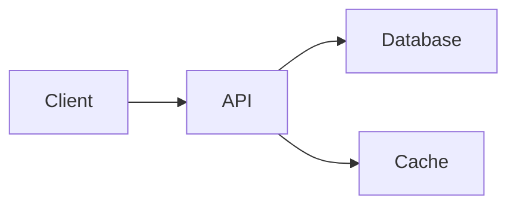
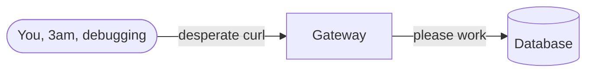

# Sections Encyclopedia

> "Every README is a house. These are the rooms. Not every house needs a billiard room, but every
> house needs a front door."

Copy-paste templates for every section in the Quick Reference Matrix, in typical page order. Each
entry gives the section's job, its priority (Required/High/Medium/Low, matching `SKILL.md`), the
same section written at 2-3 points on the [Tone Spectrum](tone-and-voice.md), and its most common
failure mode. Pick one tone level for the whole README in Step 1 — the contrast below shows range,
not a menu to mix within a single document.

---

## Header + Banner

Name, tagline, and visual identity — the first three seconds of attention. **Required.**

**Level 1 — Corporate Geek:**
```markdown
# Fiber

**Express-inspired web framework built on Fasthttp — the fastest HTTP engine for Go.**

[](.)
```

**Level 5 — Chaotic Genius:**
```markdown
# 🏢 FizzBuzz Enterprise Edition™

*The world's foremost implementation of FizzBuzz, built with an eye toward guidelines established
by Enterprise Architects the world over.*
```

**Don't:** ship a raster banner with the tagline baked into the pixels — a screen reader, search
index, and dark mode all see nothing; put the tagline in real text too.

---

## The Big Three (What / Why / How)

Answers what/why/how inside the first screen. **Required.**

**Level 1 — Corporate Geek:**

Stripe's official Go library for the Stripe API. Handles auth, retries, and idempotency so your
integration doesn't have to.

```bash
go get -u github.com/stripe/stripe-go/v79
```

**Level 4 — Full Nerd Mode:**

**What:** A language where "const const" makes a variable *extra* constant.
**Why:** It doesn't need to exist. That's the point.

```bash
npm install -g dreamberd && dreamberd hello.db
```

**Don't:** answer "how" with a link to an install *guide* instead of a runnable command — the
reader wants to paste something in the next five seconds, not open a new tab.

---

## Table of Contents

Lets readers jump to a section on a long README. **Required when the doc exceeds ~3 screens** —
skip on short READMEs, it's furniture in an empty room.

**Level 1 — Corporate Geek:**
```markdown
## Table of Contents
- [Installation](#installation)
- [Usage](#usage)
- [API Reference](#api-reference)
- [License](#license)
```

**Level 3 — Playful Hacker:**
```markdown
## Where Are We Going?
- [🚀 Quick Start](#-quick-start) — 30 seconds, one command
- [🆘 Troubleshooting](#-troubleshooting) — it's probably a typo
```

**Don't:** hand-write anchors and never re-check after renaming a heading — a stale `#instalation`
link is the single most common broken-ToC bug; grep every anchor against real heading slugs.

---

## Key Features

Skimmable list of what makes the project worth using, 4-8 specific, checkable items. **Required.**

**Level 1 — Corporate Geek:**
```markdown
## Features
- **Type-safe** — Full TypeScript definitions, no `any` in the public API
- **Zero dependencies** — 4kb gzipped
- **Tree-shakeable** — Import only what you use
```

**Level 3 — Playful Hacker:**
```markdown
## What's In The Box
- ⚡ **Stupidly fast** — Fasthttp under the hood, benchmarks below
- 🪶 **4kb gzipped** — lighter than the emoji in this bullet
- 🌳 **Tree-shakeable** — import one function, ship one function
```

**Level 5 — Chaotic Genius:**
```markdown
## Enterprise-Grade Capabilities
| Feature | Business Value | Actual Function |
| :--- | :--- | :--- |
| AbstractFizzBuzzStrategyFactory | Synergizes stakeholder alignment | Prints "Fizz" |
```

**Don't:** list features as unproven adjectives ("blazing fast," "enterprise-grade") — pair each
claim with the number or example that backs it, or cut it.

---

## Quick Start / Installation

Shortest path from "found this repo" to "have it running." **Required.**

**Level 1 — Corporate Geek:** (heading: `## Installation`)

```bash
npm install @vercel/analytics
```
```tsx
import { Analytics } from '@vercel/analytics/react';
export default function RootLayout() { return <Analytics />; }
```

**Level 4 — Full Nerd Mode:** (heading: `## Strap In`)

```bash
npm install -g haunted-cli      # summon the package
haunted init --sacrifice=node_modules   # perform the ritual
# there is no step 3, you're already running it
```

**Don't:** ship an install snippet you haven't run since the last release — a stale flag or
renamed package is the #1 reason someone closes the tab in the first 10 seconds.

---

## Architecture Diagram

Visual map of how the pieces fit, for anyone about to change the system. **High, for multi-
component systems** — skip for a single-file script. Full toolkit in
[Tables, Diagrams, and Workflows](tables-diagrams-workflows.md); box-drawing alternative in
[Char Art and Animation](char-art-and-animation.md).

**Level 1 — Corporate Geek:**

```mermaid
flowchart LR
    Client --> API --> Database
    API --> Cache
```

**Level 3 — Playful Hacker:**

```mermaid
flowchart LR
    You([You, 3am, debugging]) -->|desperate curl| API[Gateway]
    API -->|"please work"| DB[(Database)]
```

**Don't:** skip the plain-English caption underneath — a diagram with no caption fails a
screen-reader user and anyone skimming past the arrows without stopping.

---

## Usage Examples

Runnable, realistic code showing the thing doing its actual job — the most-copied section.
**Required.**

**Level 1 — Corporate Geek:**

```ts
const result = await charge({ amount: 2000, currency: 'usd', source: 'tok_visa' });
```

**Level 4 — Full Nerd Mode:**

```js
// Summon a user from the database (no incantations required)
const gandalf = await client.users.get('usr_you_shall_not_pass');
if (gandalf.role === 'admin') console.log('You shall pass.');
```

**Don't:** show only the happy path with no error handling anywhere in the doc — one example with
a `try/catch` teaches more than five that assume nothing ever fails.

---

## Configuration

Documents every env var, config field, or flag the project reads. **High, when config exists** —
skip for a zero-config tool.

**Level 1 — Corporate Geek:**
```markdown
| Variable | Required | Default | Description |
| :--- | :---: | :--- | :--- |
| `DATABASE_URL` | Yes | — | Postgres connection string |
| `PORT` | No | `3000` | HTTP port to listen on |
```

**Level 3 — Playful Hacker:**
```markdown
| Variable | Required | Default | What happens if you skip it |
| :--- | :---: | :--- | :--- |
| `DATABASE_URL` | Yes | — | The app refuses to start, correctly |
```

**Don't:** let this table drift from the real config schema — grep every `process.env.*`/config
key against the codebase before publishing; a stale row erodes trust fast.

---

## API Reference

Contract for every public function, class, or endpoint. **High, for libraries/SDKs** — skip for
an end-user app.

**Level 1 — Corporate Geek:**
```markdown
### `client.charges.create(params)`
| Param | Type | Required | Description |
| :--- | :--- | :---: | :--- |
| `amount` | `number` | Yes | Amount in cents |

**Returns:** `Promise<Charge>`
```

**Level 3 — Playful Hacker:** `app.Get(path, handler)`

Registers a GET handler. Fiber doesn't care what else you were planning to do today.

```go
app.Get("/hello/:name", func(c *fiber.Ctx) error { return c.SendString("Hi " + c.Params("name")) })
```

**Don't:** describe a parameter's type as "obvious from the name" and skip it — every param needs
an explicit type and required/optional flag; this is the section people paste into a linter.

---

## Performance / Benchmarks

Numbers backing a speed/efficiency claim, usually vs. alternatives. **Medium, in a competitive
space** — skip if there's nothing to compare against.

**Level 1 — Corporate Geek:**
```markdown
| Framework | Requests/sec | Latency (p99) |
| :--- | ---: | ---: |
| Fiber | 148,302 | 1.2ms |
| Express | 22,481 | 8.9ms |

Reproduce with `make bench` — methodology in [`/benchmarks`](./benchmarks).
```

**Level 5 — Chaotic Genius:**
```markdown
| Contender | Requests/sec | Dignity Retained |
| :--- | ---: | :---: |
| Our library | 148,302 | 100% |
| A potato with two wires stuck in it | 0 | 100% (it wasn't trying) |
```

**Don't:** publish a number with no reproduction method — "10x faster" with no linked script,
hardware spec, or dataset size is marketing, not engineering.

---

## Contributing

Tells outside contributors how to propose a change and get it merged. **High, for open source.**

**Level 1 — Corporate Geek:** (heading: `## Contributing`)

Read [CONTRIBUTING.md](CONTRIBUTING.md) before opening a PR. All contributors sign the [CLA](CLA.md).

```bash
git clone https://github.com/org/repo.git && cd repo && npm install && npm test
```

**Level 2 — Friendly Nerd:**
```markdown
## Contributing
Found a bug? We'd love your help — we don't bite (most of us don't even have teeth, we're a
Node project). Fork it, `npm test` should stay green, then open a small, focused PR.
```

**Don't:** say "we welcome contributions" with no runnable test/build command underneath — that
sentence with nothing to run is the top reason first-time contributors bounce.

---

## FAQ

Pre-answers questions that show up repeatedly, saving both reader and maintainer time. **Medium,
when a genuine confusion pattern exists** — don't invent questions no one has asked.

**Level 1 — Corporate Geek:**
```markdown
**Does this work with Webpack 4?**
No — requires Webpack 5+ for Module Federation.
```

**Level 3 — Playful Hacker:**
```markdown
**Q: Why is it called Choo?**
A: Because it's a tiny thing that gets you somewhere, and "train" was taken by four other packages.
```

**Don't:** restate the Usage or Configuration section word-for-word as a "question" — if it's
already answered above, link to that section instead of duplicating it.

---

## Troubleshooting

Maps error messages/symptoms to cause and fix — found by pasting an error into search. **Medium,
for complex setups** — skip for trivial installs.

**Level 1 — Corporate Geek:**
```markdown
| Symptom | Likely Cause | Fix |
| :--- | :--- | :--- |
| `ECONNREFUSED` on startup | Database isn't running | `docker compose up -d db` |
```

**Level 3 — Playful Hacker:**
```markdown
| If you see... | It's not you, it's... | Fix |
| :--- | :--- | :--- |
| Blank page, no errors | ...a silently swallowed exception | `DEBUG=app:* npm start` |
```

**Don't:** write "just Google the error" energy into a row — every entry needs an actual command
or config change, not a vague "check your setup."

---

## Roadmap

Signals active development and direction, usually a checklist by status. **Low** — nice for
momentum, easy to go stale, safe to omit.

**Level 1 — Corporate Geek:**
```markdown
## Roadmap
- [x] Core API stable (v1.0)
- [ ] Plugin system

See the [public project board](https://github.com/org/repo/projects/1) for live status.
```

**Level 3 — Playful Hacker:**
```markdown
## Coming Soon (No Promises)
- [x] Works on your machine too, probably
- [ ] Plugin system — it's in a branch, it's *fine*
```

**Don't:** attach dates ("Q3 2026: plugin system") with no funded commitment behind them — link a
live project board instead of a promise that ages badly in a public file.

---

## Credits / Contributors

Recognizes the people and prior art the project is built on. **Medium, for open source** — include
once there's more than one contributor.

**Level 1 — Corporate Geek:**
```markdown
## Contributors
<a href="https://github.com/org/repo/graphs/contributors">
  
</a>
```

**Level 3 — Playful Hacker:**
```markdown
## Hall of Fame
Everyone below fixed something at 2am so you didn't have to:
<a href="https://github.com/org/repo/graphs/contributors">
  
</a>
```

**Don't:** hand-maintain a bullet list of names that drifts from the real commit history — use an
auto-generated widget (contrib.rocks, All Contributors bot) instead.

---

## License

States the legal terms of use — short, but the section that decides if anyone can depend on this.
**Required.**

**Level 1 — Corporate Geek:**
```markdown
## License
[MIT](LICENSE) © 2026 Acme, Inc.
```

**Level 5 — Chaotic Genius:**
```markdown
## License
MIT — also known as "Do Whatever You Want But If It Breaks Prod Don't Call Us."
See [LICENSE](LICENSE) for the boring, legally-binding version of that sentence.
```

**Don't:** omit the license because "everyone knows it's open source" — no `LICENSE` file legally
defaults to all rights reserved, almost never the actual intent.

---

## Easter Eggs

Hidden rewards for readers who go looking — a joke in `<details>`, a hidden command, a raw-source
comment. **Optional, personality level 3+** — never load-bearing. Full catalog in
[Tone and Voice](tone-and-voice.md).

**Level 3 — Playful Hacker:**
```markdown
<details>
<summary>🥚 Psst. Click here if you read this far.</summary>

You found it. No prize, but you now know something the skimmers don't.

</details>
```

**Level 4 — Full Nerd Mode:**
```markdown
<!-- If you're reading raw markdown source: hello, `View Source` enjoyer. The real Easter egg is
`npm run --silent easter-egg`. Don't tell anyone. -->
```

**Don't:** hide anything actually needed (a required flag, a breaking-change warning) inside an
egg — if skipping it breaks the reader's setup, it's a support ticket, not a joke.

---

## Before Shipping a Section, Confirm...

- [ ] Heading depth is consistent — every top-level section is the same `##`, none nested a level
      deeper or shallower than its siblings
- [ ] Every Table of Contents link resolves to a real heading anchor — no orphaned `#anchor` links
- [ ] Tone level is consistent *within* the section — no Corporate Geek line dropped into an
      otherwise Chaotic Genius section, or vice versa
- [ ] Every code block has actually been run, not written from memory
- [ ] The section earns its place per its priority — a Low/Optional section adding nothing
      specific to this project gets cut, not included out of habit
- [ ] Claims are backed by something checkable (benchmark, link, version number) — no unverifiable
      superlatives standing alone
- [ ] Jargon introduced here is defined on first use, per [Universal Readability](universal-readability.md)
- [ ] Tables follow [Tables, Diagrams, and Workflows](tables-diagrams-workflows.md) — alignment
      markers, ≤5 columns
- [ ] Diagrams/char art follow [Char Art and Animation](char-art-and-animation.md) — captioned,
      ≤80 columns if ASCII, accessible fallback if animated
- [ ] Visual elements stay inside the shared Visual Budget Rule quota rather than adding a new
      banner/GIF/diagram on top of what Step 6 already spent
- [ ] Nothing here contradicts another section — e.g., a Roadmap item already shipped per Key
      Features, or a Configuration default that doesn't match the Quick Start example
