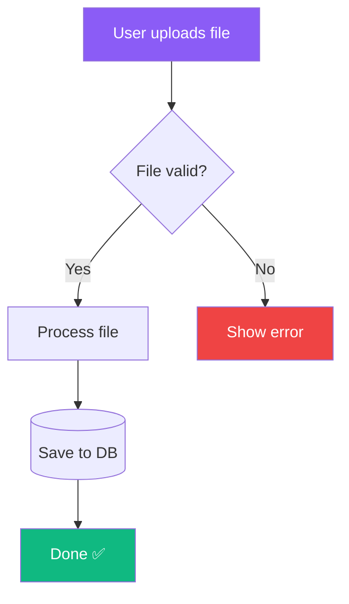
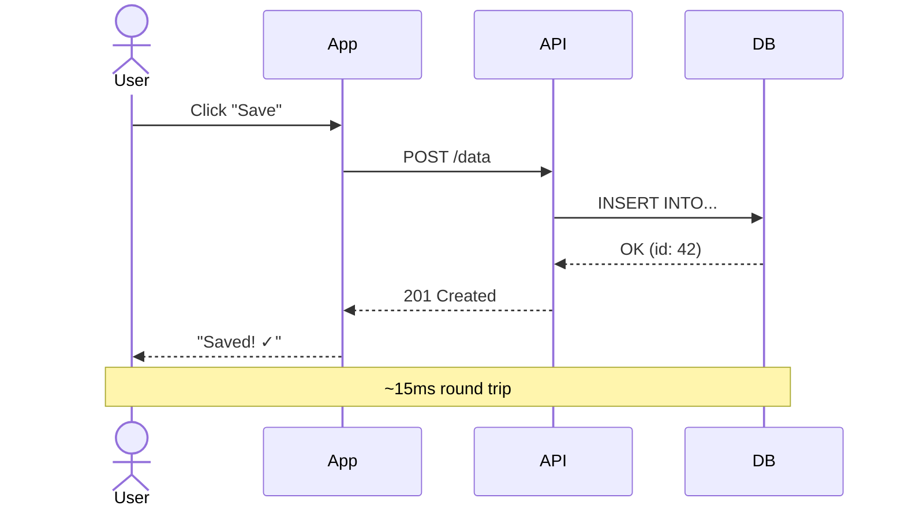
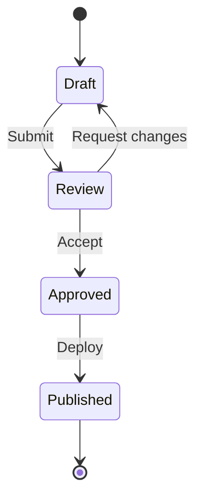
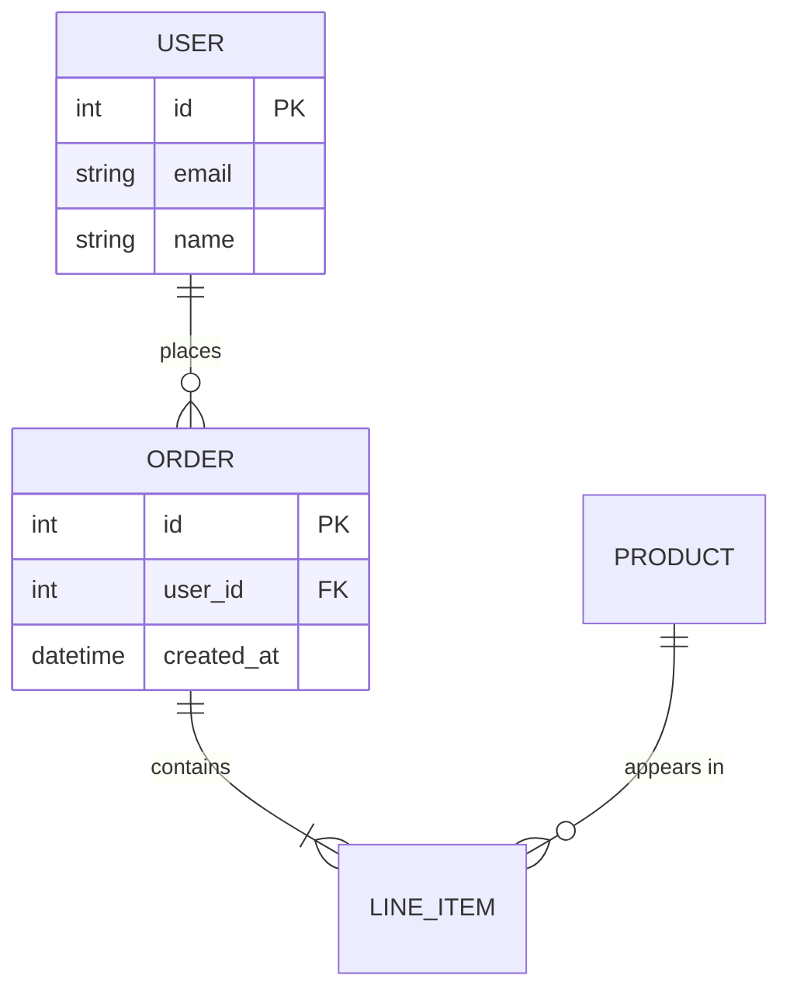
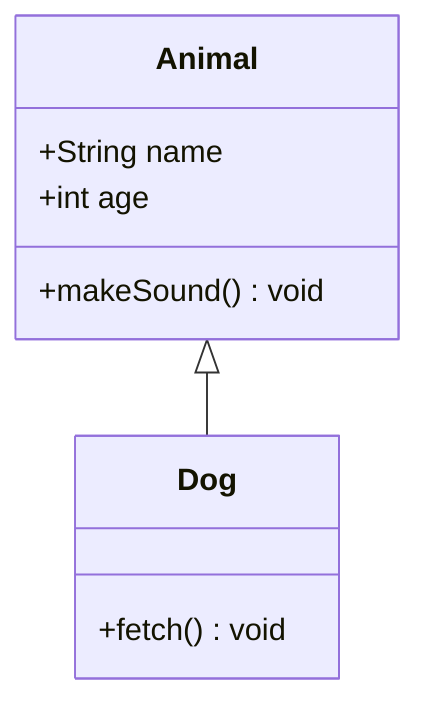
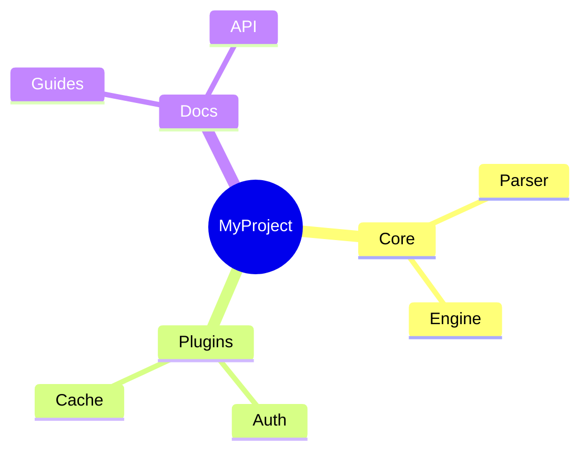
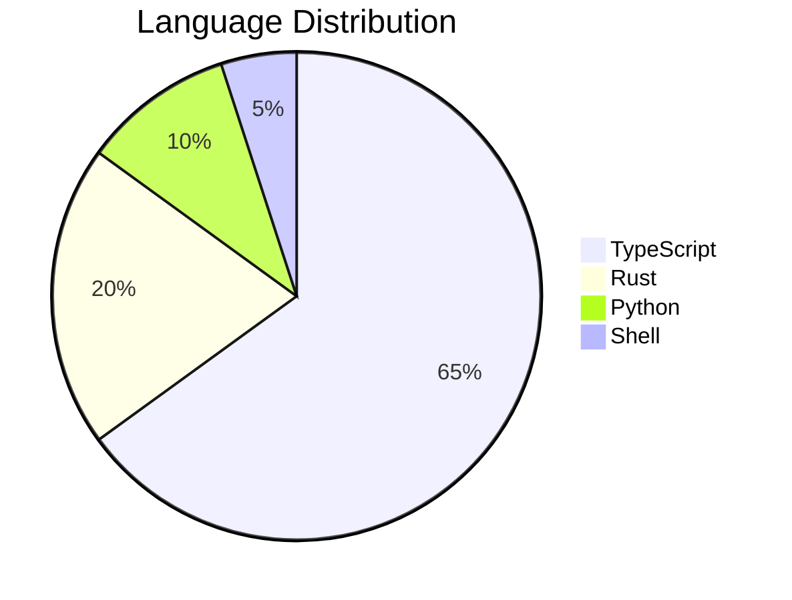
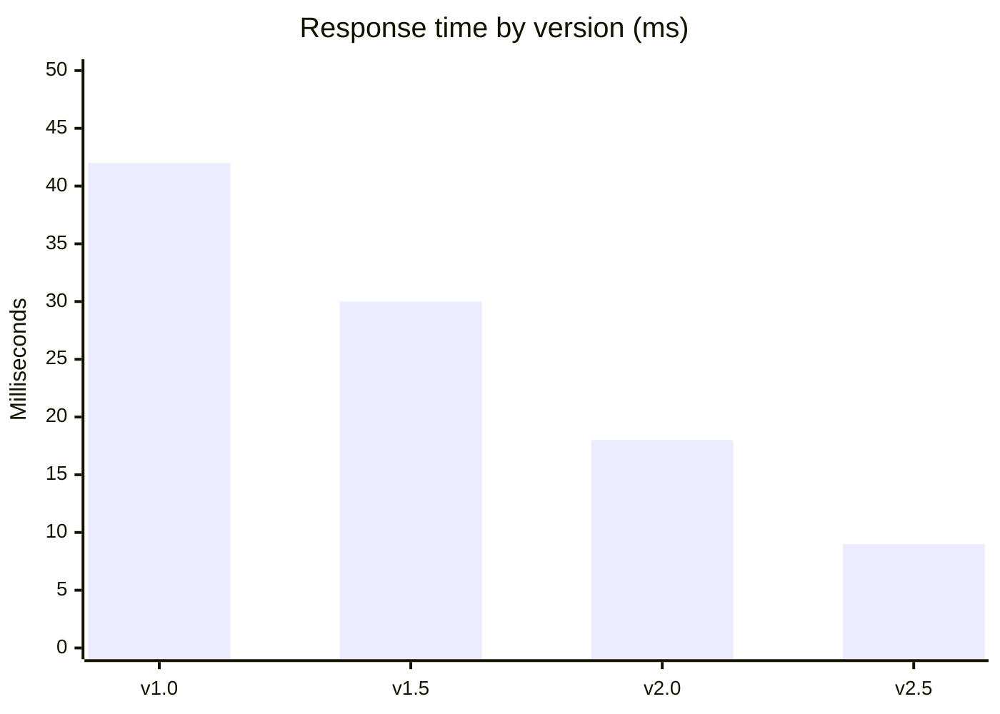
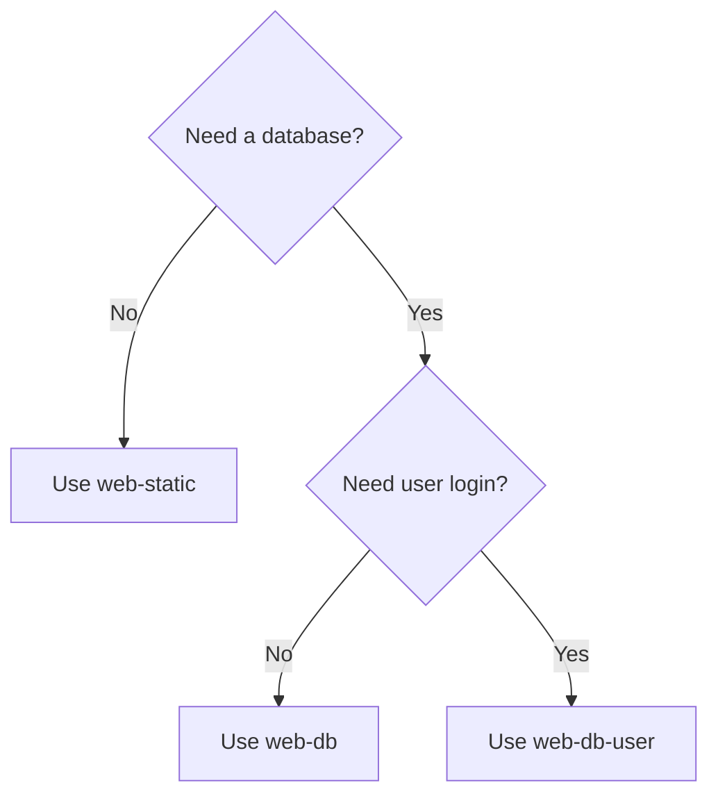

# Perfect Tables, Diagrams, Sheets, and Workflows

> "If a picture is worth a thousand words, a well-built table is worth a thousand bullet points — and a clear diagram is worth a thousand confused issues."

This reference is the master guide for the four hardest-to-get-right elements in a README: **tables**, **diagrams/drawings**, **sheets/data**, and **workflows**. Each section has rules, copy-paste patterns, and a quality checklist so every one of these elements comes out perfect.

---

## Table of Contents

- [Part 1: Perfect Tables](#part-1-perfect-tables)
- [Part 2: Perfect Diagrams and Drawings](#part-2-perfect-diagrams-and-drawings)
- [Part 3: Perfect Sheets and Data](#part-3-perfect-sheets-and-data)
- [Part 4: Perfect Workflows](#part-4-perfect-workflows)
- [Part 5: Perfect Sections](#part-5-perfect-sections)
- [Master Quality Checklist](#master-quality-checklist)

---

## Part 1: Perfect Tables

Tables are the fastest way for any reader — 15 or 80 years old — to scan and compare information. But a broken or bloated table hurts more than no table at all.

### The 7 Rules of Perfect Tables

| # | Rule | Why |
| :---: | :--- | :--- |
| 1 | Always include alignment markers (`:---`, `:---:`, `---:`) | Controls left/center/right alignment cleanly |
| 2 | Keep cells short — phrases, not paragraphs | Tables are for scanning, not reading |
| 3 | Max 4-5 columns on GitHub | More columns cause horizontal scrolling on mobile |
| 4 | Use a header row that describes, not just labels | "Time to Setup" beats "Time" |
| 5 | Put the most important column first (left) | Eyes start at the left |
| 6 | Be consistent with units and formats in a column | `12ms`, `8ms`, `40ms` — not `12 ms`, `0.008s`, `40` |
| 7 | Never merge cells or nest tables in Markdown | GitHub doesn't support it; use HTML tables only if truly needed |

### Alignment Reference

```markdown
| Left (default) | Centered | Right |
| :--- | :---: | ---: |
| Text     | Text   | 12ms  |
| More     | More   | 4ms   |
```

- `:---`  → left-aligned (use for text)
- `:---:` → centered (use for status, icons, short values)
- `---:`  → right-aligned (use for numbers, so decimals line up)

### Table Pattern: Feature Comparison (Honest, Not Trash-Talking)

```markdown
| Feature | This Project | Alternative A | Alternative B |
| :--- | :---: | :---: | :---: |
| Setup time | **30 sec** | 10 min | 5 min |
| Zero config | ✅ | ❌ | ⚠️ partial |
| Bundle size | **12 KB** | 88 KB | 45 KB |
| TypeScript | ✅ | ✅ | ❌ |
| Price | Free | $9/mo | Free |
```

Use `✅` / `❌` / `⚠️` for instant visual scanning. **Bold** your own winning cells — but stay honest about where you lose.

### Table Pattern: Options / Configuration

```markdown
| Option | Type | Default | Description |
| :--- | :--- | :--- | :--- |
| `port` | `number` | `3000` | Port the server listens on |
| `host` | `string` | `localhost` | Hostname to bind to |
| `debug` | `boolean` | `false` | Print verbose logs |
| `mode` | `'dev' \| 'prod'` | `'prod'` | Runtime mode |
```

> **Tip:** Escape the pipe inside type unions with `\|` so it doesn't break the table: `'json' \| 'xml'`.

### Table Pattern: Status / Roadmap

```markdown
| Feature | Status | Target |
| :--- | :---: | :--- |
| Core engine | ✅ Done | v1.0 |
| Plugin API | 🚧 In progress | v1.2 |
| Cloud sync | 📋 Planned | v2.0 |
| AI assistant | 💭 Idea | TBD |
```

### Table Pattern: Keyboard Shortcuts / Commands

```markdown
| Command | Shortcut | What It Does |
| :--- | :---: | :--- |
| Save | `Ctrl` + `S` | Saves the current file |
| Undo | `Ctrl` + `Z` | Reverses the last action |
| Find | `Ctrl` + `F` | Opens search |
```

### When NOT to Use a Table

- For a single list of items with no second dimension → use a bullet list
- For long prose in each cell → use headers + paragraphs
- For two items being compared on one axis → a sentence is clearer

### HTML Tables (only when you need layout, not data)

Markdown tables can't merge cells, embed block content, or do columns of images. For visual *layout* (feature cards, two-column sections), use an HTML `<table>` — but never for plain tabular data.

```html
<table>
  <tr>
    <td width="50%" valign="top">

### For Users
Plain markdown works **inside** cells if you leave blank lines around it.

    </td>
    <td width="50%" valign="top">

### For Developers
Great for side-by-side layouts that markdown tables can't do.

    </td>
  </tr>
</table>
```

### Table Quality Checklist

- [ ] Every column has an alignment marker
- [ ] Numbers are right-aligned; status icons are centered
- [ ] No cell exceeds ~6 words
- [ ] 4-5 columns max (fits mobile)
- [ ] Units/formats are consistent down each column
- [ ] Pipes inside content are escaped (`\|`)
- [ ] The header row describes the data clearly

---

## Part 2: Perfect Diagrams and Drawings

GitHub renders **Mermaid** natively — no image hosting needed, and it auto-adapts to dark/light mode. **Always prefer Mermaid over screenshots of diagrams.** For very complex architecture, use **D2** rendered to an image.

### Decision: Which Diagram Tool?

| Need | Use | Why |
| :--- | :--- | :--- |
| Flow, sequence, state, ER, timeline, gantt, pie | **Mermaid** (in a code block) | Renders natively on GitHub, theme-aware |
| Very complex/large architecture | **D2** → PNG/SVG | Cleaner auto-layout for big systems |
| A real screenshot of the UI | PNG/GIF | Show the actual product |
| Hand-style sketch | Excalidraw → export SVG/PNG | Friendly, approachable look |

> In this sandbox you can render either with: `manus-render-diagram input.mmd output.png` (Mermaid) or `manus-render-diagram input.d2 output.png` (D2). Use D2 for architecture/complex; default to Mermaid otherwise.

### The 5 Rules of Perfect Diagrams

1. **One idea per diagram** — don't cram the whole system into one picture
2. **Label every node and arrow** — an unlabeled arrow is a riddle
3. **Always add a plain-English caption** below the diagram (for non-visual readers and accessibility)
4. **Color with meaning** — use `style` lines that match your theme palette; color = importance, not decoration
5. **Left-to-right for flows, top-to-bottom for hierarchies**

### Mermaid: Flowchart (Decision / Process)

````markdown

````

### Mermaid: Sequence Diagram (API / Interaction Flow)

````markdown

````

### Mermaid: State Diagram (Lifecycle)

````markdown

````

### Mermaid: ER Diagram (Database Schema)

````markdown

````

### Mermaid: Class Diagram (OOP Structure)

````markdown

````

### Mermaid: Mindmap (Concept Map)

````markdown

````

### D2: Complex Architecture (rendered to image)

For large systems, D2 produces cleaner auto-layout. Write a `.d2` file, render it, and embed the PNG:

```d2
client: Client App {shape: rectangle}
gateway: API Gateway {shape: hexagon}
auth: Auth Service
core: Core Engine
db: Database {shape: cylinder}
cache: Redis Cache {shape: cylinder}

client -> gateway: HTTPS
gateway -> auth: verify token
gateway -> core: route request
core -> cache: read
cache -> db: cache miss
```

```markdown
<!-- After: manus-render-diagram architecture.d2 docs/architecture.png -->
<p align="center">
  
</p>

**In plain English:** The app talks to a gateway, which checks your login, then routes to the engine. The engine reads the cache first and only hits the database on a cache miss.
```

### Diagram Quality Checklist

- [ ] Prefer Mermaid; only use images for real screenshots or very complex D2 diagrams
- [ ] Every node and arrow is labeled
- [ ] There's a plain-English caption beneath the diagram
- [ ] Colors come from the theme palette and carry meaning
- [ ] The diagram shows ONE idea, not the entire system
- [ ] If an image, it has descriptive `alt` text for screen readers

---

## Part 3: Perfect Sheets and Data

When a README needs to show structured data — benchmarks, supported versions, pricing, environment variables — present it so it's both scannable and trustworthy.

### Inline Data Tables (for small datasets)

Use a Markdown table (see Part 1) for anything under ~10 rows. Right-align numbers so they compare cleanly:

```markdown
| Benchmark | Ops/sec | Relative |
| :--- | ---: | ---: |
| This project | 1,240,000 | **1.00x** |
| Alternative A | 620,000 | 0.50x |
| Alternative B | 410,000 | 0.33x |
```

### Linking to Real Data Files (CSV / spreadsheets)

For large datasets, don't paste hundreds of rows into the README. Link to the file and show a small preview:

```markdown
> Full results: [`benchmarks/results.csv`](./benchmarks/results.csv) (1,024 rows)

**Top 3 (preview):**

| Test | Median (ms) |
| :--- | ---: |
| cold-start | 42 |
| warm-read | 3 |
| bulk-write | 88 |
```

GitHub automatically renders `.csv` and `.tsv` files as interactive, searchable tables when clicked — so linking is often better than embedding.

### Collapsible Data (keep the README short)

```markdown
<details>
<summary><strong>📊 Full benchmark table (24 rows)</strong></summary>

| Test | v1 | v2 | Change |
| :--- | ---: | ---: | :---: |
| ... | ... | ... | ... |

</details>
```

### Data Visualization Options

| Option | How | Best For |
| :--- | :--- | :--- |
| Mermaid pie/xy chart | In a code block, renders natively | Simple distributions/trends |
| Static chart image | Generate with Python/matplotlib, embed PNG | Rich, custom charts |
| GitHub-rendered CSV | Link the `.csv` file | Large raw datasets |
| Shields.io dynamic badge | Endpoint badge pulling live JSON | Live metrics (coverage, downloads) |

### Mermaid: Pie Chart

````markdown

````

### Mermaid: XY / Bar Chart (trends)

````markdown

````

### Sheets/Data Quality Checklist

- [ ] Numbers are right-aligned and use consistent units/precision
- [ ] Datasets over ~10 rows are linked or collapsed, not pasted in full
- [ ] Large raw data links to a `.csv`/`.tsv` (GitHub renders it interactively)
- [ ] Any chart has a title and labeled axes
- [ ] The data source/date is stated so readers trust it

---

## Part 4: Perfect Workflows

A "workflow" is a sequence the reader must follow (install → configure → run) OR an automated pipeline (CI/CD). Both must be unambiguous and copy-paste safe.

### User Workflow: Numbered Steps + Visual

Pair numbered steps with a small Mermaid flow so visual and text learners both succeed:

````markdown
## 🚀 Getting Started

**1. Install**
```bash
npm install -g myproject
```

**2. Configure** — copy the example and add your key
```bash
cp .env.example .env
```

**3. Run**
```bash
myproject start
```


> **Result:** open `http://localhost:3000` — you should see the welcome screen.
````

### Rules for Command Workflows

1. **One command per line** — never chain unrelated commands the reader can't debug
2. **Show expected output** so readers know it worked: `# → Server running on :3000`
3. **State prerequisites first** (Node 18+, Docker, etc.) in a callout
4. **Make every block copy-paste safe** — no placeholders that crash (use `<your-key>` and explain it)
5. **End with a "what success looks like"** line

### CI/CD Workflow: Show the Pipeline

Document an automated pipeline with a diagram AND the trigger table:

````markdown
## ⚙️ CI/CD Pipeline


| Stage | Trigger | Tool |
| :--- | :--- | :--- |
| Lint | every push | ESLint |
| Test | every push | Vitest |
| Build | on `main` | Vite |
| Deploy | on tag `v*` | GitHub Actions |
````

### GitHub Actions Snippet (when documenting automation)

````markdown
```yaml
# .github/workflows/ci.yml
name: CI
on: [push, pull_request]
jobs:
  test:
    runs-on: ubuntu-latest
    steps:
      - uses: actions/checkout@v4
      - run: npm ci
      - run: npm test
```
````

### Decision Workflow: Use a Flowchart

For "which option should I pick?" guidance, a decision flowchart beats paragraphs:

````markdown

````

### Workflow Quality Checklist

- [ ] Prerequisites are stated before step 1
- [ ] Each step is one clear action with one command
- [ ] Expected output / success state is shown
- [ ] A visual (Mermaid flow) accompanies multi-step processes
- [ ] Placeholders are obvious (`<your-key>`) and explained
- [ ] Automated pipelines show both a diagram and a trigger table

---

## Part 5: Perfect Sections

Every section in a README should be self-contained, scannable, and consistent. (For the full catalog of *which* sections to include and themed naming, see [sections-encyclopedia.md](sections-encyclopedia.md) and [theme-engine.md](theme-engine.md).)

### The Anatomy of a Perfect Section

```
## [Emoji] [Clear or Themed Title]      ← scannable heading

[One-sentence purpose]                   ← what this section is for

[Content: table, diagram, code, or       ← the actual value
 2-3 short paragraphs]

> [Optional callout: tip, warning, or     ← extra help / personality
   plain-English summary]
```

### The 6 Rules of Perfect Sections

1. **Heading hierarchy is strict** — one `#` (title) → `##` (sections) → `###` (subsections). Never skip levels.
2. **Every `##` heading gets an emoji or icon** for visual scanning (optional in Minimal style).
3. **Lead with the point** — the first sentence states why the section exists.
4. **No wall of text** — break after 3-4 sentences with a header, list, table, or visual.
5. **Consistent ordering** — follow the Section Selection Matrix so readers find things where they expect.
6. **Each section earns its place** — if it has nothing useful, cut it.

### Section Dividers

Use a horizontal rule (`---`) or an animated divider between major sections for clear visual breaks:

```markdown
---

<!-- or an animated divider -->

```

### Anchor Links and Table of Contents

For READMEs longer than ~3 screens, add a Table of Contents. GitHub auto-generates anchors from headings (lowercase, spaces → hyphens, punctuation removed):

```markdown
## Table of Contents
- [Installation](#installation)
- [Quick Start](#quick-start)
- [API Reference](#api-reference)
```

> A heading `## Quick Start 🚀` becomes the anchor `#quick-start-` — test your links; trailing emojis can change the anchor.

### Section Quality Checklist

- [ ] Heading levels are strictly nested (no skips)
- [ ] Each section opens with its purpose in one sentence
- [ ] No section is a wall of text (broken by lists/tables/visuals)
- [ ] Sections follow a predictable, consistent order
- [ ] Long READMEs have a working Table of Contents
- [ ] Anchor links are tested and resolve correctly

---

## Master Quality Checklist

Run this final pass to confirm every structural element is perfect:

**Tables**
- [ ] Alignment markers present; numbers right-aligned; ≤5 columns; consistent units

**Diagrams / Drawings**
- [ ] Mermaid preferred; every node/arrow labeled; plain-English caption; themed colors

**Sheets / Data**
- [ ] Big datasets linked/collapsed; charts have titles + axes; source/date stated

**Workflows**
- [ ] Prereqs first; one action per step; expected output shown; visual flow included

**Sections**
- [ ] Strict heading hierarchy; purpose-first; no walls of text; consistent order; TOC if long
