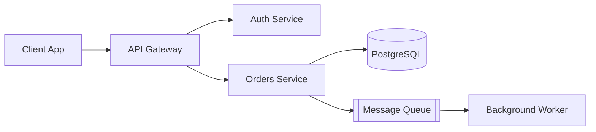
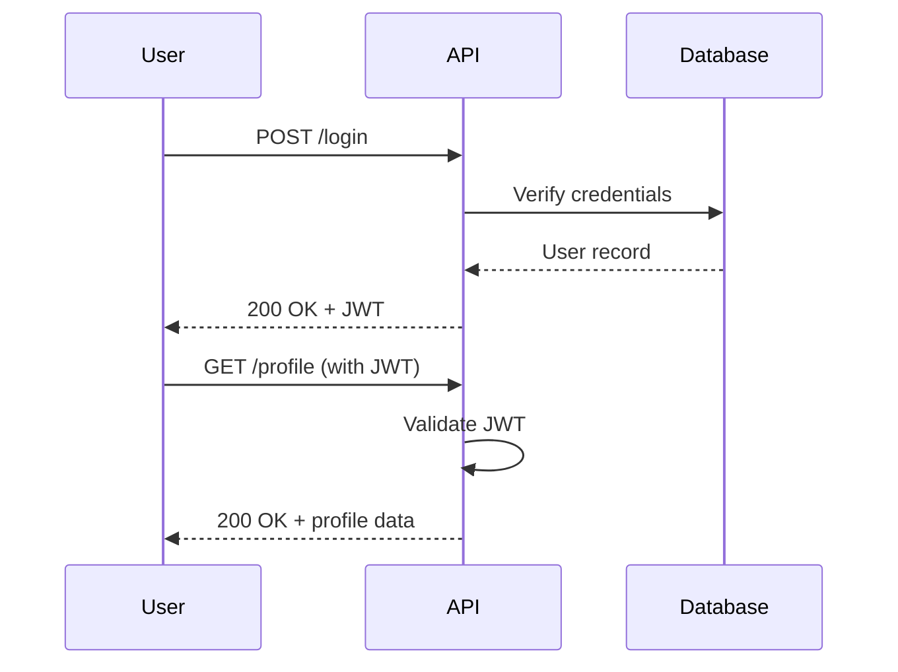

# Tables, Diagrams, and Workflows

> "A README with a 12-column table is not documentation. It's a cry for help."

This is the structural toolkit: how to build tables that don't scroll off a phone screen,
diagrams that render instead of rot, data sections that don't dump a spreadsheet into prose, and
workflows a reader can actually follow without getting lost. Use it while assembling **Step 3:
Build the Section Architecture** and while validating **Step 7** — every rule here maps to one of
the five structural checklist items already in `SKILL.md`.

Five areas, same shape each time: **Rules** (what's non-negotiable), **Patterns** (copy-paste
markdown), **Quality Checklist** (what to verify before shipping). A combined audit closes the
file.

---

## 1. Tables

### Rules

1. **≤5 columns, hard limit.** A table wider than 5 columns forces horizontal scroll on mobile
   GitHub and in most terminals/viewers — the reader either loses context scrolling right or
   never sees the last columns at all. If the data genuinely needs more, split into multiple
   focused tables (see Patterns below) or move it to a linked file (see Section 3).
2. **Always include a header row**, even for a table that feels self-explanatory. Screen readers
   and Markdown renderers use the header row to build the table's accessibility tree — a
   headerless table (just pipes and dashes mimicking a table) breaks that entirely.
3. **Use alignment markers deliberately, not by default.** `:---` (left) is the default and needs
   no marker; `---:` (right) for anything numeric so digits line up; `:---:` (center) only for
   short symbolic/status columns (✅/❌, single words like "Required"). Never center a column of
   long prose — it ping-pongs visually as row lengths vary.
4. **One unit per column, stated once.** If a column holds sizes, pick MB **or** GB for the whole
   column and say which in the header (`Size (MB)`), not `File Size` with mixed `4MB` / `1.2GB` /
   `800KB` rows — the reader has to do unit conversion in their head to compare rows.
5. **Keep cell content short.** A table cell is not a paragraph. If a cell needs more than one
   sentence, the content belongs in prose below the table, with the table holding a summary value
   or a link (`[details](#section)`).
6. **Sort or group meaningfully** — alphabetical for reference tables (config keys, CLI flags),
   priority/sequence order for anything the reader acts on top-to-bottom (setup steps disguised as
   a table, decision matrices).

### Patterns

**Alignment marker syntax** (the row directly under the header, before any data row):

```markdown
| Left (default) | Center | Right |
| :--- | :---: | ---: |
| Name | Status | Count |
```

**Bad: a 9-column table that should be split**

```markdown
| Env | Region | Instance Type | vCPU | RAM | Disk | Cost/mo | Owner | Status |
| --- | --- | --- | --- | --- | --- | --- | --- | --- |
| prod | us-east-1 | m5.xlarge | 4 | 16GB | 100GB | $280 | @lazari | Active |
| staging | us-east-1 | t3.large | 2 | 8GB | 50GB | $70 | @lazari | Active |
| dev | us-west-2 | t3.medium | 2 | 4GB | 30GB | $35 | @team | Idle |
```

This forces a mobile reader to scroll horizontally through nine columns just to find one row's
cost, and it silently mixes readability concerns (identity, sizing, ownership, billing) that
different readers care about for different reasons.

**Good: split by concern into focused tables, ≤5 columns each**

```markdown
**Environments**

| Env | Region | Owner | Status |
| :--- | :--- | :--- | :---: |
| prod | us-east-1 | @lazari | Active |
| staging | us-east-1 | @lazari | Active |
| dev | us-west-2 | @team | Idle |

**Instance sizing**

| Env | Instance Type | vCPU | RAM (GB) | Disk (GB) |
| :--- | :--- | ---: | ---: | ---: |
| prod | m5.xlarge | 4 | 16 | 100 |
| staging | t3.large | 2 | 8 | 50 |
| dev | t3.medium | 2 | 4 | 30 |

**Monthly cost (USD)**

| Env | Cost/mo |
| :--- | ---: |
| prod | $280 |
| staging | $70 |
| dev | $35 |
```

Same information, three tables a reader can actually scan — and each stays under the 5-column
cap with a single consistent unit per numeric column.

### Quality Checklist

- [ ] No table exceeds 5 columns
- [ ] Every table has a header row and an alignment-marker row
- [ ] Numeric columns are right-aligned (`---:`); status/symbol columns are centered (`:---:`);
      prose columns are left-aligned (`:---` or default)
- [ ] Every column holds one unit, and the unit is named in the header when non-obvious
- [ ] No cell contains more than roughly one sentence
- [ ] A wide dataset was split into multiple focused tables, not squeezed into one

---

## 2. Diagrams and Drawings (Mermaid + D2)

### Rules

1. **Default to Mermaid** when the diagram is a flowchart, sequence diagram, ER diagram, state
   machine, or class diagram, and it needs to live inline and render on GitHub with zero setup.
   GitHub, GitLab, and most modern Markdown viewers render ` ```mermaid ` fences natively — no
   image file to host, no build step, and it stays diffable as text in git history.
2. **Reach for box-drawing ASCII instead of Mermaid** only for a tiny 2-4 node sketch where the
   ceremony of a Mermaid fence is overkill — see
   [Char Art and Animation](char-art-and-animation.md) for that technique and its own 5-box
   ceiling.
3. **Reach for D2** ([github.com/terrastruct/d2](https://github.com/terrastruct/d2)) instead of
   Mermaid when the diagram is a dense, many-node architecture map that needs polished manual
   layout control, nested containers, or icon-heavy styling — the kind of diagram meant to be
   rendered once and embedded as an exported PNG/SVG image, not read as live text. D2 does **not**
   render natively on GitHub: generate the image (`d2 architecture.d2 architecture.svg`) and
   commit both the `.d2` source (for future edits) and the rendered image, then embed the image
   with ``.
4. **Every diagram needs a one-sentence plain-English caption immediately below it.** This is
   non-negotiable and applies to Mermaid, D2-exported images, and ASCII diagrams alike — a diagram
   alone fails a screen reader, a search/grep, and anyone unfamiliar with the notation.
5. **Keep node/actor labels short** (2-4 words). A Mermaid node with a full sentence inside it
   breaks the auto-layout and produces an ugly, oversized box.
6. **One diagram per architectural concept.** Don't cram a data flow, a deployment topology, and a
   sequence of API calls into a single mega-diagram — split into two or three smaller diagrams,
   each captioned, rather than one diagram nobody can parse.

### Patterns

**Flowchart** (architecture / data flow — the most common Mermaid use in a README):

````markdown

```mermaid
flowchart LR
    Client[Client App] --> API[API Gateway]
    API --> Auth[Auth Service]
    API --> Orders[Orders Service]
    Orders --> DB[(PostgreSQL)]
    Orders --> Queue[[Message Queue]]
    Queue --> Worker[Background Worker]
```

*A client request hits the API gateway, which checks auth and forwards to the orders service,
which writes to Postgres and queues async work for a background worker.*
````

**Sequence diagram** (request/response over time — for auth flows, API call sequences, retries):

````markdown

```mermaid
sequenceDiagram
    participant U as User
    participant A as API
    participant D as Database

    U->>A: POST /login
    A->>D: Verify credentials
    D-->>A: User record
    A-->>U: 200 OK + JWT
    U->>A: GET /profile (with JWT)
    A->>A: Validate JWT
    A-->>U: 200 OK + profile data
```

*The user logs in once to get a JWT, then reuses that token on later requests instead of
re-sending credentials.*
````

**D2, for a dense architecture map** (source checked in, image committed and embedded):

```markdown
<!-- source: docs/assets/architecture.d2 -->


*Three regional API clusters sit behind one global load balancer, all writing to a single
primary database with regional read replicas.*
```

### Quality Checklist

- [ ] Mermaid is used for flowcharts/sequence/ER/state diagrams meant to render live on GitHub
- [ ] D2 (or another exported-image tool) is used only for dense diagrams meant to ship as an
      image, and its source file is committed alongside the rendered image
- [ ] ASCII box-drawing is reserved for 2-4 node sketches only (see
      [Char Art and Animation](char-art-and-animation.md))
- [ ] Every diagram — Mermaid, D2, or ASCII — has a one-sentence plain-English caption directly
      below it
- [ ] Every node/actor label is short enough not to break auto-layout
- [ ] No single diagram tries to represent more than one architectural concept

---

## 3. Sheets and Data (CSV, charts)

### Rules

1. **Never paste a raw table with more than ~15 rows inline.** Past that point a reader is
   scrolling through data instead of reading documentation, and the table dominates the page's
   visual weight regardless of how important that section actually is.
2. **Link to the source file, or collapse it.** If the data lives in a tracked file (`benchmarks/results.csv`,
   `data/pricing.json`), link to it rather than duplicating it in the README. If it must be inline
   (e.g. for a quick preview), wrap it in a `<details>` block so it doesn't dominate the scroll.
3. **Every chart needs a title and labeled axes** — whether it's a screenshot of a generated chart
   or an embedded image. A chart with unlabeled axes forces the reader to guess units and scale,
   which defeats the entire purpose of visualizing the data instead of just stating it.
4. **Prefer generated, reproducible charts over hand-made screenshots.** If a chart is generated
   by a script, check the script in (`scripts/plot_benchmarks.py`) next to the image, the same way
   a VHS `.tape` backs a terminal GIF — so the chart can be regenerated instead of going stale
   silently.
5. **Timestamp anything that changes over time.** Benchmark numbers, pricing tables, dependency
   counts, star history — any data that isn't a fixed constant needs an explicit "as of" date so
   a reader six months later knows to distrust it rather than assuming it's current.
6. **State the source and method for any performance/benchmark number.** "40% faster" means
   nothing without "than what, measured how, when."

### Patterns

**Collapsing a large table:**

```markdown
<details>
<summary>Full benchmark results (47 rows) — click to expand</summary>

| Test | ops/sec | Memory (MB) |
| :--- | ---: | ---: |
| ... 47 rows ... | | |

</details>

Full raw data: [`benchmarks/results.csv`](benchmarks/results.csv) — *as of 2026-06-01*.
```

**Linking instead of duplicating:**

```markdown
See the full pricing matrix in [`data/pricing.csv`](data/pricing.csv) (updated quarterly, last
refreshed 2026-05-15). The table below shows only the three most common tiers.

| Tier | Price/mo (USD) | Requests/mo |
| :--- | ---: | ---: |
| Free | $0 | 10,000 |
| Pro | $29 | 1,000,000 |
| Scale | $199 | 50,000,000 |
```

**A chart with a title, labeled axes, and a freshness note:**

```markdown


*p99 latency by region, generated by [`scripts/plot_latency.py`](scripts/plot_latency.py) — as
of 2026-07-01. Re-run the script against fresh metrics before trusting this after a quarter.*
```

Note the alt text itself restates title/axes/values — this is what makes the chart usable to a
screen reader, not just decorative.

### Quality Checklist

- [ ] No inline table exceeds ~15 rows; anything larger is linked to a file or wrapped in
      `<details>`
- [ ] Every chart (screenshot or generated image) has a visible title and labeled axes
- [ ] Chart alt text restates the title, axes, and key values, not just a filename
- [ ] Any chart generated by a script has that script checked into the repo
- [ ] Any data that changes over time carries an explicit "as of <date>" note
- [ ] Any comparative/benchmark claim states what it's compared against and how it was measured

---

## 4. Workflows (user steps + CI/CD)

### Rules

1. **State prerequisites up front, before step 1.** "You'll need Node 20+, Docker, and an AWS
   account" belongs in a callout or short list before the numbered steps start — never discovered
   by the reader failing on step 4.
2. **One imperative action per numbered step.** "Install dependencies, then configure your `.env`,
   then start the server" is three steps wearing a trenchcoat. Split it — a reader following along
   needs to complete and verify one thing before moving to the next.
3. **Show the expected output or result after each step, or at minimum at the end.** A step that
   runs a command but never shows what success looks like leaves the reader guessing whether it
   worked. This is the single most common way workflows fail silently.
4. **Never assume a step happened that the reader can't verify.** Don't write "once your database
   is running" without having shown, in an earlier step, the exact command and output that
   confirms the database is running. If a step depends on external state (a running service, an
   env var, a cloned repo), name it explicitly rather than assuming it.
5. **Use imperative mood consistently** ("Run", "Open", "Set") — not a mix of imperative,
   passive, and narrative ("You should probably run...").
6. **For CI/CD pipeline descriptions**, name each stage in the order it actually executes, state
   what triggers it (push, PR, tag, schedule), and state what happens on failure (blocks merge,
   sends a Slack alert, rolls back) — a pipeline description with no failure behavior is only half
   the story.

### Patterns

**Good: numbered Quick Start with expected output shown**

```markdown
## Quick Start

**Prerequisites:** Node 20+, npm, and a free [Supabase](https://supabase.com) account.

1. Clone the repo and install dependencies:

   \```bash
   git clone https://github.com/you/project.git && cd project && npm install
   \```

   Expected output: `added 312 packages in 8s` (exact count varies by version).

2. Copy the example environment file and add your Supabase keys:

   \```bash
   cp .env.example .env
   \```

   Open `.env` and fill in `SUPABASE_URL` and `SUPABASE_ANON_KEY` from your Supabase project
   settings.

3. Start the dev server:

   \```bash
   npm run dev
   \```

   Expected output:

   \```
   ▲ Ready on http://localhost:3000 in 1.2s
   \```

4. Open `http://localhost:3000` in a browser. You should see the login screen with the project
   logo — if you see a blank page instead, check that step 2's env vars were saved correctly.
```

Every step ends with something the reader can check against reality. If step 3's terminal doesn't
say `Ready`, they know exactly where things went wrong instead of discovering it three steps
later.

**Bad: a wall of steps with no way to tell if you're still on track**

```markdown
## Setup

Clone the repo, install deps, set up your env file with your API keys, run migrations, seed the
database, then start the server and the worker in separate terminals, and you should be good to
go. If something doesn't work check your Node version.
```

This has no prerequisites section, bundles at least six actions into one paragraph, gives no
command syntax, and never shows a single expected output — a reader who hits a wall on step 3 (of
an implicit list they had to construct themselves) has no way to tell whether they're even on
step 3.

**CI/CD pipeline description pattern:**

```markdown
## CI/CD Pipeline

| Stage | Trigger | What it does | On failure |
| :--- | :--- | :--- | :--- |
| Lint | Every push | Runs `eslint` + `prettier --check` | Blocks merge |
| Test | Every push | Runs unit + integration suite | Blocks merge |
| Build | Push to `main` | Builds and pushes Docker image | Slack alert to `#ci` |
| Deploy | Tag `v*` | Deploys image to production | Auto-rollback to previous tag |
```

*Every push runs lint and tests; only a merge to `main` builds an image, and only a version tag
ships it to production.*

### Quality Checklist

- [ ] Prerequisites are stated before the first numbered step, not discovered mid-way
- [ ] Every numbered step contains exactly one imperative action
- [ ] Every step (or at minimum the final step) shows the expected output/result
- [ ] No step assumes state the reader has no way to verify
- [ ] Steps use consistent imperative mood throughout
- [ ] Any CI/CD description states trigger, action, and failure behavior for each stage

---

## 5. Well-Structured Sections

### Rules

1. **Never skip a heading level.** `#` → `##` → `###` in strict order. Going straight from `#`
   (h1, the project title) to `###` breaks the document outline that screen readers, editors'
   "outline" panes, and GitHub's own auto-generated table of contents all rely on to build
   navigation.
2. **Keep a consistent section order across similar projects.** A reader who has seen five of your
   team's READMEs should be able to guess where "Configuration" lives in the sixth. Pick an order
   (see the Quick Reference: Section Selection Matrix in `SKILL.md`, or the full catalog in
   [Sections Encyclopedia](sections-encyclopedia.md)) and don't reshuffle it project to project
   without a reason.
3. **Use one consistent heading capitalization style for the whole document.** Sentence case
   ("Getting started", "How it works") is recommended — it's easier to write consistently than
   Title Case, and avoids the "which small words get capitalized" ambiguity (a/an/the/of/in).
   Whichever style is chosen, apply it to every heading, including personality-injected ones
   ("Strap in" not "Strap In" if the doc is otherwise sentence-case).
4. **A heading should introduce content, not repeat it.** Avoid a heading that just restates the
   first sentence under it — the heading is a signpost for scanning, the sentence is the payload.
5. **Sections at the same depth should be roughly comparable in scope.** If `## Installation` is
   two lines and `## Configuration` is four screens, consider whether `## Configuration` actually
   contains three sub-topics that deserve their own `###` subheadings.

### Patterns

**Correct nesting — no skipped levels:**

```markdown
# ProjectName

## Installation

### Prerequisites

### Install via npm

## Configuration

### Environment variables

### Config file
```

**Broken nesting — h1 straight to h3, never fix this:**

```markdown
# ProjectName

### Prerequisites   <!-- ✗ skipped h2 entirely -->

##### Install via npm   <!-- ✗ skipped h3 and h4 -->
```

**Consistent order across a team's projects** (pin this order in a team template rather than
reinventing it per README):

```markdown
# ProjectName
## What it is / The Big Three
## Key features
## Quick start / Installation
## Configuration
## Usage examples
## Architecture
## Contributing
## License
```

**Sentence case applied consistently:**

```markdown
## Getting started         <!-- not "Getting Started" -->
## Frequently asked questions   <!-- not "Frequently Asked Questions" -->
### Environment variables  <!-- not "Environment Variables" -->
```

### Quality Checklist

- [ ] No heading level is skipped anywhere in the document (`#`→`##`→`###`, never `#`→`###`)
- [ ] Section order matches the team's established convention (or the Section Selection Matrix)
- [ ] One capitalization style (sentence case recommended) is applied to every heading, including
      themed/personality headings
- [ ] No heading merely repeats the sentence immediately beneath it
- [ ] Sibling sections at the same heading depth are roughly comparable in scope

---

## Structure and Data Audit

Run this combined checklist during Step 7 whenever the README contains tables, diagrams, data, or
workflows:

- [ ] No table exceeds 5 columns; wide datasets are split into multiple focused tables
- [ ] Every table has a header row, correct alignment markers, and one consistent unit per column
- [ ] Diagrams use Mermaid (native GitHub render) for flowcharts/sequences/ER/state, D2 for dense
      architecture maps meant to ship as an image, and ASCII only for 2-4 node sketches
- [ ] Every diagram has a one-sentence plain-English caption directly below it
- [ ] No inline table exceeds ~15 rows; larger data is linked to a file or collapsed in `<details>`
- [ ] Every chart has a visible title, labeled axes, and alt text that restates them
- [ ] Time-sensitive data (benchmarks, pricing, stats) carries an explicit "as of <date>" note
- [ ] Every workflow states prerequisites up front, uses one imperative action per step, and shows
      expected output after each step (or at least at the end)
- [ ] No workflow step assumes unverified state
- [ ] Heading levels are never skipped, and one capitalization style is used throughout
- [ ] Section order is consistent with the project's established convention

For the full section catalog these structural rules slot into, see
[Sections Encyclopedia](sections-encyclopedia.md). For the surrounding visual toolkit (badges,
banners, screenshots, GIFs) these tables/diagrams share a visual budget with, see
[Visual Arsenal](visual-arsenal.md). For static ASCII art and box-drawing diagrams as a lighter
alternative to Mermaid, see [Char Art and Animation](char-art-and-animation.md).
