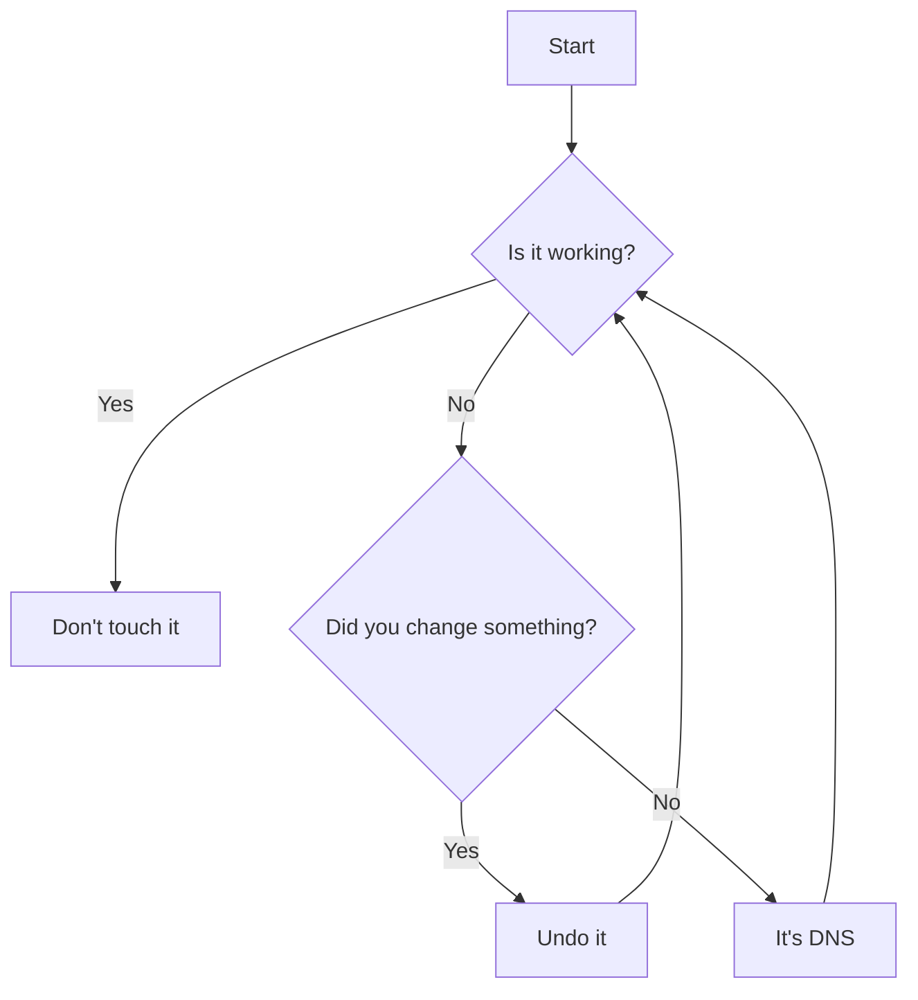
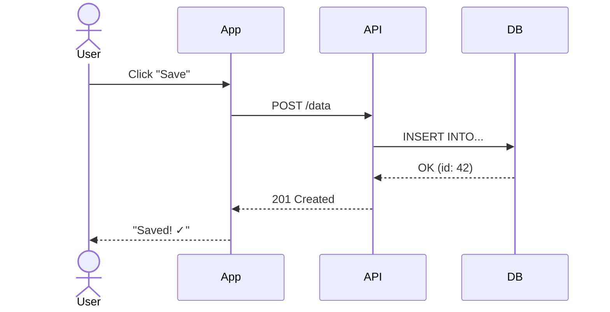
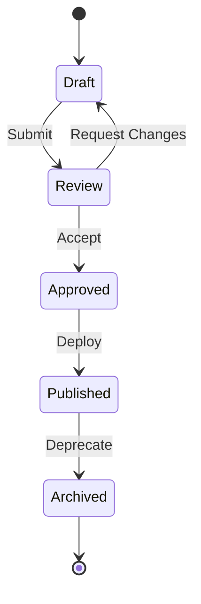
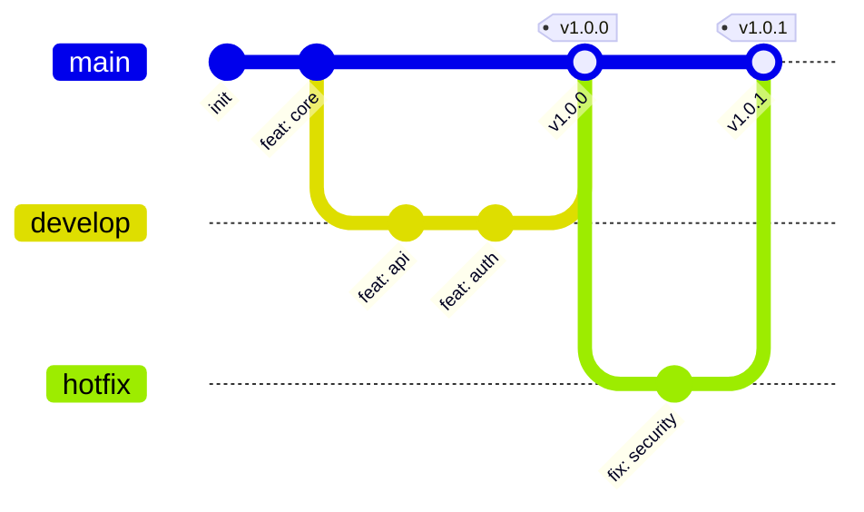
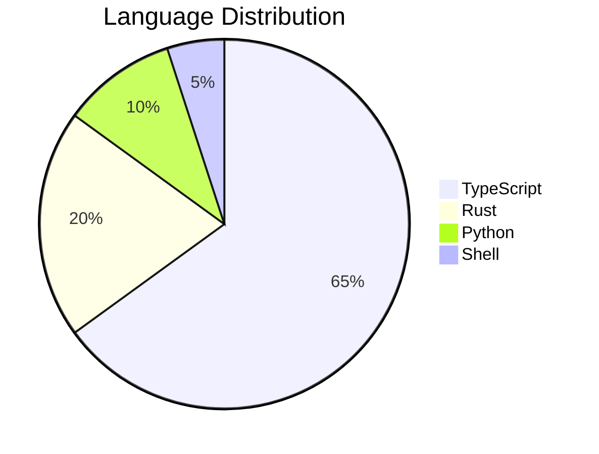
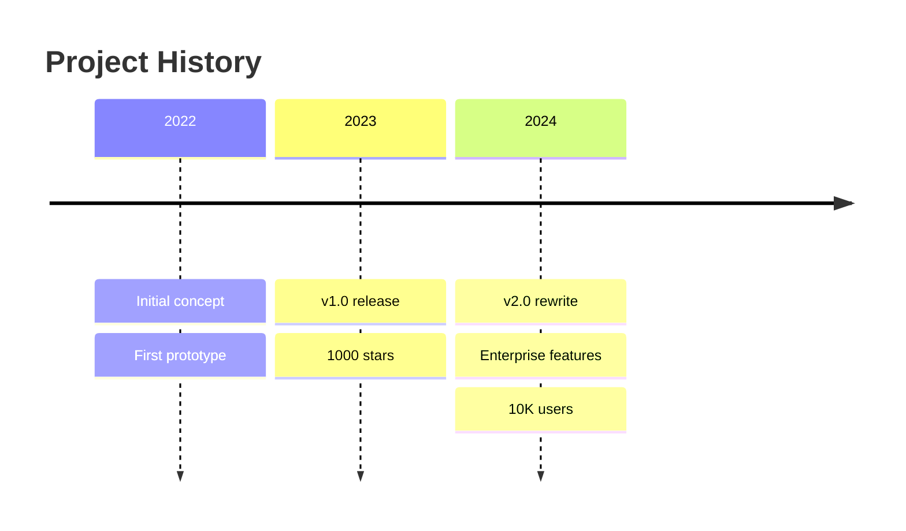

# Visual Arsenal: Badges, Banners, ASCII Art, and Diagrams

> "A picture is worth a thousand words. A well-placed GIF is worth a thousand stars."

This reference covers every visual technique available for making your README a visual masterpiece that works on GitHub, GitLab, and other platforms.

---

## Table of Contents

- [Header Banners](#header-banners)
- [Badges and Shields](#badges-and-shields)
- [ASCII Art](#ascii-art)
- [Mermaid.js Diagrams](#mermaidjs-diagrams)
- [GIFs and Screenshots](#gifs-and-screenshots)
- [Dark/Light Mode Support](#darklight-mode-support)
- [Custom HTML Layouts](#custom-html-layouts)
- [Visual Easter Eggs](#visual-easter-eggs)

---

## Header Banners

### Capsule Render (Dynamic SVG — No Hosting Required)

Base URL: `https://capsule-render.vercel.app/api`

| Parameter | Options | Description |
| :--- | :--- | :--- |
| `type` | `waving`, `egg`, `shark`, `slice`, `rect`, `soft`, `rounded`, `cylinder`, `venom`, `transparent` | Banner shape |
| `color` | `auto`, `gradient`, `timeAuto`, hex code, `0:COLOR1,100:COLOR2` | Color scheme |
| `height` | Number (px) | Banner height |
| `text` | URL-encoded string | Display text |
| `fontSize` | Number | Text size |
| `fontColor` | Hex code (no #) | Text color |
| `animation` | `fadeIn`, `scaleIn`, `blink`, `blinking`, `twinkling` | Text animation |
| `section` | `header`, `footer` | Position |
| `desc` | URL-encoded string | Subtitle text |

**Popular Combinations:**

```markdown
<!-- Waving gradient with animation -->


<!-- Minimal transparent with color accent -->


<!-- Venom style (dramatic) -->


<!-- Footer wave -->

```

### Typing Effect (Animated Taglines)

```markdown
<p align="center">
  <a href="https://git.io/typing-svg">
    
  </a>
</p>
```

Parameters: `font`, `weight`, `size`, `pause` (ms between lines), `color`, `center`, `vCenter`, `width`, `lines` (separated by `;`).

---

## Badges and Shields

### Badge Anatomy

URL pattern: `https://img.shields.io/badge/LABEL-MESSAGE-COLOR?style=STYLE&logo=LOGO&logoColor=LOGOCOLOR`

### Style Options

| Style | Look | Best For |
| :--- | :--- | :--- |
| `flat` | Default, clean | General use |
| `flat-square` | No rounded corners | Modern, minimal |
| `for-the-badge` | Large, bold | Headers, CTAs |
| `plastic` | Glossy, 3D | Retro feel |
| `social` | GitHub-style | Social metrics |

### Essential Badge Categories

**Project Health:**
```markdown


```

**Tech Stack:**
```markdown


```

**Fun/Personality Badges:**
```markdown


```

**Social/Community:**
```markdown


```

### Custom Badge Builder

For any custom badge: `https://img.shields.io/badge/LABEL-MESSAGE-COLOR`

- Replace spaces with `_` or `%20`
- Replace `-` with `--` (double dash)
- Colors: named (`green`, `blue`) or hex (`FF6B6B`)

---

## ASCII Art

### When to Use ASCII Art

- Terminal-focused projects (CLI tools, shell scripts)
- Retro/hacker aesthetic (personality level 4-5)
- Project logos when no image is available
- Section dividers for dramatic effect

### ASCII Art Generators

Use these tools, then paste the output in a code block:

- **figlet** — Classic block letters: `figlet -f slant "ProjectName"`
- **toilet** — Colored ASCII: `toilet -f mono12 "ProjectName"`
- **boxes** — Decorative borders: `echo "text" | boxes -d stone`

### Pre-Made Patterns

**Simple divider:**
```
═══════════════════════════════════════════════════════
```

**Retro computer:**
```
┌──────────────────────────────────────────────────┐
│  ██████╗ ██████╗  ██████╗      ██╗███████╗ ██████╗████████╗│
│  ██╔══██╗██╔══██╗██╔═══██╗     ██║██╔════╝██╔════╝╚══██╔══╝│
│  ██████╔╝██████╔╝██║   ██║     ██║█████╗  ██║        ██║   │
│  ██╔═══╝ ██╔══██╗██║   ██║██   ██║██╔══╝  ██║        ██║   │
│  ██║     ██║  ██║╚██████╔╝╚█████╔╝███████╗╚██████╗   ██║   │
│  ╚═╝     ╚═╝  ╚═╝ ╚═════╝  ╚════╝ ╚══════╝ ╚═════╝   ╚═╝   │
└──────────────────────────────────────────────────┘
```

**Minimal box:**
```
╔═══════════════════════════════╗
║   ProjectName v2.0            ║
║   "Making things less broken" ║
╚═══════════════════════════════╝
```

---

## Mermaid.js Diagrams

GitHub renders Mermaid natively. No images needed. Always prefer Mermaid over static diagrams.

### Flowchart (Decision/Process)

````markdown

````

### Sequence Diagram (API Flows)

````markdown

````

### State Diagram (Lifecycle)

````markdown

````

### Git Graph (Branching Strategy)

````markdown

````

### Pie Chart (Distribution)

````markdown

````

### Timeline (Project History)

````markdown

````

---

## GIFs and Screenshots

### Best Practices

| Aspect | Recommendation |
| :--- | :--- |
| Format | GIF for short demos (<30s), MP4/WebM for longer |
| Width | 600-800px (fits most screens without scrolling) |
| Duration | 5-15 seconds ideal, loop if possible |
| File size | Under 5MB (GitHub has a 10MB limit) |
| Content | Show the "wow moment" — the thing that makes people want to use it |

### Recording Tools

- **Terminal**: [asciinema](https://asciinema.org/) (records as text, tiny files)
- **Screen**: [Kap](https://getkap.co/) (macOS), [Peek](https://github.com/phw/peek) (Linux), [ScreenToGif](https://www.screentogif.com/) (Windows)
- **Browser**: Chrome DevTools → Performance → Screenshot

### Embedding Patterns

```markdown
<!-- Centered GIF with caption -->
<p align="center">
  
  <br />
  <em>Creating a new project in under 10 seconds</em>
</p>

<!-- Side-by-side comparison -->
<table>
  <tr>
    <td align="center"><strong>Before</strong></td>
    <td align="center"><strong>After</strong></td>
  </tr>
  <tr>
    <td></td>
    <td></td>
  </tr>
</table>
```

---

## Dark/Light Mode Support

GitHub supports theme-aware images using the `<picture>` element.

### Pattern: Swap Entire Images

```markdown
<picture>
  <source media="(prefers-color-scheme: dark)" srcset="./docs/logo-dark.svg">
  <source media="(prefers-color-scheme: light)" srcset="./docs/logo-light.svg">
  
</picture>
```

### Pattern: Theme-Aware Diagrams

```markdown
<picture>
  <source media="(prefers-color-scheme: dark)" srcset="./docs/architecture-dark.png">
  <source media="(prefers-color-scheme: light)" srcset="./docs/architecture-light.png">
  
</picture>
```

### Tip: Mermaid Auto-Adapts

Mermaid.js diagrams automatically adapt to GitHub's dark/light mode. This is another reason to prefer Mermaid over static images.

---

## Custom HTML Layouts

GitHub Markdown supports a subset of HTML for advanced layouts.

### Centered Content Block

```html
<div align="center">

  **ProjectName** — Your tagline here

  [Website](https://example.com) · [Docs](https://docs.example.com) · [Discord](https://discord.gg/xxx)

</div>
```

### Two-Column Layout

```html
<table>
  <tr>
    <td width="50%" valign="top">

### 🎯 For Users

- Easy installation
- Zero configuration
- Works out of the box

    </td>
    <td width="50%" valign="top">

### 🔧 For Developers

- Extensible plugin API
- Full TypeScript support
- Comprehensive test suite

    </td>
  </tr>
</table>
```

### Feature Showcase Cards

```html
<table>
  <tr>
    <td align="center" width="33%">
      <br />
      <strong>Fast</strong><br />
      <sub>Sub-ms latency</sub>
    </td>
    <td align="center" width="33%">
      <br />
      <strong>Secure</strong><br />
      <sub>Zero-trust by default</sub>
    </td>
    <td align="center" width="33%">
      <br />
      <strong>Simple</strong><br />
      <sub>3 lines to start</sub>
    </td>
  </tr>
</table>
```

---

## Visual Easter Eggs

### The Hidden Image

```markdown
<!-- This comment contains a secret message for source-code readers:
     ___
    /   \
   | o o |
    \_^_/
   You found Blobby! The unofficial mascot.
   Blobby says: "Star this repo and good things will happen."
-->
```

### The Expandable Art Gallery

```markdown
<details>
<summary>🎨 Click for unnecessary but delightful art</summary>

```
    /\_/\
   ( o.o )
    > ^ <   "I helped write this README"
   /|   |\
  (_|   |_)
```

</details>
```

### The Progress Bar (Fake but Fun)

```markdown
**Project Completion:**

```
██████████████████████░░░░░ 84% — Almost there!
```

**Documentation Quality:**

```
████████████████████████████ 100% — You're reading proof
```
```

### Star History Chart

```markdown
## ⭐ Star History

<a href="https://star-history.com/#user/repo&Date">
  <picture>
    <source media="(prefers-color-scheme: dark)" srcset="https://api.star-history.com/svg?repos=user/repo&type=Date&theme=dark" />
    <source media="(prefers-color-scheme: light)" srcset="https://api.star-history.com/svg?repos=user/repo&type=Date" />
    
  </picture>
</a>
```
