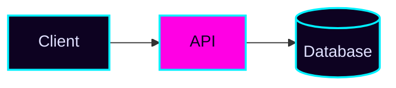

# Visual Style System

> "Consistency is the only special effect that never goes out of style."

This file is the **paint, not the story**. [Theme Engine](theme-engine.md) figures out WHO a
README is — a mascot, a catchphrase, section names built around a metaphor derived from what the
project *does*. This file is purpose-agnostic: it's the hex codes, font feels, badge params,
banner URLs, illustration sources, and stats-widget configs that ANY theme — or a README with no
theme at all, just a clean design pass — plugs into. A Guardian Fortress theme (see Theme Engine)
might wear the **Dark Luxe** kit below; a Space Mission theme might wear **Cyberpunk Neon**. Pick
the narrative in Theme Engine, pick the paint here, and never mix two paint kits in one README.

Use this file in **Step 6: Add Visual Firepower** right after a style is chosen, to pull the exact
palette/badge/banner/illustration/stats values instead of inventing them ad hoc. For the ASCII-art
and terminal-GIF techniques that a style's assets get built with, see
[Char Art and Animation](char-art-and-animation.md). For the badge/banner/diagram mechanics
themselves (syntax, dark-mode `<picture>` tags), see [Visual Arsenal](visual-arsenal.md).

---

## Style Selection at a Glance

| Style | Mood in one line | Great fit for | Skip if... |
| :--- | :--- | :--- | :--- |
| **Cyberpunk Neon** | Blade Runner alley, cyan and magenta signage | Security tools, CLIs, hacker-culture projects | The project is enterprise/regulated — reads unserious |
| **Minimal Mono** | One typeface, one accent, total restraint | Libraries, SDKs, anything judged on API quality | The project wants to feel fun/playful — reads cold |
| **Sunset Gradient** | Warm pink-to-orange horizon | Creative tools, design/no-code products, personal projects | A security or infra tool — reads too soft |
| **Ocean Depth** | Calm deep blue and teal | Data/analytics platforms, infra, anything "steady and deep" | A project that wants high energy — reads sleepy |
| **Forest Tech** | Green-on-black, organic-meets-technical | Sustainability, dev-tools with a "grown, not built" pitch | Fintech/security — undermines a "hardened" pitch |
| **Retro Terminal** | Green (or amber) phosphor CRT glow | Terminal tools, emulators, nostalgia-flavored dev tools | Anything targeting non-technical end users |
| **Candy Pop** | Bright pastel, bubbly, high-saturation fun | Kids'/education tools, playful side projects, joke repos | Anything needing to look "serious" or "production-grade" |
| **Dark Luxe** | Black and gold, premium and restrained | Paid/premium products, finance tools, "flagship" releases | Scrappy open-source projects — reads pretentious |

**Rule:** pick exactly one row. Every visual element in the README — banner, badges, diagrams,
GIF borders, footer — draws from that row's kit only.

### Quick reference: all 8 palettes

For scanning without jumping between sections — the full kits with typography/badge/banner/
illustration/stats detail are below, this is just the raw hexes:

| Style | Primary | Accent | BG-dark | BG-light | Text |
| :--- | :--- | :--- | :--- | :--- | :--- |
| Cyberpunk Neon | `#00F0FF` | `#FF00E4` | `#0D0221` | `#F2F0FF` | `#E0E0FF` |
| Minimal Mono | `#111111` | `#2F6FED` | `#000000` | `#FFFFFF` | `#4A4A4A` |
| Sunset Gradient | `#FF5F6D` | `#FFC371` | `#2E1437` | `#FFF3E6` | `#3D2645` |
| Ocean Depth | `#0077B6` | `#00B4D8` | `#03045E` | `#CAF0F8` | `#E8F9FF` |
| Forest Tech | `#2D6A4F` | `#74C69D` | `#081C15` | `#D8F3DC` | `#E9F5EC` |
| Retro Terminal | `#39FF14` | `#FFB000` | `#0C0C0C` | `#1A1A1A` | `#33FF33` |
| Candy Pop | `#FF6FB5` | `#8CE6FF` | `#2A1B3D` | `#FFF0F7` | `#4A2E55` |
| Dark Luxe | `#D4AF37` | `#C0A062` | `#0A0A0A` | `#F5F0E1` | `#EDE3C8` |

---

## 1. Cyberpunk Neon

| Role | Hex | Usage |
| :--- | :--- | :--- |
| Primary | `#00F0FF` | headings-as-image, primary badge color, link accents |
| Accent | `#FF00E4` | secondary badge color, hover/CTA emphasis, banner subtitle |
| BG-dark | `#0D0221` | banner/footer background, badge `labelColor` |
| BG-light | `#F2F0FF` | light-mode `<picture>` fallback background |
| Text | `#E0E0FF` | body text on dark cards/diagrams |

- **Typography pairing:** display/glitch-feel headers (in any custom SVG/PNG banner, or via
  `readme-typing-svg`'s `font=` param set to `Fira+Code` or `Share+Tech+Mono`) over a plain
  `system-ui` body — the contrast between a "hacked" heading and a normal-reading body is the
  joke.
- **Badge style:** `style=for-the-badge` (blocky, poster-like, reads as a terminal alert) with
  `labelColor=0D0221` and `color=FF00E4` or `00F0FF` alternating per badge so no two adjacent
  badges are identical.
- **Banner recipe:**
  `https://capsule-render.vercel.app/api?type=waving&color=0:0D0221,100:1A0B2E&height=200&section=header&text=YOUR_PROJECT&fontColor=00F0FF&fontSize=42&fontAlignY=35&animation=fadeIn&desc=tagline+goes+here&descAlignY=55&descColor=FF00E4`
- **Illustration source:** [unDraw](https://undraw.co) — use its color picker to set the single
  override hex to `#00F0FF` (recolors every illustration's line-art to match); for icons, pull
  [Simple Icons](https://simpleicons.org) SVGs and swap `fill="#000000"` for `fill="#FF00E4"`
  before committing to `docs/assets/`.
- **Stats widget config:**
  `https://github-readme-stats.vercel.app/api?username=USER&show_icons=true&bg_color=0D0221&title_color=00F0FF&icon_color=FF00E4&text_color=E0E0FF&border_color=FF00E4`
  (or the shortcut built-in theme `&theme=radical`, which is close but won't match custom hex
  exactly — prefer the explicit params above for a pixel-perfect match).

---

## 2. Minimal Mono

| Role | Hex | Usage |
| :--- | :--- | :--- |
| Primary | `#111111` | headings, primary badge text/background |
| Accent | `#2F6FED` | the ONE pop of color — links, one highlighted badge, nothing else |
| BG-dark | `#000000` | dark-mode banner/footer background |
| BG-light | `#FFFFFF` | light-mode banner/footer background, badge `labelColor` |
| Text | `#4A4A4A` | body copy (never pure black — too harsh against white) |

- **Typography pairing:** monospace for everything (`JetBrains Mono` or `IBM Plex Mono` feel) —
  headings and body share one family; the "typography" IS the design in this style.
- **Badge style:** `style=flat-square` (no gradient, no shadow — matches the no-decoration ethos)
  with `labelColor=FFFFFF&color=111111`; use the accent hex on exactly one badge in the row (e.g.
  "sponsor" or "docs"), never more.
- **Banner recipe:**
  `https://capsule-render.vercel.app/api?type=rect&color=0:FFFFFF,100:FFFFFF&height=120&section=header&text=YOUR_PROJECT&fontColor=111111&fontSize=36&fontAlignY=50` —
  flat rectangle, no gradient, no animation. Motion contradicts the style.
- **Illustration source:** skip illustrations almost entirely — if one is unavoidable, use
  [Lucide](https://lucide.dev) icons at `stroke="#111111"` (their default), unmodified. Do not
  recolor them; recoloring a minimal icon set is the first sign of style drift.
- **Stats widget config:**
  `https://github-readme-stats.vercel.app/api?username=USER&show_icons=true&hide_border=true&bg_color=FFFFFF&title_color=111111&icon_color=2F6FED&text_color=4A4A4A`
  — note `hide_border=true`, since a visible border reads as decoration this style avoids.

---

## 3. Sunset Gradient

| Role | Hex | Usage |
| :--- | :--- | :--- |
| Primary | `#FF5F6D` | headings-as-image, primary badge color |
| Accent | `#FFC371` | banner gradient second stop, secondary badges |
| BG-dark | `#2E1437` | footer/dark-mode background, badge `labelColor` |
| BG-light | `#FFF3E6` | light-mode background |
| Text | `#3D2645` | body text on light cards |

- **Typography pairing:** rounded geometric sans feel (`Poppins` or `Quicksand`, set via
  `readme-typing-svg`'s `font=` param) for headings, `system-ui` for body — soft shapes match a
  soft gradient.
- **Badge style:** `style=for-the-badge` (the gradient banner is already bold; matching bold
  badges keep the energy consistent) with `labelColor=2E1437&color=FF5F6D` for primary badges and
  `color=FFC371` for secondary ones.
- **Banner recipe:**
  `https://capsule-render.vercel.app/api?type=waving&color=0:FF5F6D,100:FFC371&height=200&section=header&text=YOUR_PROJECT&fontColor=2E1437&fontSize=42&animation=fadeIn`
  — the gradient IS the palette; note the dark `fontColor` for contrast against a light-warm fill.
- **Illustration source:** [unDraw](https://undraw.co) color override at `#FF5F6D`, or
  [Storyset](https://storyset.com) in "Customize" mode — set the illustration's primary shape
  fill to `#FF5F6D` and its secondary/background shape fill to `#FFC371` for a two-tone match
  instead of unDraw's single-color limit.
- **Stats widget config:**
  `https://github-readme-stats.vercel.app/api?username=USER&show_icons=true&bg_color=FF5F6D,FFC371,45&title_color=2E1437&icon_color=2E1437&text_color=3D2645`
  — `bg_color` accepts a `hex,hex,angle` gradient triplet, so the card background gradient matches
  the banner exactly.

---

## 4. Ocean Depth

| Role | Hex | Usage |
| :--- | :--- | :--- |
| Primary | `#0077B6` | headings, primary badge color |
| Accent | `#00B4D8` | secondary badges, link hover, diagram edges |
| BG-dark | `#03045E` | banner/footer background |
| BG-light | `#CAF0F8` | light-mode background, card fills |
| Text | `#E8F9FF` | body text on dark cards |

- **Typography pairing:** clean humanist sans feel (`Manrope` or `Sen`) for headings — calm,
  wide letterforms — with `system-ui` body; avoid anything condensed or aggressive, it fights the
  "deep and steady" mood.
- **Badge style:** `style=flat-square` (clean edges, no bevel — matches "calm water" over "loud
  neon") with `labelColor=03045E&color=00B4D8`.
- **Banner recipe:**
  `https://capsule-render.vercel.app/api?type=soft&color=0:03045E,100:0077B6&height=200&section=header&text=YOUR_PROJECT&fontColor=CAF0F8&fontSize=40&animation=fadeIn`
  — the `soft` capsule type renders a gentle wave silhouette instead of `waving`'s sharper crest,
  reading calmer.
- **Illustration source:** [Storyset](https://storyset.com)'s nature/ocean-tagged packs
  recolored to `#0077B6` primary / `#00B4D8` secondary in Customize mode; alternatively unDraw
  color override at `#0077B6` for a faster, single-hex pass.
- **Stats widget config:**
  `https://github-readme-stats.vercel.app/api?username=USER&show_icons=true&bg_color=03045E&title_color=00B4D8&icon_color=00B4D8&text_color=E8F9FF&border_color=0077B6`
  (built-in shortcut: `&theme=cobalt` is a close approximation if custom hex isn't needed).

---

## 5. Forest Tech

| Role | Hex | Usage |
| :--- | :--- | :--- |
| Primary | `#2D6A4F` | headings, primary badge color |
| Accent | `#74C69D` | secondary badges, diagram highlight nodes |
| BG-dark | `#081C15` | banner/footer background |
| BG-light | `#D8F3DC` | light-mode background |
| Text | `#E9F5EC` | body text on dark cards |

- **Typography pairing:** modern grotesque with a slight technical edge (`Space Grotesk` feel) for
  headings, `system-ui` body — "grown, not built" without going twee/handwritten.
- **Badge style:** `style=flat-square` with `labelColor=081C15&color=74C69D` — earthy, not glossy;
  avoid `for-the-badge`'s bold poster look here, it reads more "eco-brand" than "grown."
- **Banner recipe:**
  `https://capsule-render.vercel.app/api?type=waving&color=0:081C15,100:2D6A4F&height=200&section=header&text=YOUR_PROJECT&fontColor=D8F3DC&fontSize=42&animation=fadeIn`
- **Illustration source:** unDraw color override at `#2D6A4F` (their "nature/eco" tagged
  illustrations recolor especially well since the source line-art already implies plants); for
  icons, [Lucide](https://lucide.dev)'s leaf/tree/sprout icons recolored `stroke="#74C69D"`.
- **Stats widget config:**
  `https://github-readme-stats.vercel.app/api?username=USER&show_icons=true&bg_color=081C15&title_color=74C69D&icon_color=74C69D&text_color=E9F5EC`
  (built-in shortcut: `&theme=gruvbox` leans warmer/earthier — use it only if you're not chasing
  the exact hexes above).

---

## 6. Retro Terminal

| Role | Hex | Usage |
| :--- | :--- | :--- |
| Primary | `#39FF14` | headings, primary badge color, "phosphor green" text |
| Accent | `#FFB000` | amber alt-phosphor accent for a second badge tier |
| BG-dark | `#0C0C0C` | banner/footer/card background — this is the ONLY background |
| BG-light | `#1A1A1A` | slightly lighter panel background (there is no true light mode) |
| Text | `#33FF33` | body text — everything is phosphor-on-black, no exceptions |

- **Typography pairing:** monospace CRT feel (`VT323` or `Press Start 2P` for a display banner,
  a plain monospace like `Courier` for anything meant to be read at length — `Press Start 2P` at
  body-text size is unreadable, reserve it for short banner headlines only).
- **Badge style:** `style=plastic` — shields.io's `plastic` style has a subtle bevel/gradient that
  reads as old-school UI chrome, which fits a CRT terminal better than the flat modern styles.
  Use `labelColor=0C0C0C&color=39FF14`.
- **Banner recipe:**
  `https://capsule-render.vercel.app/api?type=rect&color=0:0C0C0C,100:0C0C0C&height=140&section=header&text=YOUR_PROJECT&fontColor=39FF14&fontSize=36&animation=blink`
  — the `blink` animation on the text mimics a cursor/CRT flicker; pair with the SMIL blinking
  cursor recipe in [Char Art and Animation](char-art-and-animation.md) for a self-hosted version
  with no third-party dependency.
- **Illustration source:** skip illustration libraries entirely — none of them read as "terminal."
  Use self-made box-drawing diagrams and ASCII mascots (see Char Art and Animation, Section 1) as
  the illustration layer, or a pixel-art icon set like [Pixelarticons](https://pixelarticons.com)
  recolored `fill="#39FF14"`.
- **Stats widget config:**
  `https://github-readme-stats.vercel.app/api?username=USER&show_icons=true&bg_color=0C0C0C&title_color=39FF14&icon_color=FFB000&text_color=33FF33&border_color=39FF14`
  (built-in shortcut: `&theme=vue-dark` is close but greener-teal than true phosphor — custom hex
  is worth it for this style specifically).

---

## 7. Candy Pop

| Role | Hex | Usage |
| :--- | :--- | :--- |
| Primary | `#FF6FB5` | headings, primary badge color |
| Accent | `#8CE6FF` | secondary badges, banner gradient second stop |
| BG-dark | `#2A1B3D` | dark-mode background, badge `labelColor` |
| BG-light | `#FFF0F7` | light-mode background |
| Text | `#4A2E55` | body text on light cards |

- **Typography pairing:** bubbly rounded display feel (`Baloo 2` or `Fredoka`) for headings, kept
  to `system-ui` for body so long-form text stays actually readable — bubbly fonts at paragraph
  length turn cute into tiring fast.
- **Badge style:** `style=for-the-badge` (chunky and bold matches "candy," not subtle) with
  `labelColor=FF6FB5&color=8CE6FF` — alternate which color is the label vs. the message across
  the badge row so it doesn't look like one repeated sticker.
- **Banner recipe:**
  `https://capsule-render.vercel.app/api?type=waving&color=0:FF6FB5,100:8CE6FF&height=200&section=header&text=YOUR_PROJECT&fontColor=2A1B3D&fontSize=42&animation=fadeIn`
- **Illustration source:** [Storyset](https://storyset.com) Customize mode, set primary shapes to
  `#FF6FB5` and secondary to `#8CE6FF` — Storyset's rounder illustration packs (its "Bro"/"Rafiki"
  families) suit this style better than unDraw's flatter line style.
- **Stats widget config:**
  `https://github-readme-stats.vercel.app/api?username=USER&show_icons=true&bg_color=FFF0F7&title_color=FF6FB5&icon_color=8CE6FF&text_color=4A2E55&border_color=FF6FB5`

---

## 8. Dark Luxe

| Role | Hex | Usage |
| :--- | :--- | :--- |
| Primary | `#D4AF37` | headings, primary badge color, dividers |
| Accent | `#C0A062` | secondary badges, muted champagne highlights |
| BG-dark | `#0A0A0A` | banner/footer/card background — the dominant surface |
| BG-light | `#F5F0E1` | light-mode background (ivory, never pure white — reads cheaper) |
| Text | `#EDE3C8` | body text on dark cards |

- **Typography pairing:** elegant serif feel (`Playfair Display`) for headings against a plain,
  light-weight `system-ui` body — the serif/sans contrast is what sells "premium," not the gold
  color alone.
- **Badge style:** `style=flat-square` (restraint is the whole point — `for-the-badge`'s chunkiness
  undercuts luxury) with `labelColor=0A0A0A&color=D4AF37`. Never use more than 2 colors across the
  entire badge row.
- **Banner recipe:**
  `https://capsule-render.vercel.app/api?type=rect&color=0:0A0A0A,100:0A0A0A&height=160&section=header&text=YOUR_PROJECT&fontColor=D4AF37&fontSize=38&animation=fadeIn`
  — flat black field, gold text, no gradient. A gradient reads as "trying," and this style's whole
  pitch is that it isn't.
- **Illustration source:** illustration libraries (unDraw/Storyset) don't have a "luxury" register
  — skip them. Use [Simple Icons](https://simpleicons.org) or [Heroicons](https://heroicons.com)
  outline icons recolored `fill`/`stroke="#D4AF37"` on a solid `#0A0A0A` card background instead of
  any cartoon-style illustration.
- **Stats widget config:**
  `https://github-readme-stats.vercel.app/api?username=USER&show_icons=true&hide_border=true&bg_color=0A0A0A&title_color=D4AF37&icon_color=C0A062&text_color=EDE3C8`
  (built-in shortcut: `&theme=onedark` is a reasonable dark-neutral fallback but has no gold —
  custom hex is required to actually hit this style).

---

## Theming Mermaid Diagrams to Match

Diagrams are part of the same consistency contract as the banner and badges — a default-gray
Mermaid flowchart sitting under a Cyberpunk Neon header breaks the style as visibly as a mismatched
badge color would. Mermaid supports per-node coloring via `classDef`, which takes the same hex
values as everything else in this file:



`classDef default` recolors every node that isn't otherwise assigned; a second `classDef` (here
`highlight`) marks the one node you want to draw the eye to — usually the primary/accent pairing
inverted, exactly like a badge's `labelColor`/`color` pairing.

| Style | `default` node (`fill` / `stroke` / `color`) | `highlight` node (`fill` / `stroke` / `color`) |
| :--- | :--- | :--- |
| Cyberpunk Neon | `#0D0221` / `#00F0FF` / `#E0E0FF` | `#FF00E4` / `#00F0FF` / `#0D0221` |
| Minimal Mono | `#FFFFFF` / `#111111` / `#111111` | `#2F6FED` / `#111111` / `#FFFFFF` |
| Sunset Gradient | `#2E1437` / `#FF5F6D` / `#FFF3E6` | `#FFC371` / `#2E1437` / `#2E1437` |
| Ocean Depth | `#03045E` / `#00B4D8` / `#E8F9FF` | `#00B4D8` / `#CAF0F8` / `#03045E` |
| Forest Tech | `#081C15` / `#74C69D` / `#E9F5EC` | `#74C69D` / `#081C15` / `#081C15` |
| Retro Terminal | `#0C0C0C` / `#39FF14` / `#33FF33` | `#FFB000` / `#0C0C0C` / `#0C0C0C` |
| Candy Pop | `#2A1B3D` / `#FF6FB5` / `#FFF0F7` | `#8CE6FF` / `#2A1B3D` / `#2A1B3D` |
| Dark Luxe | `#0A0A0A` / `#D4AF37` / `#EDE3C8` | `#C0A062` / `#0A0A0A` / `#0A0A0A` |

**Rule:** GitHub renders Mermaid in both light and dark page modes using its own default theme
unless you set explicit `classDef` colors — so an un-styled diagram silently reverts to GitHub's
gray/blue defaults and breaks style consistency the moment someone toggles light/dark. Always set
`classDef default` explicitly; never rely on a diagram's out-of-the-box look matching the rest of
the page.

---

## Recoloring Illustrations: The Generic Steps

Every style kit above says "recolor to X" — here's the actual mechanic, once, for each source:

| Source | How to recolor |
| :--- | :--- |
| **[unDraw](https://undraw.co)** | Open the site, click the color swatch in the top bar, paste the style's primary hex (e.g. `#00F0FF`), then browse/download — every illustration on the page now renders in that one hex plus white. Fastest option; only supports a single hex. |
| **[Storyset](https://storyset.com)** | Open an illustration, click **Customize**, then click each individual shape group and set its fill to the desired hex — supports the full 2-3 color palette (primary + accent + a neutral), at the cost of a few minutes of manual clicking per illustration. |
| **[Simple Icons](https://simpleicons.org)** / **[Lucide](https://lucide.dev)** / **[Heroicons](https://heroicons.com)** | Download the raw SVG, open it in a text editor, and replace the `fill="..."` (Simple Icons/Heroicons solid) or `stroke="..."` (Lucide, Heroicons outline) attribute with the target hex. Commit the edited SVG to `docs/assets/` rather than re-hosting — these sets ship as static files, not a themeable API. |
| **[Devicon](https://devicon.dev)** | Tech-stack logos are brand-colored by design (React's blue, Node's green) — do NOT recolor these to match a style's palette; recoloring a recognizable brand mark reads as broken, not themed. Use Devicon as-is and keep any style-matched recoloring confined to generic icon sets instead. |

---

## GIF Libraries

- **[Giphy](https://giphy.com)** — search by mood-matching category term, not the literal word
  "programming": `hacker typing`, `matrix code`, `glitch`, `terminal`, `robot dance`, `debugging`,
  `works on my machine`, `deploy friday`, `coffee coding`, `stack overflow`, `computer rage`. These
  return dev-culture-savvy results instead of generic stock-footage "person at laptop" clips.
- **Self-made terminal GIFs** — the most reliable way to guarantee zero color clash: script the
  demo with VHS (`Set Theme` to a palette that matches your chosen style — e.g. a custom VHS theme
  with `background`/`foreground` set to the style's `bg-dark`/`primary` hex) as covered in
  [Char Art and Animation](char-art-and-animation.md), Section 2. A self-made GIF is themed by
  construction; a scraped Giphy result is themed by luck.

### Giphy search terms that fit each style's mood

| Style | Search terms that land in-family |
| :--- | :--- |
| Cyberpunk Neon | `glitch`, `matrix code`, `neon sign`, `hacker typing` |
| Minimal Mono | Avoid GIFs — motion and color both fight the minimalist ethos. If one is unavoidable, use a grayscale/desaturated clip only. |
| Sunset Gradient | `sunset timelapse`, `retro wave`, `confetti pastel` |
| Ocean Depth | `underwater`, `slow wave loop`, `bioluminescence` |
| Forest Tech | `forest timelapse`, `plant growing`, `terminal green` |
| Retro Terminal | `crt static`, `dos boot`, `dial up modem`, `pixel loading` |
| Candy Pop | `confetti`, `bouncy`, `cute robot`, `sparkle` |
| Dark Luxe | `gold shimmer`, `vault door`, `slow motion pour` — use very sparingly, restraint is the style |

**Rule — no palette clashes:** a GIF's color grading has to sit near the chosen style's hue family,
or acknowledge the clash on purpose. Concretely: don't drop a warm-orange, high-saturation retro
GIF into a **Cyberpunk Neon** cyan/magenta layout, or a pastel Candy Pop GIF into a **Dark Luxe**
black-and-gold layout, without either (a) picking a different GIF, or (b) running it through a
quick duotone pass so it lands back in-family:

```bash
# Rough duotone toward a target hue using ffmpeg (desaturate, then tint)
ffmpeg -i input.gif -vf "hue=s=0,colorbalance=rs=.3:gs=-.1:bs=.4" -y output.gif
```

If neither is practical, at minimum caption the GIF acknowledging the tonal shift ("yes, this one's
warmer than the rest of the page — it's the joke") rather than letting it look like an accident.

---

## Stats Widgets (General)

A quick catalog of the standard GitHub-profile widget services. All four are theme-able with the
same `bg_color`/`title_color`/`icon_color`/`text_color` hex params (or a `&theme=` shortcut) shown
per-style above — apply whichever style's palette the README already committed to.

| Widget | Shows | Best used on |
| :--- | :--- | :--- |
| **[github-readme-stats](https://github.com/anuraghazra/github-readme-stats)** | Commit count, stars, PRs, issues, contribution rank | Profile READMEs; sparingly on project READMEs (e.g. a small "maintainer activity" line, never the hero) |
| **[github-readme-streak-stats](https://github.com/DenverCoder1/github-readme-streak-stats)** | Current/longest contribution streak | Profile READMEs only — meaningless on a project README |
| **[github-profile-trophy](https://github.com/ryo-ma/github-profile-trophy)** | Gamified trophy row (stars, followers, commits) for a person | Profile READMEs only |
| **[wakatime badges](https://github.com/athul/waka-readme)** | Weekly coding-time breakdown by language | Profile READMEs, or a project's `CONTRIBUTING.md` "who's active" section |

**Rule:** these are personal/profile widgets that happen to render as embeddable images — they
answer "who is this person," not "what does this project do." Use them sparingly, if at all, on a
project-level README; they belong in an author's profile README or a project's contributors page,
not the hero section.

---

## Badge Logos: the `logoColor` Trap

shields.io badges accept `logo=<name>` (any [Simple Icons](https://simpleicons.org) slug, e.g.
`logo=github`, `logo=typescript`, `logo=go`) and `logoColor=<hex>` to recolor that logo glyph. This
is where style consistency most often silently breaks — someone adds a tech-stack badge, gets the
`color`/`labelColor` right, and forgets `logoColor`, leaving a default dark logo glyph sitting on
top of a neon or black badge background where it's nearly invisible.

```
https://img.shields.io/badge/Go-1.22-00F0FF?style=for-the-badge&logo=go&logoColor=0D0221&labelColor=0D0221
```

**Rule:** every badge that includes a `logo=` param also needs an explicit `logoColor=` set to
either the style's `bg-dark` (logo reads as a cutout against the fill color) or `text` hex (logo
reads as a filled icon) — never leave `logoColor` unset and let it default to shields.io's stock
white/black, which clashes with seven of the eight kits above.

---

## Wiring a Style into Light/Dark `<picture>` Swaps

Every style kit above ships both a `bg-dark` and a `bg-light` hex specifically so the banner can
swap per GitHub's rendered color scheme instead of looking broken in one of the two modes. The
`<picture>`/`prefers-color-scheme` mechanics themselves live in
[Visual Arsenal](visual-arsenal.md) — this is just which hex pair to feed it. For Cyberpunk Neon:

```markdown
<picture>
  <source media="(prefers-color-scheme: dark)" srcset="https://capsule-render.vercel.app/api?type=rect&color=0:0D0221,100:0D0221&height=160&section=header&text=YOUR_PROJECT&fontColor=00F0FF" />
  <source media="(prefers-color-scheme: light)" srcset="https://capsule-render.vercel.app/api?type=rect&color=0:F2F0FF,100:F2F0FF&height=160&section=header&text=YOUR_PROJECT&fontColor=FF00E4" />
  
</picture>
```

Note the `fontColor` also flips (primary-on-dark becomes accent-on-light here) — a light banner
using the exact same font color as the dark one is the most common way this pattern still ends up
low-contrast in one mode. **Retro Terminal is the one style that skips this entirely** — it has no
real light-mode identity (`bg-light` is just a slightly lifted black, not an actual light
background), so ship the dark variant only and don't bother with the `<picture>` swap for it.

---

## Complete Copy-Paste Layout Recipes

Two fully worked header-to-footer blocks, ready to drop into a README and swap `YOUR_PROJECT` /
`username` for real values. Each uses only its style's exact hexes and choices from above — nothing
invented ad hoc.

### Recipe A: Cyberpunk Neon

````markdown
<p align="center">
  
</p>

<p align="center">
  
  
  
</p>

## ⚡ Overview

NeonForge compiles your build pipeline down to a single glowing command.

<p align="center">
  
</p>

```bash
npx create-neon-forge my-project   # up and glowing in under a minute
```

<p align="center">
  
</p>
````

### Recipe B: Minimal Mono

````markdown
<p align="center">
  
</p>

<p align="center">
  
  
  
</p>

## Overview

`mono.stack` is a build tool. It does one thing. It does it well.

```bash
npm install -g mono-stack
mono build
```

<p align="center">
  
</p>
````

---

## Style Consistency Checklist

- [ ] Exactly one style from the eight above is used across the ENTIRE README — no mixing
- [ ] Banner, badge row, diagram colors, and footer all pull from that one style's palette table
- [ ] Any illustration/icon set used is recolored to the style's primary/accent hex, not left in
      its library default color (except Minimal Mono, which intentionally uses icon defaults)
- [ ] Any GIF's color grading sits within the style's hue family, or the clash is acknowledged
- [ ] Stats widgets (if used at all) use the style's exact hex params, not a mismatched built-in
      `theme=` shortcut chosen for convenience
- [ ] Dark-mode contrast checked: text hex against bg-dark hex passes a quick squint test (or a
      real contrast checker) — light-on-light or dark-on-dark text has slipped into more than one
      "themed" README
- [ ] Typography pairing (where it applies — SVG banners, typing effects) matches the style's feel,
      not a leftover default from a different kit
- [ ] If a project-driven theme from [Theme Engine](theme-engine.md) is also in play, this style
      kit is the one that theme's kit maps to — not a second, competing style
