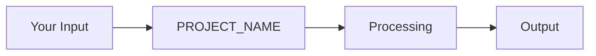

# Full Legendary README Template

> Copy this template and replace all `[PLACEHOLDER]` values with your project's information.
> Delete sections you don't need. Keep the personality.

---

<!-- COPY BELOW THIS LINE -->

<p align="center">
  
</p>

<p align="center">
  <a href="https://github.com/[USER]/[REPO]/actions"></a>
  <a href="https://github.com/[USER]/[REPO]/releases"></a>
  <a href="https://github.com/[USER]/[REPO]/blob/main/LICENSE"></a>
  <a href="https://github.com/[USER]/[REPO]/stargazers"></a>
  
</p>

<p align="center">
  <strong>[ONE_KILLER_SENTENCE: What this does and why it matters, in plain English.]</strong>
</p>

<p align="center">
  <a href="#-quick-start">Quick Start</a> •
  <a href="#-features">Features</a> •
  <a href="#-documentation">Docs</a> •
  <a href="#-contributing">Contributing</a>
</p>

---

## 🤔 What is [PROJECT_NAME]?

**[PROJECT_NAME]** [does what] for [whom]. Think of it as [simple analogy that anyone can understand].

**Why does this exist?** Because [the current way of doing this] requires [painful thing], and life is too short for that.

```bash
# Try it right now (takes ~30 seconds)
[ONE_COMMAND_TO_GET_STARTED]
```

---

<details open>
<summary><strong>📖 Table of Contents</strong></summary>

- [Features](#-features)
- [Quick Start](#-quick-start)
- [Usage](#-usage)
- [Architecture](#-architecture)
- [Configuration](#-configuration)
- [Performance](#-performance)
- [FAQ](#-faq)
- [Contributing](#-contributing)
- [License](#-license)

</details>

---

## ✨ Features

| | Feature | Description |
| :---: | :--- | :--- |
| 🚀 | **[Feature 1]** | [Benefit-focused description, not technical jargon] |
| 🔒 | **[Feature 2]** | [What problem this solves for the user] |
| 🧩 | **[Feature 3]** | [Why this matters in plain English] |
| 📱 | **[Feature 4]** | [Where/how this works] |
| ⚡ | **[Feature 5]** | [The "wow" factor] |

---

## 🚀 Quick Start

### Prerequisites

| Requirement | Version | Check |
| :--- | :--- | :--- |
| [Runtime] | [version]+ | `[check command]` |
| [Tool] | [version]+ | `[check command]` |

<details>
<summary>Need to install these? Click here.</summary>

- **[Runtime]**: Download from [link]
- **[Tool]**: Download from [link]

</details>

### Installation

```bash
# Option 1: The one-liner (recommended)
[INSTALL_COMMAND]

# Option 2: Package manager
[PACKAGE_MANAGER_COMMAND]

# Option 3: From source
git clone https://github.com/[USER]/[REPO].git
cd [REPO]
[BUILD_COMMAND]
```

### Verify It Works

```bash
[VERIFY_COMMAND]
# Expected output: [EXPECTED_OUTPUT]
```

🎉 **You're ready!** Keep reading for usage examples, or jump to the [docs][DOCS_LINK].

---

## 📖 Usage

### Basic Example

```[language]
[BASIC_CODE_EXAMPLE]
```

### Real-World Example

```[language]
[REALISTIC_CODE_EXAMPLE_WITH_COMMENTS]
```

<details>
<summary>🔥 Advanced Usage (for power users)</summary>

```[language]
[ADVANCED_CODE_EXAMPLE]
```

</details>

---

## 🏗️ Architecture

Here's how [PROJECT_NAME] works under the hood:



**In plain English:** [Simple explanation of the flow that a non-developer could follow.]

<details>
<summary>📂 Project Structure</summary>

```
[REPO]/
├── src/                    # [What this contains]
│   ├── core/              # [What this contains]
│   ├── api/               # [What this contains]
│   └── utils/             # [What this contains]
├── tests/                  # [What this contains]
├── docs/                   # [What this contains]
├── .env.example            # Config template
└── README.md               # You are here 📍
```

</details>

---

## ⚙️ Configuration

Create a `.env` file (or copy the example):

```bash
cp .env.example .env
```

| Variable | Required | Default | Description |
| :--- | :---: | :---: | :--- |
| `[VAR_1]` | Yes | — | [What this controls] |
| `[VAR_2]` | No | `[default]` | [What this controls] |
| `[VAR_3]` | No | `[default]` | [What this controls] |

---

## 📊 Performance

| Metric | [PROJECT_NAME] | Alternative A | Alternative B |
| :--- | :---: | :---: | :---: |
| [Metric 1] | **[best value]** | [value] | [value] |
| [Metric 2] | **[best value]** | [value] | [value] |
| [Metric 3] | **[best value]** | [value] | [value] |

<details>
<summary>How we measured this</summary>

[Methodology, hardware specs, and how to reproduce]

</details>

---

## ❓ FAQ

<details>
<summary><strong>Is this production-ready?</strong></summary>

[Honest answer with evidence]

</details>

<details>
<summary><strong>How is this different from [competitor]?</strong></summary>

[Honest, respectful comparison]

</details>

<details>
<summary><strong>[Common question 3]?</strong></summary>

[Clear answer]

</details>

---

## 🤝 Contributing

We welcome contributions of all kinds! See [CONTRIBUTING.md](CONTRIBUTING.md) for guidelines.

```bash
# Quick contribution setup
git clone https://github.com/[USER]/[REPO].git
cd [REPO]
[SETUP_COMMAND]
[TEST_COMMAND]  # Make sure everything passes
```

<a href="https://github.com/[USER]/[REPO]/graphs/contributors">
  
</a>

---

## 🔒 Security

Found a vulnerability? **DO NOT** open a public issue.
Email [SECURITY_EMAIL] or use [GitHub Security Advisories](https://github.com/[USER]/[REPO]/security/advisories/new).

---

## 📄 License

[LICENSE_TYPE] — see [LICENSE](LICENSE) for details.

---

<details>
<summary>🥚 Easter Egg (you found it!)</summary>

[FUN_HIDDEN_CONTENT]

Achievement Unlocked: 🏆 README Completionist

</details>

---

<p align="center">
  
</p>

<p align="center">
  Made with ❤️ by <a href="https://github.com/[USER]">@[USER]</a>
  <br />
  <sub>If this helped you, a ⭐ would make our day!</sub>
</p>
