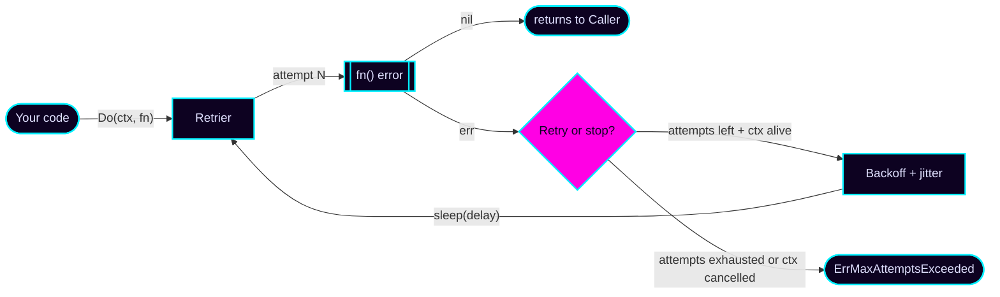

<!-- Full Legendary README Template — swap ProjectName, description, and code examples for your
     project. Demonstrates every Required/High-priority section from SKILL.md's Quick Reference
     Matrix at Tone Spectrum level 3 (Playful Hacker). Fictional example project: Ricochet, a Go
     retry/backoff library + CLI (module github.com/relaysoft/ricochet — not a real org or repo).
     To adapt: swap the capsule-render banner `text=`, the badge repo path, the Go code blocks,
     and the Mermaid diagram for your own; keep the section order, the one-tone-level-throughout
     rule, and the Table of Contents anchors matching your real headings exactly. -->

<p align="center">
  
</p>

<p align="center">
  
  
  
  
  
</p>

**What:** Ricochet retries flaky operations — HTTP calls, database writes, that one internal API
that only works on Tuesdays — with exponential backoff, real jitter, and a hard stop so it never
retries forever.

**Why:** Networks fail. Third-party APIs nap. Hand-writing `for i := 0; i < 3; i++ { time.Sleep(x) }`
in every service is how 2am pages are born. Ricochet is the boring, correct version of that loop,
written once so nobody has to write it badly five more times.

**How:**

```bash
go get github.com/relaysoft/ricochet@latest   # 1 command, 0 excuses
```

```go
err := ricochet.Do(ctx, func() error {
	return callFlakyAPI()
})
```

That's the whole pitch. Everything below is just details for people who like details — hi, you.

---

## Table of Contents

- 🧰 [What's In The Box](#whats-in-the-box) — the feature list, with receipts
- 🚀 [Quick Start](#quick-start) — running in under a minute
- 🗺️ [How It Fits Together](#how-it-fits-together) — one diagram, one decision
- 💻 [Usage Examples](#usage-examples) — copy-paste code that actually runs
- ⚙️ [Configuration](#configuration) — every option and every env var
- 📖 [API Reference](#api-reference) — every exported function, typed and explained
- 🆘 [Troubleshooting](#troubleshooting) — probably not a Ricochet bug, but let's check
- ❓ [FAQ](#faq) — questions people actually asked in Issues
- 🤝 [Contributing](#contributing) — how to get a PR merged, not just opened
- 🏆 [Hall of Fame](#hall-of-fame) — the people who made this less broken
- 📜 [License](#license) — the legally-binding TL;DR

---

## What's In The Box

- ⚡ **Exponential backoff with real jitter** — full jitter per the [AWS backoff
  paper](https://aws.amazon.com/blogs/architecture/exponential-backoff-and-jitter/), not the
  "add `rand.Intn(100)` and call it a day" kind.
- 🛑 **Bounded by default** — every retrier has a max-attempts ceiling and an optional
  max-elapsed-time ceiling. Ricochet will not retry until the heat death of the universe, unlike
  some `for {}` loops we've all written at 2am.
- 🔌 **Context-aware** — every call takes a `context.Context`. Cancel it, and Ricochet stops
  mid-backoff instead of politely pretending it didn't hear you.
- 🎛️ **Pluggable backoff strategies** — exponential, constant, or Fibonacci out of the box, all
  satisfying one 12-line interface if you want your own.
- 🪶 **Zero dependencies** — `go.mod` has exactly one `require` line, and it's the Go standard
  library's `errors` package.
- 🖥️ **Ships a CLI too** — wrap any shell command in retries without writing a line of Go:
  `ricochet run -- curl https://flaky.example.com`.
- 🧪 **100% branch-covered retry logic** — the part of your stack you're trusting to fail
  gracefully has actually been tested to fail gracefully, including the flaky-network simulator
  in `go test ./... -race`.

---

## Quick Start

Install the library:

```bash
go get github.com/relaysoft/ricochet@latest
```

Or install the CLI, if you'd rather not write Go for this:

```bash
go install github.com/relaysoft/ricochet/cmd/ricochet@latest
```

Retry something in the next 30 seconds:

```go
package main

import (
	"context"
	"fmt"
	"net/http"

	"github.com/relaysoft/ricochet"
)

func main() {
	ctx := context.Background()

	err := ricochet.Do(ctx, func() error {
		resp, err := http.Get("https://api.example.com/health")
		if err != nil {
			return err // any non-nil error is retryable by default
		}
		defer resp.Body.Close()
		if resp.StatusCode >= 500 {
			return fmt.Errorf("server said %d, worth another shot", resp.StatusCode)
		}
		return nil
	})

	if err != nil {
		fmt.Println("gave up:", err) // only fires once every retry is exhausted
	}
}
```

Or from a terminal, no Go required:

```bash
ricochet run --max-attempts=5 -- curl -sf https://api.example.com/health
```

---

## How It Fits Together

Ricochet has exactly one moving decision: *retry or stop?* Everything else is bookkeeping around
that one fork in the road.


```mermaid
flowchart LR
    Caller(["Your code"]) -->|"Do(ctx, fn)"| Retrier["Retrier"]
    Retrier -->|"attempt N"| Fn[["fn() error"]]
    Fn -->|"nil"| Success(["returns to Caller"])
    Fn -->|"err"| Decide{"Retry or stop?"}
    Decide -->|"attempts left + ctx alive"| Backoff["Backoff + jitter"]
    Backoff -->|"sleep(delay)"| Retrier
    Decide -->|"attempts exhausted or ctx cancelled"| GiveUp(["ErrMaxAttemptsExceeded"])

    classDef default fill:#0D0221,stroke:#00F0FF,color:#E0E0FF,stroke-width:2px
    classDef highlight fill:#FF00E4,stroke:#00F0FF,color:#0D0221
    class Decide highlight
```

*In plain English: your function runs, and if it fails, Ricochet checks whether it still has
attempts left and whether your context is still alive. If yes, it waits — backoff plus jitter —
and tries again. If no, it hands you back one clean, wrapped error instead of retrying into
infinity.*

---

## Usage Examples

### Basic Retry (the one you'll actually use)

```go
ctx, cancel := context.WithTimeout(context.Background(), 30*time.Second)
defer cancel()

err := ricochet.Do(ctx, func() error {
	row := db.QueryRowContext(ctx, "SELECT id FROM orders WHERE id = $1", orderID)
	return row.Scan(&order.ID) // sql.ErrNoRows is retryable here on purpose:
	// this table is written by an async job that sometimes lags a few seconds
})
if err != nil {
	return fmt.Errorf("order %s never showed up: %w", orderID, err)
}
```

Note the `context.WithTimeout` — it's doing double duty. It bounds the whole retry loop AND every
individual query inside it, so a slow database can't turn "retry 3 times" into "hang forever."

### Batch Retries

```go
r := ricochet.New(ricochet.WithMaxAttempts(4))

var failed []string
for _, url := range urls {
	url := url
	if err := r.Do(ctx, func() error { return warmCache(url) }); err != nil {
		failed = append(failed, url) // one Retrier, reused across the whole batch
	}
}
if len(failed) > 0 {
	log.Printf("%d/%d URLs never warmed, giving up on: %v", len(failed), len(urls), failed)
}
```

### Custom Backoff Strategy

```go
r := ricochet.New(
	ricochet.WithMaxAttempts(6),
	ricochet.WithBackoff(ricochet.Exponential(200*time.Millisecond, 10*time.Second)),
	ricochet.WithJitter(ricochet.FullJitter),
	ricochet.WithOnRetry(func(attempt int, err error, delay time.Duration) {
		log.Printf("attempt %d failed (%v), retrying in %s", attempt, err, delay)
	}),
)

err := r.Do(ctx, writeToDatabase) // r is safe to reuse across many calls
```

### Handling Permanent Failures (the try/catch this README promised)

```go
err := ricochet.Do(ctx, func() error {
	resp, err := chargeCard(order)
	if err != nil {
		return err
	}
	if resp.StatusCode == http.StatusPaymentRequired {
		// Retrying a declined card 5 times will not make it less declined.
		return ricochet.Permanent(err) // stops retrying now, saves the rest of the backoff budget
	}
	return nil
})

var permErr *ricochet.PermanentError
if errors.As(err, &permErr) {
	notifyUser("payment failed — no amount of retrying fixes this one")
}
```

### CLI Usage

```bash
# Retry a flaky deploy step up to 8 times, 500ms base backoff
ricochet run --max-attempts=8 --base-delay=500ms -- ./scripts/deploy.sh

# Exit code mirrors the underlying command's final exit code
echo $?
```

---

## Configuration

Two surfaces exist: functional `Option`s for the library, environment variables for the CLI.

### Library Options

| Option | Default | What happens if you skip it |
| :--- | :--- | :--- |
| `WithMaxAttempts(n int)` | `3` | Ricochet stops after 3 tries — plenty for a network blip, not enough for a truly dead dependency |
| `WithBackoff(s Strategy)` | `Exponential(100ms, 5s)` | Retries back off exponentially between 100ms and 5s |
| `WithJitter(j JitterMode)` | `FullJitter` | Every retrying client backs off on the exact same clock — hello, thundering herd |
| `WithMaxElapsed(d time.Duration)` | `0` (disabled) | Ricochet can retry past any wall-clock budget, bounded only by `WithMaxAttempts` |
| `WithOnRetry(fn func(int, error, time.Duration))` | no-op | Retries happen silently — fine in production, less fun while debugging at 2am |

### CLI Environment Variables

| Variable | Required | Default | What happens if you skip it |
| :--- | :---: | :--- | :--- |
| `RICOCHET_MAX_ATTEMPTS` | No | `3` | Same default as the library — prefer `--max-attempts` for a one-off override |
| `RICOCHET_BASE_DELAY` | No | `100ms` | Accepts any Go `time.Duration` string (`500ms`, `2s`, `1m`) |
| `RICOCHET_QUIET` | No | `false` | Ricochet logs one line per retry attempt to stderr; set `true` to silence it |

---

## API Reference

### `ricochet.Do(ctx context.Context, fn func() error, opts ...Option) error`

Runs `fn` with a one-off retrier built from `opts`. Shorthand for `ricochet.New(opts...).Do(ctx,
fn)` — reach for this unless you're reusing the same retry policy across many call sites.

| Param | Type | Required | Description |
| :--- | :--- | :---: | :--- |
| `ctx` | `context.Context` | Yes | Cancelling it stops retries immediately, even mid-backoff |
| `fn` | `func() error` | Yes | Return `nil` for success, any `error` to retry, `ricochet.Permanent(err)` to stop now |
| `opts` | `...Option` | No | Same options accepted by `New` |

**Returns:** `error` — `nil` on eventual success, `*ricochet.PermanentError` if `fn` gave up early,
or `ErrMaxAttemptsExceeded` (wrapping the last underlying error) once attempts run out.

### `ricochet.New(opts ...Option) *Retrier`

Builds a reusable `Retrier`. Construct once at startup, call `.Do` many times, so every call site
shares one policy instead of copy-pasting options everywhere. Safe for concurrent use once built.

### `(*Retrier) Do(ctx context.Context, fn func() error) error`

Same contract as the package-level `Do`, using the `Retrier`'s pre-built policy.

### Backoff Strategy Constructors

| Function | Signature | Behavior |
| :--- | :--- | :--- |
| `Exponential` | `Exponential(base, max time.Duration) Strategy` | Doubles the delay each attempt, capped at `max` |
| `Constant` | `Constant(interval time.Duration) Strategy` | Same delay every attempt — the tortoise, not the hare |
| `Fibonacci` | `Fibonacci(base time.Duration) Strategy` | Grows slower than exponential, faster than constant — for when you're not sure how flaky this really is |

### `ricochet.Permanent(err error) error`

Wraps `err` so Ricochet stops retrying on the next check instead of spending the rest of the
attempt budget on something backoff can't fix — a 400, a declined card, a typo in a URL.

**Don't:** wrap every error in `Permanent` "to be safe." That's just a function call with extra
steps, and it quietly turns off the retries you added this library to get.

---

## Troubleshooting

| If you see... | It's not you, it's... | Fix |
| :--- | :--- | :--- |
| Retries stop instantly, no backoff at all | Your `fn` returned `ricochet.Permanent(err)` somewhere upstream | Check the error chain with `errors.As(err, &ricochet.PermanentError{})` |
| `ErrMaxAttemptsExceeded` on the very first real failure | `WithMaxAttempts(1)` was set, or the default wasn't raised for a slower operation | Raise `WithMaxAttempts`, or switch to `WithMaxElapsed` instead of a hard attempt count |
| CLI keeps retrying longer than `--max-attempts` implies | `RICOCHET_MAX_ATTEMPTS` env var is set globally and overriding your intent | Flags win over env vars — check for a stray export in your shell profile |
| Two services retry in perfect lockstep during an outage | `WithJitter(ricochet.NoJitter)` was set, probably for a test | Switch back to `FullJitter` in production — that's the entire point of jitter |

---

## FAQ

**Q: Why is it called Ricochet?**
A: Because it bounces off failure and comes back to try again, and "Bouncy McRetry" did not test
well with the naming committee (n=1, it was a Tuesday).

**Q: Does it work with concurrent calls?**
A: Yes — a `*Retrier` is safe for concurrent use once built. Build it once at startup, not once
per request; a fresh `Retrier` per call still works, it's just wasted allocations.

**Q: Can it retry panics too?**
A: No, and you should not want it to. A panic means your program's assumptions broke; retrying it
just re-runs the broken assumption, faster. Fix the bug, not the loop.

**Q: Is this basically a rewrite of some other backoff library?**
A: It rhymes with a few. Ricochet's angle is context cancellation, a CLI, and jitter modes as
first-class `Option`s instead of an afterthought bolted onto a `Sleep` call.

**Q: Why did `ErrMaxRetries` get renamed to `ErrMaxAttemptsExceeded` in v2?**
A: Because "retries" was ambiguous about whether the first attempt counted. `ErrMaxAttemptsExceeded`
is longer to type and impossible to misread. v1 users get a deprecated alias for one major version,
then it's gone — see the [migration note](CHANGELOG.md#v2) before you upgrade.

---

## Contributing

Found a bug, or a backoff curve that doesn't feel right? We'd love the PR.

```bash
git clone https://github.com/relaysoft/ricochet.git
cd ricochet
go test ./... -race    # must stay green — this includes the flaky-network simulator
```

Read [CONTRIBUTING.md](CONTRIBUTING.md) for the full guide. Short version: one focused change per
PR, tests for anything touching the backoff math, and please don't remove the jitter "for
simplicity" — that PR has been opened three times and closed three times, gently.

---

## Hall of Fame

Everyone below fixed something at 2am so your retries wouldn't have to:

<a href="https://github.com/relaysoft/ricochet/graphs/contributors">
  
</a>

Ricochet's jitter math leans on the [AWS Architecture Blog's backoff-and-jitter
post](https://aws.amazon.com/blogs/architecture/exponential-backoff-and-jitter/) — read it once
and you'll never write naive linear retries again.

---

## License

[MIT](LICENSE) © 2026 The Ricochet Contributors — do whatever you want with it, just don't blame
us if you disable jitter and your database falls over during a deploy.

<p align="center">
  
</p>

<!-- Not listed in the Table of Contents above. If you're reading raw markdown source instead of
     the rendered page: hello, View Source enjoyer. -->
## <a name="the-fourth-backoff-strategy"></a> The Backoff Strategy That Didn't Ship

There's a fourth `Strategy` sitting in an old branch called `Spite`. Its delay grows every time
you check your phone while waiting for the retry to succeed. It never passed code review. It also
never lost an argument about why it shouldn't ship.

```
┌───────────────┐     it fails      ┌────────────────┐
│  Your Request │ ─────────────────▶│  Spite Backoff  │
└───────────────┘                   └────────┬────────┘
                                              │ waits exactly
                                              │ as long as you're
                                              │ staring at the terminal
                                              ▼
                                     ┌────────────────┐
                                     │  Still Failing  │
                                     └────────────────┘
```

*A backoff strategy that measures your patience instead of the clock — mercifully, it lives only
in a deleted branch.*

If you made it this far by reading the source, you're exactly the kind of person this project was
built for. Go build something that retries gracefully. 🛰️
