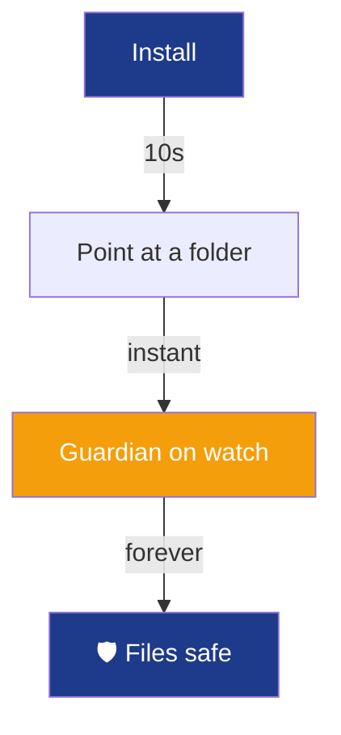

# Themed Project README Template

> A fully worked example of the **Theme Engine** in action.
> This sample uses the **Guardian Fortress** kit for a fictional backup tool called **VaultKeeper**.
> Study how EVERY element — banner, colors, mascot 🛡️ "Sir Backsalot", section names, GIFs, and catchphrase — points back to one concept: *"Your files have a guardian."*
> To reuse: swap the theme kit, replace `[bracketed]` values, and keep the structure.

---

<!-- ════════════ THEME KIT (keep as a comment for future editors) ════════════
Concept:     "Your files have a guardian"
Archetype:   Guardian Fortress
Mascot:      🛡️ Sir Backsalot
Catchphrase: "Sleep well. The Guardian is watching."
Palette:     #1E3A8A · #64748B · #F59E0B · BG #0F172A · Text #F1F5F9
Gradient:    0:1E3A8A,100:F59E0B
═══════════════════════════════════════════════════════════════════════════ -->

<!-- COPY BELOW THIS LINE -->

<!-- BANNER: themed colors + animation -->
<p align="center">
  
</p>

<!-- TYPING TAGLINE: the catchphrase, in a themed font -->
<p align="center">
  
</p>

<!-- BADGES: only palette colors (navy, steel, gold) -->
<p align="center">
  
  
  
  
</p>

<!-- HERO GIF: the mascot's domain — a vault/shield (themed, not random) -->
<p align="center">
  
  <br />
  <sub><em>🛡️ Sir Backsalot reporting for duty.</em></sub>
</p>

---

## 📜 The Oath  <!-- themed name for "Intro" -->

**VaultKeeper** automatically backs up your files so you never lose work again. It runs quietly in the background, copies your important folders to safe storage, and lets you roll back to any earlier version in one command.

Think of it as a **guardian angel for your files** 🛡️. You don't have to remember to back up — Sir Backsalot never sleeps, never forgets, and never complains.

**Why?** Because losing three days of work to a crashed laptop is a special kind of pain that nobody should feel twice.

```bash
# Summon the Guardian in 30 seconds
npm install -g vaultkeeper && vaultkeeper guard ./my-project
```

> **For everyone:** A "backup" is just a safe copy of your files kept somewhere else. If your computer breaks, your copy is still safe. That's all this does — automatically.

---

## 🗡️ The Arsenal  <!-- themed name for "Features" -->

<table>
  <tr>
    <td align="center" width="33%">
      <br /><br />
      <strong>Always Watching</strong><br />
      <sub>Backs up automatically, every change</sub><br /><br />
    </td>
    <td align="center" width="33%">
      <br /><br />
      <strong>Time Travel</strong><br />
      <sub>Roll back to any past version</sub><br /><br />
    </td>
    <td align="center" width="33%">
      <br /><br />
      <strong>Locked Tight</strong><br />
      <sub>End-to-end encrypted, always</sub><br /><br />
    </td>
  </tr>
</table>

---

## ⚔️ Summon the Guardian  <!-- themed name for "Install" -->

<table>
  <tr>
    <td>

**Step 1 — Recruit him**
```bash
npm install -g vaultkeeper
```

**Step 2 — Give him a post**
```bash
vaultkeeper guard ./important-folder
```

**Step 3 — Sleep well**
```bash
vaultkeeper status   # "All quiet. Watching 1,204 files."
```

    </td>
    <td width="40%" align="center">



    </td>
  </tr>
</table>

---

## 🏰 Standing Watch  <!-- themed name for "Usage" -->

Here's the Guardian protecting a folder, then restoring a file from yesterday:

<!-- DEMO GIF: the REAL product working — this one is non-negotiable -->
<p align="center">
  
  <br />
  <sub><em>Restoring a file from yesterday — in one command.</em></sub>
</p>

```bash
# See every saved version of a file
vaultkeeper history report.pdf

# Bring back the version from 2 hours ago
vaultkeeper restore report.pdf --when "2 hours ago"
```

---

## 🤝 Join the Order  <!-- themed name for "Contributing" -->

The Order of the Guardian always welcomes new knights.

<table>
  <tr>
    <td align="center" width="25%"><strong>🐛</strong><br /><a href="#">Report a Breach</a></td>
    <td align="center" width="25%"><strong>💡</strong><br /><a href="#">Propose a Weapon</a></td>
    <td align="center" width="25%"><strong>📜</strong><br /><a href="CONTRIBUTING.md">Read the Code</a></td>
    <td align="center" width="25%"><strong>⭐</strong><br /><a href="#">Pledge a Star</a></td>
  </tr>
</table>

> **Sir Backsalot says:** "A single star powers my shield for a fortnight. Probably."

---

## 📖 The Decree  <!-- themed name for "License" -->

VaultKeeper is released under the MIT License — free to use, modify, and share. See [LICENSE](LICENSE) for the full decree.

---

<!-- FOOTER: mirrors the header, mascot says goodbye in theme voice -->
<p align="center">
  
</p>

<p align="center">
  
</p>

<!-- Easter egg for source readers -->
<!--
   🛡️  You read the source. Sir Backsalot respects that.
   Secret command:  vaultkeeper --knight-mode
-->
