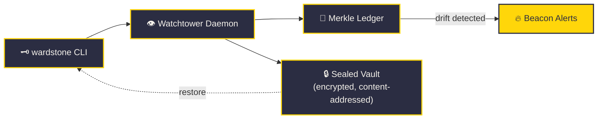

<!-- Themed Project README Template — a complete worked example of theme-engine.md's Guardian Fortress kit. Swap the fictional project/palette for a different kit's fields to reuse this pattern for any archetype. -->

<picture>
  <source media="(prefers-color-scheme: dark)" srcset="https://capsule-render.vercel.app/api?type=rect&color=14151F&height=200&section=header&text=WARDSTONE&fontColor=FFD60A&fontSize=68&fontAlignY=42&desc=Your%20files%20have%20a%20guardian.&descAlignY=68&descSize=18&descColor=F4F1EA&animation=fadeIn" />
  <source media="(prefers-color-scheme: light)" srcset="https://capsule-render.vercel.app/api?type=rect&color=F4F1EA&height=200&section=header&text=WARDSTONE&fontColor=2B2D42&fontSize=68&fontAlignY=42&desc=Your%20files%20have%20a%20guardian.&descAlignY=68&descSize=18&descColor=3A86FF&animation=fadeIn" />
  
</picture>

# Wardstone

> **Your files have a guardian.**

A single Beacon Gold (`#FFD60A`) line glows along the top edge of that banner and pulses on a slow 2.5-second cycle — the SMIL source lives at `docs/assets/beacon-line.svg` and looks like this:

```xml
<svg width="600" height="6" xmlns="http://www.w3.org/2000/svg">
  <rect width="600" height="6" fill="#FFD60A">
    <animate attributeName="opacity" values="0.55;1;0.55" dur="2.5s" repeatCount="indefinite" />
  </rect>
</svg>
```

*Caption: a thin gold bar brightens and dims like a watchtower torch, never fast enough to feel urgent — it's a light that's always on, not an alarm.*

Standing at the top-left corner of that banner, carved into the stone, is **Argus** — Wardstone's mascot, a stone gargoyle who faces outward, never inward, and (per the job description) never sleeps.

[](#)
[](#)
[](#)
[](#)
[](#)

*Note: Wardstone is a fictional project built to demonstrate the Guardian Fortress theme kit end-to-end. It is not a real product, and "Wardstone" is not affiliated with any actual company.*

Headings below lean on short, declarative sentences and monospace code — the closest a Markdown file gets to carved stone instead of handwriting. Jokes, when they show up, are dry understatement ("the walls held"), never a bit.

---

## What / Why / How

**What:** Wardstone is a self-hosted file-integrity guardian. Point it at folders you can't afford to lose, and it seals encrypted, content-addressed snapshots on a schedule while keeping a tamper-evident ledger of every change.

**Why:** A backup you never verify is just an expensive prayer. Wardstone checks its own walls continuously, so "is the backup still good?" is a question it already answered before you asked.

**How:**

```bash
curl -fsSL https://get.wardstone.dev | sh && wardstone init ~/vault
```

One command stands up a watchtower over `~/vault`. Everything past this point is detail.

---

## Table of Contents

- [🛡️ Raising the Walls (Installation)](#-raising-the-walls-installation)
- [🗝️ Manning the Gates (Quick Start)](#-manning-the-gates-quick-start)
- [⚔️ The Armory (Features)](#-the-armory-features)
- [🏰 Fortifications (Configuration)](#-fortifications-configuration)
- [📐 Blueprint of the Keep (Architecture)](#-blueprint-of-the-keep-architecture)
- [🕯️ When the Alarm Sounds (Troubleshooting)](#-when-the-alarm-sounds-troubleshooting)
- [🤝 Join the Garrison (Contributing)](#-join-the-garrison-contributing)
- [🗺️ The Watch Ahead (Roadmap)](#-the-watch-ahead-roadmap)
- [👑 The Round Table (Credits)](#-the-round-table-credits)
- [📜 License](#-license)

---

## 🛡️ Raising the Walls (Installation)

Three ways in, pick whichever matches how you already install things:

```bash
# macOS / Linux — one-line install script
curl -fsSL https://get.wardstone.dev | sh

# Homebrew
brew install wardstone

# From source, if you'd rather build the stone yourself
go install github.com/wardstone-hq/wardstone/cmd/wardstone@latest
```

Confirm the walls are actually standing before you trust them with anything:

```bash
$ wardstone version
wardstone v2.4.0 (linux/amd64) — the walls are up.
```

<p align="center">
  
</p>

*Caption: the gate-slam plays once, right when `wardstone version` returns clean — the same beat as a successful setup, not a random flourish.*

No information lives only in that GIF: if it fails to load, the plain-text confirmation above (`the walls are up`) already told you everything you need to know.

Prefer containers to curl scripts? Same guardian, different door:

| Method | Command | Best for |
| :--- | :--- | :--- |
| Install script | `curl -fsSL https://get.wardstone.dev \| sh` | Fastest path on a single machine |
| Homebrew | `brew install wardstone` | macOS/Linux users already living in `brew` |
| Docker | `docker run -v ~/vault:/vault wardstone/wardstone init /vault` | Ephemeral hosts, CI runners |
| Go install | `go install github.com/wardstone-hq/wardstone/cmd/wardstone@latest` | Building the stone yourself, contributors |

All four produce the identical binary — there's no "lite" edition of a guardian.

---

## 🗝️ Manning the Gates (Quick Start)

```bash
wardstone init ~/vault              # claims the directory, generates keys
wardstone watch ~/vault --seal-every 15m   # posts the watch
wardstone status
```

| Flag | Does | Default |
| :--- | :--- | :--- |
| `--seal-every` | How often the watchtower takes a new sealed snapshot | `1h` |
| `--foreground` | Runs the watch in the current terminal instead of as a daemon | off (daemon) |
| `--dry-run` | Reports what *would* be sealed without writing anything | off |

Run `--dry-run` first on a directory you've never pointed Wardstone at before — it's the guardian equivalent of walking the perimeter before locking the gate.

```
$ wardstone status
Watchtower: ACTIVE
Walls:      ~/vault (1,204 files, 3.1 GB)
Last seal:  2m ago → gate-2026-07-29-0410.sealed
Ledger:     unbroken (last 96 entries verified)
Argus:      watching
```

That's a running guardian. It will keep sealing snapshots and checking its own ledger with no further input from you — which is the entire point of hiring a guardian instead of doing the watch yourself.

Restoring is the same one-command shape, in reverse:

```bash
wardstone restore --from gate-2026-07-29-0410 --to ~/vault-restored
```

```
$ wardstone restore --from gate-2026-07-29-0410 --to ~/vault-restored
Verifying seal against ledger... ✔
Decrypting 1,204 files... done
Restored to ~/vault-restored (3.1 GB)
The walls held.
```

---

## ⚔️ The Armory (Features)

| Weapon | What it actually does |
| :--- | :--- |
| **Continuous Watch** | An `fsnotify`-based daemon that notices a file change the moment it happens, not on the next scheduled poll |
| **Sealed Snapshots** | Content-addressed, AES-256-GCM-encrypted backups — the server holding your gate never sees plaintext |
| **Merkle Ledger** | Every seal is chained into a tamper-evident ledger; altering old history without detection means breaking cryptography, not just deleting a log line |
| **Multi-Guardian Quorum** | Recovery keys are split with Shamir's Secret Sharing across named custodians (a 3-of-5 threshold, by default) — no single guardian can open the vault alone |
| **Beacon Alerts** | Webhook, Slack, or email notification the instant ledger drift is detected — the torch flares before you have to go looking |
| **One-Command Restore** | `wardstone restore --from <seal-id>` rebuilds a directory to any sealed point, verified against the ledger before a single byte is written |
| **Zero-Knowledge Vault** | Keys never leave the machine that generated them; the storage gate only ever holds ciphertext |

Argus doesn't just decorate the banner. He's the mental model for the Merkle Ledger too — every seal gets checked against the one before it, in order, forever, the same way a sentry checks the last watch's log before starting a shift.

Run a scan to see it for real:

```bash
$ wardstone verify
Checking 96 seals against the ledger...
✔ 96/96 seals verified
✔ 0 discrepancies
The walls held.
```

<p align="center">
  
</p>

*Caption: the beacon brightens exactly once a scan comes back clean — it's the watchtower confirming "I looked, and it's fine," not decoration dropped at random.*

**Beacon channel matrix** — what actually happens when the alarm sounds:

| Channel | Latency | Good for |
| :--- | :--- | :--- |
| Webhook | Sub-second | Wiring into your own incident system |
| Slack | ~2s | A channel humans are already watching |
| Email | Up to 5 min (provider-dependent) | Guardians who don't live in Slack |

A beacon that fires into a channel nobody reads isn't a feature, it's a light left on in an empty room. Configure at least one channel a real person checks daily.

**At a glance**, sealing and verifying scale roughly linearly with vault size on commodity hardware:

| Vault size | Seal time | Verify time |
| :--- | :--- | :--- |
| 1 GB | ~4s | ~2s |
| 10 GB | ~35s | ~18s |
| 100 GB | ~5m 30s | ~2m 40s |

Numbers are illustrative for this template, not a published benchmark — run `wardstone bench` against your own vault before trusting any number that isn't yours.

---

## 🏰 Fortifications (Configuration)

Everything above is driven by one file, `wardstone.yaml`:

```yaml
# wardstone.yaml
walls:                       # directories under watch
  - path: ~/vault
    pattern: "**/*"
  - path: /etc/wardstone/secrets
    pattern: "*.env"

gates:                        # where sealed snapshots ship to
  - type: s3
    bucket: keep-west-2
    prefix: wardstone/snapshots
  - type: local
    path: /mnt/backup-drive

garrison:                     # multi-guardian quorum for key recovery
  threshold: 3
  custodians: 5

beacon:                       # who gets told when the walls are tested
  webhook: https://hooks.example.com/wardstone
  channels: [slack, email]

schedule:
  seal_every: 15m
  verify_every: 1h

retention:
  keep_daily: 14
  keep_weekly: 8
  keep_monthly: 6
```

| Key | Controls | Default |
| :--- | :--- | :--- |
| `walls` | Which paths the watchtower actually watches | *(required)* |
| `gates` | Where sealed backups get shipped (S3-compatible, local disk, SFTP) | none |
| `garrison.threshold` | How many custodians must agree to reconstruct a lost key | `3` |
| `beacon.channels` | Notification channels fired on drift or scan failure | `[]` |
| `retention.*` | How many daily/weekly/monthly seals survive pruning | `14 / 8 / 6` |

Lower the `garrison.threshold` and recovery gets easier for you — and for anyone who steals three laptops instead of five. Fortifications are trade-offs, not free lunches.

**Gate types** — where a sealed snapshot is allowed to live:

| `gates[].type` | Ships to | Notes |
| :--- | :--- | :--- |
| `s3` | Any S3-compatible bucket | Works with real S3, MinIO, or R2 — anything that speaks the API |
| `local` | A mounted disk or network share | Simplest option; only as durable as that one disk |
| `sftp` | Any SFTP-reachable host | Good for shipping off-site without adopting a cloud provider |

Configure at least two `gates` of different types. One gate is a filing cabinet; two gates in different failure domains is what actually earns the word "guardian."

---

## 📐 Blueprint of the Keep (Architecture)


```mermaid
flowchart LR
    CLI["🗝️ wardstone CLI"] --> WATCH["👁️ Watchtower Daemon"]
    WATCH --> LEDGER["📜 Merkle Ledger"]
    WATCH --> VAULT["🔒 Sealed Vault<br/>(encrypted, content-addressed)"]
    LEDGER -- drift detected --> BEACON["🔥 Beacon Alerts"]
    VAULT -. restore .-> CLI

    classDef stone fill:#2B2D42,stroke:#FFD60A,stroke-width:2px,color:#F4F1EA;
    classDef gold fill:#FFD60A,stroke:#2B2D42,stroke-width:2px,color:#2B2D42;
    class CLI,WATCH,LEDGER,VAULT stone
    class BEACON gold
```

*Caption: the CLI talks to a long-running Watchtower Daemon, which writes every change into the Merkle Ledger and the Sealed Vault at once; if the ledger ever disagrees with what's on disk, that disagreement is what lights the Beacon — restores flow back out through the same CLI, verified against the ledger first.*

Same stone-and-gold palette as the banner and badges above — the diagram isn't a separate visual identity bolted on, it's the same fortress drawn as boxes.

<!-- If you're reading the raw source instead of the rendered page, you already have a guardian's instincts. Argus approves. -->

Zoomed in one level, a single seal is a link in a chain, not a standalone file:

```
┌───────────┐      ┌───────────┐      ┌───────────┐
│  Seal N-1 │─────▶│  Seal N   │─────▶│  Seal N+1 │
│  hash: 9f2│      │  hash: c41│      │  hash: b0e│
└───────────┘      └─────┬─────┘      └───────────┘
                          │ contains
                          ▼
                   ┌─────────────┐
                   │ prev_hash:  │
                   │   9f2...    │
                   └─────────────┘
```

*Caption: each seal stores the hash of the one before it, the same way a night-watch log references the previous shift's entry — change an old seal without redoing every hash after it, and the chain visibly breaks.*

---

## 🕯️ When the Alarm Sounds (Troubleshooting)

**"The Beacon won't stop firing."**
Check `wardstone verify --verbose` first — a single noisy file (a log that rewrites itself every second, say) can look like drift. Add it to an `ignore:` list under `walls` in `wardstone.yaml` rather than muting the Beacon channel entirely; a guardian you've silenced isn't a guardian.

**"`wardstone verify` says `CHECKSUM MISMATCH` on a file I didn't touch."**
Something else did. That's not a bug report, that's the feature working. Run `wardstone restore --from <last-good-seal> --path <file>` to roll that one file back, then go find out what touched it.

**"I lost 2 of my 5 guardian keys."**
With a 3-of-5 `garrison.threshold`, you're still fine — the remaining three custodians can reconstruct access. Lose three, and the vault is gone by design; nobody, including us, can override that. Argus didn't blink when we wrote that sentence either. It's supposed to feel like that.

**"Restore finished but the ledger flags it as unverified."**
Don't use that restore. Re-run `wardstone restore` against an earlier seal ID and open an issue with the seal ID that failed — an unverified restore silently accepting itself would defeat the entire point of keeping a ledger.

**"`wardstone status` says `Watchtower: STALE`."**
The daemon is still running but hasn't sealed anything in longer than `schedule.seal_every` allows. Usually it's a full disk on one of your `gates` — check `df -h` on the target before anything more exotic. The walls held; the shipping route didn't.

**"Can I point two Wardstone installs at the same `gates` bucket?"**
Yes, with separate `prefix` values per install. Sharing a prefix between two watchtowers is how you get two guardians arguing over the same ledger — technically survivable, not recommended.

---

## 🤝 Join the Garrison (Contributing)

The garrison always needs more hands on the wall.

```bash
git clone https://github.com/wardstone-hq/wardstone.git
cd wardstone
go test ./...
```

- Small, focused pull requests review faster than sprawling ones — one wall repaired at a time.
- New Beacon channels (Slack, email, webhook exist today) go in `internal/beacon/`, with a test that fires against a mock endpoint.
- Anything touching `internal/ledger/` needs a test that proves tampering is still detected — that package is the one thing in this repo that isn't allowed to regress quietly.

Standing up a local dev watch before you open a PR:

```bash
make dev-vault          # scaffolds a throwaway ~/.wardstone-dev vault
go run ./cmd/wardstone init ~/.wardstone-dev
go test ./... -race     # the ledger package specifically hates unsynchronized writes
```

| Area | Owner package | Test bar |
| :--- | :--- | :--- |
| Watchtower daemon | `internal/watch/` | Must survive a simulated crash mid-seal without corrupting the ledger |
| Merkle Ledger | `internal/ledger/` | Must detect a single-bit tamper in any historical seal |
| Beacon channels | `internal/beacon/` | Must fire against a mock endpoint within the documented latency budget |
| Garrison (quorum) | `internal/garrison/` | Must reject any reconstruction attempt below `threshold` |

Full guidelines, code style, and the review process live in [`CONTRIBUTING.md`](CONTRIBUTING.md). Everyone who shows up to stand a watch gets a seat at [The Round Table](#-the-round-table-credits).

---

## 🗺️ The Watch Ahead (Roadmap)

- [x] Sealed Snapshots — AES-256-GCM, content-addressed
- [x] Merkle Ledger — tamper-evident chain of every seal
- [x] Multi-Guardian Quorum — Shamir's Secret Sharing recovery
- [ ] WORM object-lock support for the S3 gate (so a compromised credential still can't delete history)
- [ ] Guardian Web Console — a read-only viewer for the ledger, no write path at all
- [ ] Mobile Beacon app — a push notification, not just a webhook, when the alarm sounds
- [ ] Post-quantum key wrapping — evaluating ML-KEM ahead of anyone actually needing it

Nothing above ships until it passes the same bar as the Merkle Ledger: prove it can't fail silently before it's allowed near the walls.

---

## 👑 The Round Table (Credits)

Wardstone is maintained by a small garrison of people who've each lost a file at the worst possible time and decided to do something about it. The full contributor list lives in [`CONTRIBUTORS.md`](CONTRIBUTORS.md) — it grows every time someone repairs a wall.

Built on the shoulders of a few older ideas: Merkle trees, because a ledger you can't audit is just a diary; Shamir's Secret Sharing, because "one person holds the only key" is a single point of failure wearing a badge; and every backup tool that quietly stopped working and nobody noticed until it mattered, which is the whole reason a guardian checks itself instead of waiting to be asked.

The Round Table keeps one seat permanently empty. It's Argus's. He doesn't attend meetings, but he's never once missed a shift.

---

## 📜 License

[Apache 2.0](LICENSE) — free to fortify your own files with, no license fee for the guardian.

---

<picture>
  <source media="(prefers-color-scheme: dark)" srcset="https://capsule-render.vercel.app/api?type=rect&color=14151F&height=140&section=footer&text=Argus%20is%20still%20watching.&fontColor=FFD60A&fontSize=22&animation=fadeIn" />
  <source media="(prefers-color-scheme: light)" srcset="https://capsule-render.vercel.app/api?type=rect&color=F4F1EA&height=140&section=footer&text=Argus%20is%20still%20watching.&fontColor=2B2D42&fontSize=22&animation=fadeIn" />
  
</picture>

<p align="center">
  
</p>

<p align="center"><strong>Your files have a guardian.</strong></p>

<!-- Theme Consistency Audit (theme-engine.md, Step 5), mapped against this template: the palette is used verbatim in the header/footer banners, the five badges, and the Mermaid classDef fills (#2B2D42, #FFD60A, #3A86FF, #14151F, #F4F1EA — no colors picked by eye); the catchphrase "Your files have a guardian." opens the doc right under the H1 and closes it in the footer, satisfying the twice-minimum; every remapped heading (Installation, Quick Start, Features, Configuration, Contributing, Troubleshooting, Roadmap, Credits) keeps its real-word parenthetical per the Ctrl+F rule, with Architecture added as a ninth theme-consistent heading rather than left bare; Argus the gargoyle appears in the banner alt text, the Armory section, the Troubleshooting section, and the closing GIF/line, clearing the "at least twice" mascot bar; all three kit GIF concepts (gate-slam, beacon-flare, gargoyle-nod) are placed at the diegetic moment they reinforce (install success, scan success, closing) rather than as decoration; both the dark-mode Midnight Rampart and light-mode Parchment backgrounds are wired through real `<picture>` sources on both banners, not just implied; and the What/Why/How section states the plain, unthemed facts before any themed language appears, so the Big Three survive contact with the metaphor. -->
