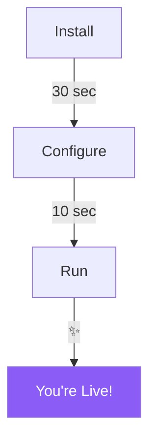
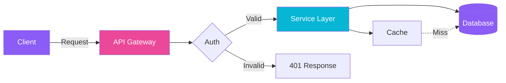

# Visual Showcase README Template

> A template that demonstrates maximum visual impact while maintaining readability.
> Choose your style from the Visual Style System, then replace all `[PLACEHOLDER]` values.
> This template uses the **Cyberpunk Neon** palette by default — swap colors to match your chosen style.

---

<!-- COPY BELOW THIS LINE -->

<!-- ═══════════════════════════════════════════════════════════════════ -->
<!-- HEADER SECTION: Banner + Typing Effect + Badges                    -->
<!-- ═══════════════════════════════════════════════════════════════════ -->

<p align="center">
  
</p>

<p align="center">
  
</p>

<!-- Action Buttons -->
<p align="center">
  <a href="#-quick-start"></a>
  <a href="[DOCS_URL]"></a>
  <a href="[COMMUNITY_URL]"></a>
</p>

<!-- Status Badges -->
<p align="center">
  
  
  
  
  
</p>

<!-- Animated Divider -->


<!-- ═══════════════════════════════════════════════════════════════════ -->
<!-- HERO SECTION: What + Why + Demo GIF                                -->
<!-- ═══════════════════════════════════════════════════════════════════ -->

## 🎯 What is [PROJECT_NAME]?

<table>
  <tr>
    <td width="55%" valign="top">

**[PROJECT_NAME]** [does what] for [whom].

Think of it as [simple analogy]. Instead of [painful old way], you just [simple new way].

**Why?** Because [problem] shouldn't require [painful solution].

```bash
# Try it in 30 seconds
[ONE_COMMAND]
```

    </td>
    <td width="45%" align="center">


<sub><em>[Caption describing what the demo shows]</em></sub>

    </td>
  </tr>
</table>

<!-- ═══════════════════════════════════════════════════════════════════ -->
<!-- TECH STACK: Visual icon row                                        -->
<!-- ═══════════════════════════════════════════════════════════════════ -->

<p align="center">
  <strong>Built With</strong>
</p>

<p align="center">
  
</p>

<!-- ═══════════════════════════════════════════════════════════════════ -->
<!-- FEATURES: Visual feature grid                                      -->
<!-- ═══════════════════════════════════════════════════════════════════ -->

## ✨ Features

<table>
  <tr>
    <td align="center" width="33%">
      <br />
      <br />
      <strong>[Feature 1 Name]</strong><br />
      <sub>[One-line benefit description]</sub>
      <br /><br />
    </td>
    <td align="center" width="33%">
      <br />
      <br />
      <strong>[Feature 2 Name]</strong><br />
      <sub>[One-line benefit description]</sub>
      <br /><br />
    </td>
    <td align="center" width="33%">
      <br />
      <br />
      <strong>[Feature 3 Name]</strong><br />
      <sub>[One-line benefit description]</sub>
      <br /><br />
    </td>
  </tr>
  <tr>
    <td align="center" width="33%">
      <br />
      <br />
      <strong>[Feature 4 Name]</strong><br />
      <sub>[One-line benefit description]</sub>
      <br /><br />
    </td>
    <td align="center" width="33%">
      <br />
      <br />
      <strong>[Feature 5 Name]</strong><br />
      <sub>[One-line benefit description]</sub>
      <br /><br />
    </td>
    <td align="center" width="33%">
      <br />
      <br />
      <strong>[Feature 6 Name]</strong><br />
      <sub>[One-line benefit description]</sub>
      <br /><br />
    </td>
  </tr>
</table>

<!-- ═══════════════════════════════════════════════════════════════════ -->
<!-- QUICK START: Step-by-step with visual indicators                   -->
<!-- ═══════════════════════════════════════════════════════════════════ -->

## 🚀 Quick Start

<table>
  <tr>
    <td>

### Step 1: Install

```bash
[INSTALL_COMMAND]
```

### Step 2: Configure

```bash
[CONFIG_COMMAND]
```

### Step 3: Run

```bash
[RUN_COMMAND]
```

    </td>
    <td width="40%" align="center">



    </td>
  </tr>
</table>

> **Result:** Open `http://localhost:[PORT]` and you should see [expected result].

<!-- ═══════════════════════════════════════════════════════════════════ -->
<!-- ARCHITECTURE: Mermaid diagram with explanation                     -->
<!-- ═══════════════════════════════════════════════════════════════════ -->

## 🏗️ Architecture



**In plain English:** [Simple 2-sentence explanation of the architecture for non-technical readers.]

<!-- ═══════════════════════════════════════════════════════════════════ -->
<!-- PERFORMANCE: Visual comparison                                     -->
<!-- ═══════════════════════════════════════════════════════════════════ -->

## 📊 Performance

<table>
  <tr>
    <td align="center"><strong>Metric</strong></td>
    <td align="center"><strong>[PROJECT_NAME] 🏆</strong></td>
    <td align="center"><strong>Alternative A</strong></td>
    <td align="center"><strong>Alternative B</strong></td>
  </tr>
  <tr>
    <td>[Metric 1]</td>
    <td align="center"></td>
    <td align="center"></td>
    <td align="center"></td>
  </tr>
  <tr>
    <td>[Metric 2]</td>
    <td align="center"></td>
    <td align="center"></td>
    <td align="center"></td>
  </tr>
  <tr>
    <td>[Metric 3]</td>
    <td align="center"></td>
    <td align="center"></td>
    <td align="center"></td>
  </tr>
</table>

<!-- ═══════════════════════════════════════════════════════════════════ -->
<!-- CONTRIBUTING + COMMUNITY                                           -->
<!-- ═══════════════════════════════════════════════════════════════════ -->

## 🤝 Contributing

<table>
  <tr>
    <td align="center" width="25%">
      <strong>🐛</strong><br />
      <a href="https://github.com/[USER]/[REPO]/issues/new?template=bug_report.md">Report Bug</a>
    </td>
    <td align="center" width="25%">
      <strong>💡</strong><br />
      <a href="https://github.com/[USER]/[REPO]/issues/new?template=feature_request.md">Request Feature</a>
    </td>
    <td align="center" width="25%">
      <strong>📝</strong><br />
      <a href="CONTRIBUTING.md">Contribute Code</a>
    </td>
    <td align="center" width="25%">
      <strong>⭐</strong><br />
      <a href="https://github.com/[USER]/[REPO]">Star This Repo</a>
    </td>
  </tr>
</table>

<p align="center">
  <a href="https://github.com/[USER]/[REPO]/graphs/contributors">
    
  </a>
</p>

<!-- ═══════════════════════════════════════════════════════════════════ -->
<!-- STAR HISTORY                                                        -->
<!-- ═══════════════════════════════════════════════════════════════════ -->

## ⭐ Star History

<p align="center">
  <a href="https://star-history.com/#[USER]/[REPO]&Date">
    <picture>
      <source media="(prefers-color-scheme: dark)" srcset="https://api.star-history.com/svg?repos=[USER]/[REPO]&type=Date&theme=dark" />
      <source media="(prefers-color-scheme: light)" srcset="https://api.star-history.com/svg?repos=[USER]/[REPO]&type=Date" />
      
    </picture>
  </a>
</p>

<!-- ═══════════════════════════════════════════════════════════════════ -->
<!-- FOOTER                                                             -->
<!-- ═══════════════════════════════════════════════════════════════════ -->


<p align="center">
  
</p>

<p align="center">
  <sub>
    Made with ❤️ by <a href="https://github.com/[USER]">@[USER]</a>
    <br />
    If [PROJECT_NAME] helped you, consider giving it a ⭐ — it means more than you think!
  </sub>
</p>

<!-- Secret for source readers -->
<!--
╔══════════════════════════════════════════╗
║  You found the secret! 🎉               ║
║  Here's a cookie: 🍪                    ║
║  Now go star this repo.                 ║
╚══════════════════════════════════════════╝
-->
