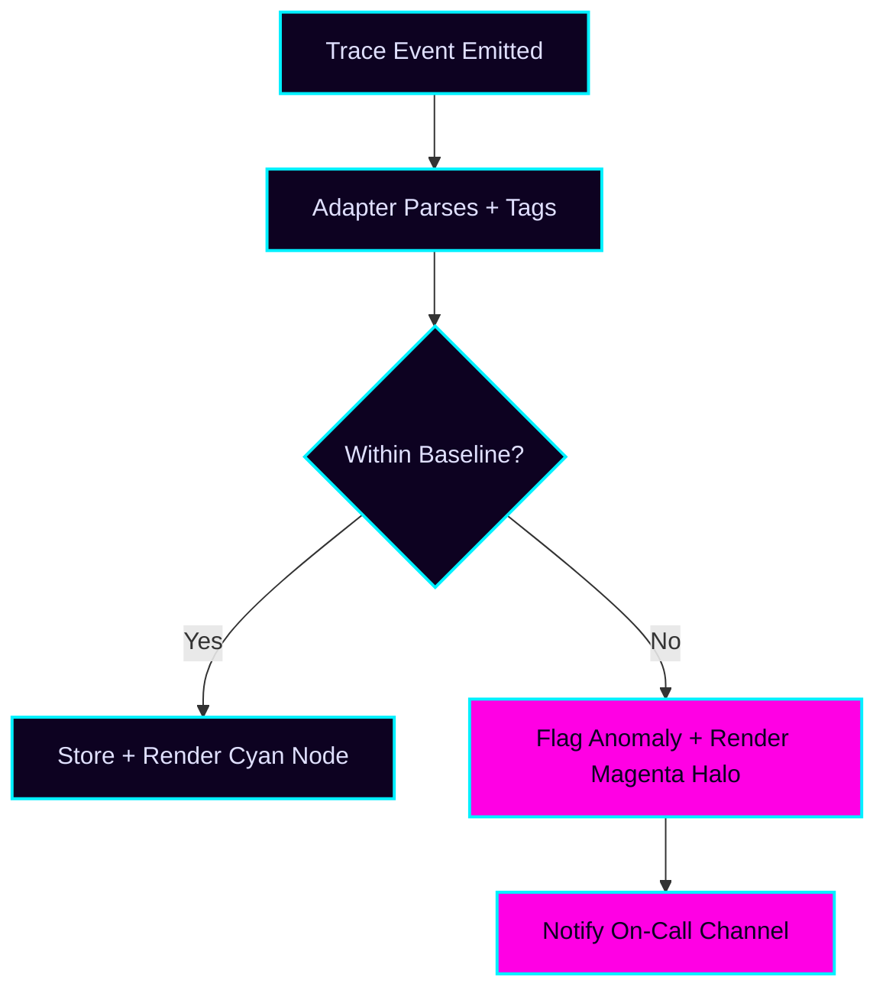

<!-- Visual Showcase README Template — demonstrates maximum visual impact within the skill's Visual Budget Rule, using the Cyberpunk Neon kit from visual-style-system.md. Swap the palette/recipe for a different style to reuse this layout. -->

<picture>
  <source media="(prefers-color-scheme: dark)" srcset="https://capsule-render.vercel.app/api?type=rect&color=0:0D0221,100:0D0221&height=160&section=header&text=PULSEGRID&fontColor=00F0FF&fontSize=42&animation=fadeIn&desc=See+every+request+light+up+the+grid&descColor=FF00E4&descAlignY=75" />
  <source media="(prefers-color-scheme: light)" srcset="https://capsule-render.vercel.app/api?type=rect&color=0:F2F0FF,100:F2F0FF&height=160&section=header&text=PULSEGRID&fontColor=FF00E4&fontSize=42&animation=fadeIn&desc=See+every+request+light+up+the+grid&descColor=0D0221&descAlignY=75" />
  
</picture>

<p align="center">
  
  
  
  
  
</p>

<p align="center"><em>Note: this README is a fictional demo project built to showcase the Cyberpunk Neon visual style. PulseGrid is not a real product.</em></p>

---

## What / Why / How

**What:** PulseGrid is a real-time observability grid for distributed systems — every service, every request, every anomaly, rendered as one living map.

**Why:** Dashboards that update every 30 seconds are useless during an incident. PulseGrid streams trace events as they happen, so you see the outage forming instead of reading about it five minutes later.

**How:**

```bash
npx create-pulsegrid my-grid   # scaffolds a config and opens the live dashboard
```

Most observability tools make you choose between "fast" and "detailed." PulseGrid's Grid Engine keeps every trace in memory just long enough to render it, then hands it off to durable storage — so the dashboard you're staring at during an incident is always showing what's happening *right now*, not what happened half a minute ago.

---

## Table of Contents

- [Feature Cards](#feature-cards)
- [Watch It Run](#watch-it-run)
- [Architecture](#architecture)
- [The Life of a Trace](#the-life-of-a-trace)
- [Live Dashboard](#live-dashboard)
- [Quick Start](#quick-start)
- [Configuration](#configuration)
- [Performance](#performance)
- [Maintainer Activity](#maintainer-activity)
- [FAQ](#faq)
- [Troubleshooting](#troubleshooting)
- [Roadmap](#roadmap)
- [Contributing](#contributing)
- [License](#license)

---

## Feature Cards

<table>
  <tr>
    <td width="50%" valign="top">
      <h3>⚡ Live Trace Grid</h3>
      <p>Sub-100ms ingestion from every instrumented service. No polling, no batch windows — a trace lands on the grid the moment it's emitted.</p>
    </td>
    <td width="50%" valign="top">
      <h3>🛰 Anomaly Radar</h3>
      <p>Rolling statistical baselines per route. When p99 drifts past its learned envelope, the node halos magenta before your pager does.</p>
    </td>
  </tr>
  <tr>
    <td width="50%" valign="top">
      <h3>🧩 Plugin Adapters</h3>
      <p>Ingest OpenTelemetry, Prometheus remote-write, or a raw webhook. One adapter interface, three protocols, zero vendor lock-in.</p>
    </td>
    <td width="50%" valign="top">
      <h3>🔐 Zero-Trust Viewer Tokens</h3>
      <p>Dashboard links carry scoped, short-lived tokens — share a live grid with an on-call teammate without handing out standing access.</p>
    </td>
  </tr>
</table>

Each card above maps to one real subsystem, not a marketing bullet — the Grid Engine, the Radar's baseline calculator, the adapter registry, and the token issuer are all separate, independently testable packages under `internal/`. If a feature is on this page, it shipped; nothing here is aspirational.

---

## Watch It Run

The clip below is a scripted terminal recording (checked in as [`docs/demo.tape`](docs/demo.tape), rendered with [VHS](https://github.com/charmbracelet/vhs)) — not a screen capture, so it replays identically every time and stays regenerable when the CLI's output changes.

<p align="center">
  
</p>

In plain English: the recording shows `pulsegrid init` generating a config file, then `pulsegrid watch` tailing live traces — most rows print in cyan, and the one row that breaches the latency baseline prints in magenta so it's impossible to miss while scrolling.

```bash
pulsegrid init                 # scaffold grid.yaml in the current directory
pulsegrid watch --tail=200     # stream the last 200 trace events, live
```

The `.tape` script behind this recording is checked into the repo rather than the GIF being a one-off screen capture — when the CLI's output format changes, regenerating the demo is `vhs docs/demo.tape`, not "re-record the whole thing and hope you don't fat-finger a command this time."

---

## Architecture


```mermaid
flowchart LR
    A[Instrumented Services] --> B[Ingest Adapter]
    B --> C[Grid Engine]
    C --> D[(Trace Store)]
    C --> E[Anomaly Radar]
    E --> F[Live Dashboard]
    classDef default fill:#0D0221,stroke:#00F0FF,color:#E0E0FF,stroke-width:2px
    classDef highlight fill:#FF00E4,stroke:#00F0FF,color:#0D0221
    class C highlight
```

*Caption: services push traces through the Ingest Adapter into the Grid Engine (highlighted in magenta), which fans out to durable storage and to the Anomaly Radar; the Radar's findings surface directly on the Live Dashboard.*

---

## The Life of a Trace


```mermaid
flowchart TD
    T[Trace Event Emitted] --> P[Adapter Parses + Tags]
    P --> Q{Within Baseline?}
    Q -->|Yes| S[Store + Render Cyan Node]
    Q -->|No| R[Flag Anomaly + Render Magenta Halo]
    R --> N[Notify On-Call Channel]
    classDef default fill:#0D0221,stroke:#00F0FF,color:#E0E0FF,stroke-width:2px
    classDef highlight fill:#FF00E4,stroke:#00F0FF,color:#0D0221
    class R,N highlight
```

*Caption: every trace is checked against its route's rolling baseline the instant it arrives — traces inside the baseline render as a normal cyan node, and the rare one that isn't (highlighted in magenta above) also fires an on-call notification, not just a color change.*

---

## Live Dashboard

<p align="center">
  
</p>

Every node on this graph is a real service; every pulse is a real request. When the grid is quiet, the dashboard is genuinely boring to watch — which is the point. The Grid Engine (see [Architecture](#architecture) above) is what makes that boredom trustworthy: nothing is sampled, batched, or smoothed before it hits the screen, so "quiet" actually means quiet.

The dashboard itself is a small React app talking to the Grid Engine over a WebSocket — no polling, no refresh button, because there's nothing to refresh.

---

## Quick Start

```bash
# 1. Scaffold a new grid
npx create-pulsegrid my-grid
cd my-grid

# 2. Point an adapter at your services (OTel shown here)
pulsegrid adapter add otel --endpoint=http://localhost:4317

# 3. Open the live dashboard
pulsegrid dashboard --open
```

| Command | What it does |
| :--- | :--- |
| `pulsegrid init` | Scaffolds `grid.yaml` in the current directory |
| `pulsegrid watch` | Streams live trace events to the terminal |
| `pulsegrid adapter add <name>` | Registers an ingest adapter (`otel`, `prometheus`, `webhook`) |
| `pulsegrid dashboard --open` | Opens the live grid in your default browser |

<details>
<summary>🥚 Psst. There's a hidden flag.</summary>

`pulsegrid watch --tail=200 --disco` recolors every trace row by service instead of by health status. It's useless for debugging and delightful for demos. We are not sorry.

</details>

---

## Configuration

Every setting below lives in `grid.yaml`; anything marked "Required" makes `pulsegrid init` refuse to start without it.

| Setting | Required | Default | Description |
| :--- | :---: | :--- | :--- |
| `grid.name` | Yes | — | Display name shown on the dashboard header |
| `ingest.adapters` | Yes | — | List of adapters to enable (`otel`, `prometheus`, `webhook`) |
| `radar.baseline_window` | No | `15m` | Rolling window used to compute each route's latency baseline |
| `radar.sensitivity` | No | `2.5` | Standard deviations from baseline before a trace is flagged |
| `dashboard.token_ttl` | No | `1h` | Lifetime of a shared viewer token before it expires |
| `store.retention` | No | `7d` | How long raw traces stay in the Trace Store before rollup |

```yaml
# grid.yaml
grid:
  name: checkout-service-grid
ingest:
  adapters: [otel]
radar:
  baseline_window: 15m
  sensitivity: 2.5
```

### Adapters, one at a time

**OTel** — point it at any OpenTelemetry Collector already exporting spans; no re-instrumentation needed.

```bash
pulsegrid adapter add otel --endpoint=http://localhost:4317
```

**Prometheus** — reads your existing `remote_write` stream; PulseGrid never scrapes `/metrics` directly.

```bash
pulsegrid adapter add prometheus --remote-write=http://localhost:9090/api/v1/write
```

**Webhook** — for anything with no native exporter; POST a trace as JSON and the adapter normalizes it onto the grid.

```bash
curl -X POST http://localhost:4980/ingest \
  -H "Content-Type: application/json" \
  -d '{"service": "checkout", "route": "/pay", "duration_ms": 84, "status": 200}'
```

---

## Performance

| Ingestion path | Events/sec | p99 dashboard lag |
| :--- | ---: | ---: |
| OTel gRPC adapter | 84,200 | 62ms |
| Prometheus remote-write | 51,900 | 140ms |
| Raw webhook | 12,300 | 210ms |

Reproduce with `make bench` — methodology, hardware spec, and dataset size are in [`/benchmarks`](./benchmarks). The OTel path is fastest because it skips a text-parsing step the other two adapters need; that gap is architectural, not a tuning trick, so don't expect webhook ingestion to close it.

---

## Maintainer Activity

<p align="center">
  
</p>

A small maintainer-activity signal, not the hero of the page — the grid above already made the case for whether this thing works.

---

## FAQ

**Q: Does PulseGrid replace my existing metrics stack (Prometheus, Grafana)?**
A: No — it sits alongside them. PulseGrid's Prometheus adapter *reads* your existing remote-write stream; it doesn't ask you to re-instrument anything.

**Q: Why does the dashboard need a token instead of just being a link?**
A: Because "just a link" to a live production trace stream is a link anyone who finds it can use forever. A scoped, expiring token means sharing a grid during an incident doesn't quietly become a standing security hole.

**Q: Can I self-host the dashboard instead of using the hosted one?**
A: Yes — `pulsegrid dashboard --open` runs entirely against your own Grid Engine instance; nothing is sent to a third-party service.

**Q: What happens if the Grid Engine goes down?**
A: Adapters buffer locally for up to 60 seconds and retry; the dashboard shows a "reconnecting" state instead of silently going blank, so a Grid Engine restart never looks like a real outage.

---

## Troubleshooting

| If you see... | It's probably... | Fix |
| :--- | :--- | :--- |
| Dashboard loads but the grid stays gray, no pulses | No adapter is registered | `pulsegrid adapter add otel --endpoint=<your-collector>` |
| `radar: baseline not yet computed` warning | The service is newer than `radar.baseline_window` | Wait out the window, or lower it in `grid.yaml` for faster (noisier) baselines |
| Terminal recording in this README won't play | Your browser/markdown viewer doesn't render inline GIFs | Open `docs/assets/pulsegrid-cli-demo.gif` directly, or re-run `docs/demo.tape` locally with VHS |
| Viewer token rejected immediately | `dashboard.token_ttl` already expired | Re-issue with `pulsegrid dashboard --share`, which mints a fresh token |

---

## Roadmap

- [x] OTel + Prometheus + webhook adapters (v2.0)
- [x] Anomaly Radar with configurable sensitivity (v2.3)
- [ ] Multi-region grid federation
- [ ] Slack/PagerDuty native notification adapters

See the [public project board](https://github.com/example-org/pulsegrid/projects/1) for live status — dates aren't listed here on purpose; a shipped board beats a stale promise.

---

## Contributing

Fork it, run the suite, open a small and focused PR:

```bash
git clone https://github.com/example-org/pulsegrid.git && cd pulsegrid
go test ./...
```

Full guidelines live in [CONTRIBUTING.md](CONTRIBUTING.md). A few starting points if you're not sure where to dig in:

| Area | Good first issue looks like | Package |
| :--- | :--- | :--- |
| Adapters | Add a new ingest source (e.g. StatsD) | `internal/adapter/` |
| Radar | Tune the baseline calculator's cold-start behavior | `internal/radar/` |
| Dashboard | New node-halo animation for a second anomaly severity tier | `web/dashboard/` |
| CLI | Add `--json` output to `pulsegrid watch` for scripting | `cmd/pulsegrid/` |

---

## Why "PulseGrid"?

Every request is a pulse. Every service is a node on the grid. When the system's healthy, the grid just... pulses, quietly, in cyan. The name is the whole pitch — we just didn't want to make you read a paragraph to get it. (You just read the paragraph anyway. Thanks for that.)

<!-- Not listed in the Table of Contents above. If you're reading raw markdown source: hi. -->
## <a name="you-found-it"></a> The Room Behind the Grid

If you made it this far by reading the source instead of the rendered page, here's the thing nobody puts in the visible docs: the Anomaly Radar's default sensitivity (`2.5` standard deviations) was picked by staring at three months of real incident data, not by rounding a nicer-sounding number. Turning it down to `1.5` catches more real problems and roughly triples your false-positive rate. There's no free lunch in anomaly detection — only a slider, and now you know which way it tilts.

---

## License

[MIT](LICENSE) © 2026 PulseGrid Labs — a fictional project built to demonstrate a README visual style.

Do whatever you want with the code. If you ship it to production and it pages you at 3am, that's between you and your Anomaly Radar sensitivity setting.

---

<p align="center">
  
</p>

<!--
Style used: Cyberpunk Neon (references/visual-style-system.md, Section 1). Every banner, badge,
diagram, GIF caption reference, stats widget, and footer pulls from that one kit only — no mixed
palettes. Exact hexes used throughout: Primary #00F0FF, Accent #FF00E4, BG-dark #0D0221,
BG-light #F2F0FF, Text #E0E0FF.

Visual Budget Rule compliance (max 1 banner + 1 badge row + 2-3 GIFs + 1-2 diagrams + 1 footer):
- Banners:  1  (capsule-render `rect` + `animation=fadeIn`, wired as a dark/light <picture> swap)
- Badge row: 1  (5 badges, all `style=for-the-badge`, alternating 00F0FF/FF00E4 on labelColor=0D0221)
- GIFs:     2  (1 terminal-recording GIF per char-art-and-animation.md §2, 1 dashboard screen
               recording — within the 2-3 cap)
- Diagrams: 2  (architecture flowchart + trace-lifecycle flowchart, both classDef-themed to the
               Cyberpunk Neon default/highlight pairing — at the 1-2 cap, not over it)
- Footers:  1  (capsule-render `rect`, dark-mode gradient reversed to mirror the header)

Non-budgeted extras layered on top per Step 6 (feature-card table, stats widget, Quick Start
table) do not compete against the five counts above — they're content structure, not banner/
badge/GIF/diagram/footer slots.
-->
