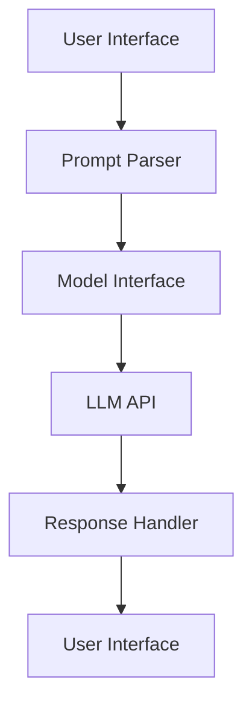

# Prompt Engineering and Systems: Comprehensive Troubleshooting & Diagnostics Guide

## Table of Contents

1. [Introduction](#introduction)
2. [Understanding Prompt Systems](#understanding-prompt-systems)
3. [Common Error Codes and Their Meanings](#common-error-codes-and-their-meanings)
4. [Recovery Strategies](#recovery-strategies)
5. [Health Checks for Prompt Systems](#health-checks-for-prompt-systems)
6. [Common Issues and Troubleshooting](#common-issues-and-troubleshooting)
7. [Case Studies and Examples](#case-studies-and-examples)
8. [Conclusion](#conclusion)

---

## Introduction

With the increasing reliance on artificial intelligence and machine learning, prompt engineering has emerged as a critical component in the development and deployment of AI models. Prompt systems are designed to interface with large language models (LLMs) and transform user input into machine-understandable commands. Given their complexity, prompt systems require robust troubleshooting and diagnostic processes to ensure optimal performance.

This guide aims to provide a comprehensive overview of troubleshooting and diagnostics in prompt systems, offering insights into error codes, recovery strategies, health checks, and common issues.

## Understanding Prompt Systems

Prompt systems serve as an intermediary layer between user inputs and AI models. These systems are responsible for interpreting, formatting, and delivering prompts to models like OpenAI's GPT or Google's BERT.

### Architecture of Prompt Systems

A typical prompt system consists of the following components:

- **User Interface Layer**: Collects inputs from users.
- **Prompt Parser**: Converts user inputs into structured prompts.
- **Model Interface**: Interfaces with the LLM API.
- **Response Handler**: Processes and formats the output from the model.



### Key Concepts

- **Prompt Engineering**: The process of designing and refining prompts to elicit the most accurate responses from LLMs.
- **Natural Language Understanding (NLU)**: The ability of the system to comprehend and process human language input.

## Common Error Codes and Their Meanings

Error codes in prompt systems often arise from the interaction between components. Below is a list of common error codes, their meanings, and potential causes.

| Error Code | Description                              | Potential Causes                                        |
|------------|------------------------------------------|---------------------------------------------------------|
| 1001       | Invalid Prompt Format                    | Malformed input, syntax errors                          |
| 1002       | API Connection Failure                   | Network issues, incorrect API endpoint                  |
| 1003       | Model Timeout                            | Long processing time, overloaded server                 |
| 1004       | Unauthorized Access                      | Incorrect API keys, expired tokens                      |
| 1005       | Insufficient Permissions                 | Lack of required permissions for operation              |
| 2001       | Rate Limit Exceeded                      | Excessive request frequency, API rate limits            |
| 3001       | Response Parsing Error                   | Unexpected model output format, parsing logic failure   |
| 4001       | Internal Server Error                    | Unhandled exceptions, server misconfiguration           |

### Example Error Code: 1001 - Invalid Prompt Format

#### Description
Occurs when the input prompt does not conform to the expected format.

#### Potential Solution
- **Validate Input**: Implement input validation to check for common syntax errors before processing.
- **Error Logging**: Maintain logs to identify patterns in invalid inputs.

```python
def validate_prompt(prompt):
    if not isinstance(prompt, str) or len(prompt) == 0:
        raise ValueError("Invalid Prompt Format")
```

## Recovery Strategies

Effective recovery strategies are essential to minimize downtime and ensure prompt systems remain operational. Below are some common strategies:

### Automatic Retries

For transient errors like network issues or temporary API failures, implement automatic retry mechanisms with exponential backoff.

```python
import time
import random

def call_api_with_retries(api_call, max_retries=3):
    for attempt in range(max_retries):
        try:
            return api_call()
        except ConnectionError:
            wait_time = random.uniform(1, 2**attempt)
            time.sleep(wait_time)
    raise Exception("API call failed after retries")
```

### Fallback Systems

Deploy fallback mechanisms to handle failures gracefully. For instance, if the primary model is unavailable, use a backup model or cached responses.

### Circuit Breaker Pattern

Implement the circuit breaker pattern to prevent repeated failures from overwhelming the system.

```python
class CircuitBreaker:
    def __init__(self, failure_threshold, recovery_timeout):
        self.failure_threshold = failure_threshold
        self.recovery_timeout = recovery_timeout
        self.failures = 0
        self.last_failure_time = None

    def call(self, func):
        if self.failures >= self.failure_threshold:
            if self.last_failure_time and (time.time() - self.last_failure_time) < self.recovery_timeout:
                raise Exception("Circuit is open")
            else:
                self.failures = 0

        try:
            result = func()
            self.failures = 0
            return result
        except Exception as e:
            self.failures += 1
            self.last_failure_time = time.time()
            raise e
```

## Health Checks for Prompt Systems

Regular health checks are vital for ensuring prompt systems operate efficiently. These checks should cover both software and hardware aspects.

### Software Health Checks

- **API Connectivity**: Regularly test the connectivity to LLM APIs.
- **Response Time**: Monitor the average response time of prompts.
- **Error Rate**: Track the frequency of errors and anomalies.

### Hardware Health Checks

- **CPU and Memory Utilization**: Monitor resource usage to prevent bottlenecks.
- **Network Latency**: Ensure low latency for API calls to maintain prompt response times.

### Implementing Health Checks

Use monitoring tools like Prometheus and Grafana to set up dashboards and alerts for real-time health checks.

## Common Issues and Troubleshooting

Several common issues can arise in prompt systems. Below are some typical problems and troubleshooting steps.

### Issue: Delayed Responses

#### Possible Causes
- High server load
- Long processing time by the model
- Network latency

#### Troubleshooting Steps
1. **Analyze Server Load**: Use monitoring tools to check server load and optimize resource allocation.
2. **Optimize Prompts**: Simplify prompts to reduce processing time.
3. **Improve Network Infrastructure**: Upgrade network hardware or optimize configurations.

### Issue: Incorrect Output

#### Possible Causes
- Poor prompt design
- Model limitations
- Incorrect parsing logic

#### Troubleshooting Steps
1. **Refine Prompt Design**: Experiment with different prompt structures to improve output accuracy.
2. **Understand Model Limitations**: Study the model's capabilities and limitations to set realistic expectations.
3. **Review Parsing Logic**: Debug the response handler to ensure correct interpretation of model outputs.

### Issue: High Error Rate

#### Possible Causes
- API misconfigurations
- Frequent invalid inputs
- Rate limiting by the API provider

#### Troubleshooting Steps
1. **Validate API Configuration**: Ensure that all API configurations, such as keys and endpoints, are correct.
2. **Implement Input Validation**: Prevent invalid inputs from reaching the model.
3. **Monitor and Adjust Request Rates**: Track request rates and adjust as necessary to stay within API limits.

## Case Studies and Examples

### Case Study 1: Reducing Response Time in a High-Traffic System

#### Background
A company using a prompt system experienced significant delays during peak traffic hours. The system's performance was critical to their customer service operations.

#### Solution
1. **Load Balancing**: Implemented load balancing to distribute traffic evenly across multiple servers.
2. **Prompt Optimization**: Analyzed and restructured prompts to minimize processing time.
3. **Caching**: Deployed a caching mechanism for frequently used prompts.

#### Outcome
The response time was reduced by 40%, and system reliability improved significantly.

### Case Study 2: Improving Output Quality through Prompt Design

#### Background
A financial firm relied on prompt systems to generate market analysis reports. However, the quality of the generated reports was inconsistent.

#### Solution
1. **Prompt Iteration**: Conducted multiple iterations of prompt design, incorporating domain-specific language and context.
2. **Feedback Loop**: Established a feedback loop where users could rate the quality of responses, providing data for further refinement.

#### Outcome
The quality of the generated reports improved by 30%, leading to higher user satisfaction.

## Conclusion

Prompt systems are a vital part of modern AI applications, bridging the gap between user inputs and machine understanding. As these systems become more complex, robust troubleshooting and diagnostics are essential to maintain performance and reliability. By understanding common error codes, implementing effective recovery strategies, conducting regular health checks, and addressing common issues, engineers can ensure that prompt systems operate efficiently and deliver high-quality outputs.

This guide has provided a comprehensive overview of troubleshooting and diagnostics in prompt systems. By following the detailed strategies and examples outlined here, engineers can effectively manage and optimize their prompt systems for various applications.