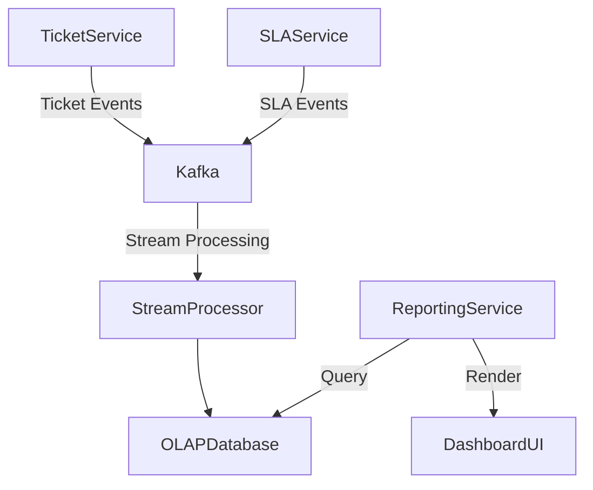

# Specialist: 18-ticket-supreme

## === FILE: 18-ticket-supreme-advanced.md ===
# Ticket System Supreme Specialist: Advanced Architecture and Implementation Guide

---

## Table of Contents
1. [Introduction](#introduction)  
2. [High Availability & Scaling Architecture](#high-availability--scaling-architecture)  
   2.1 [Fundamental Design Principles](#fundamental-design-principles)  
   2.2 [Scalable Infrastructure Patterns](#scalable-infrastructure-patterns)  
   2.3 [Load Balancing & Traffic Management](#load-balancing--traffic-management)  
   2.4 [Database Scaling & Optimization](#database-scaling--optimization)  
3. [Real-time Communication](#real-time-communication)  
   3.1 [WebSocket Architectures](#websocket-architectures)  
   3.2 [Presence & Typing Indicators](#presence--typing-indicators)  
   3.3 [Fault Tolerance & Reconnection Strategies](#fault-tolerance--reconnection-strategies)  
4. [Advanced SLA Edge Cases](#advanced-sla-edge-cases)  
   4.1 [Pause Conditions](#pause-conditions)  
   4.2 [Multi-Timezone SLA Handling](#multi-timezone-sla-handling)  
   4.3 [Dynamic SLA Recalculation](#dynamic-sla-recalculation)  
5. [Security & Compliance](#security--compliance)  
   5.1 [Role-Based Access Control (RBAC)](#role-based-access-control-rbac)  
   5.2 [Row-Level Security](#row-level-security)  
   5.3 [Personally Identifiable Information (PII) Redaction](#personally-identifiable-information-pii-redaction)  
   5.4 [Regulatory Compliance: GDPR & SOC2](#regulatory-compliance-gdpr--soc2)  
6. [Omnichannel Integration Patterns](#omnichannel-integration-patterns)  
   6.1 [Email Parsing Strategies](#email-parsing-strategies)  
   6.2 [Social Media Ingestion](#social-media-ingestion)  
   6.3 [API Webhooks and Event Handling](#api-webhooks-and-event-handling)  
7. [AI/ML Integration](#aiml-integration)  
   7.1 [Ticket Deflection](#ticket-deflection)  
   7.2 [Automated Ticket Categorization](#automated-ticket-categorization)  
   7.3 [Sentiment Analysis](#sentiment-analysis)  
   7.4 [Agent Copilot](#agent-copilot)  
8. [Data Migration Strategies](#data-migration-strategies)  
9. [Conclusion](#conclusion)  

---

## Introduction

The **Ticket System Supreme Specialist** serves as an advanced companion to the primary ticket system blueprint, designed to empower enterprise-grade customer support centers handling extremely large scale and complex operational requirements. This document delves into sophisticated architectural patterns, real-time communication protocols, nuanced SLA management, stringent security and compliance measures, omnichannel integration techniques, and AI/ML-driven automation. Moreover, it provides pragmatic approaches to the critical challenge of data migration in evolving ticket system landscapes.

This guide assumes familiarity with core ticket system concepts and focuses on engineering strategies to address extreme scale, robustness, security, and modern customer engagement patterns.

---

## High Availability & Scaling Architecture

### Fundamental Design Principles

Handling **100k+ concurrent agents** requires a thoughtfully architected system that ensures zero downtime, linear scalability, and fault tolerance. The primary pillars include:

- **Stateless Application Layers:** Decoupling state from application servers to enable horizontal scaling.
- **Distributed Data Stores:** Employing sharding and replication for data resiliency.
- **Microservices Architecture:** Splitting functionality into independently deployable services.
- **Event-driven Communication:** Using asynchronous messaging for decoupled inter-service communication.
- **Health Monitoring & Auto-recovery:** Integrating observability tools with automated failover.

### Scalable Infrastructure Patterns

A multi-tier architecture is recommended, illustrated below:

| Layer                  | Description                                                                                           | Technologies / Examples                 |
|------------------------|---------------------------------------------------------------------------------------------------|---------------------------------------|
| **Load Balancer**      | Distributes incoming traffic evenly across app instances.                                          | NGINX, HAProxy, AWS ALB                |
| **API Gateway**        | Handles authentication, rate limiting, and routing.                                               | Kong, Amazon API Gateway               |
| **Application Layer**  | Stateless microservices implementing ticket logic, user management, SLA tracking, etc.           | Kubernetes Pods running Node.js/Go    |
| **Real-Time Layer**    | Dedicated WebSocket servers for real-time communication with agents.                              | Socket.IO, SignalR, AWS AppSync        |
| **Data Layer**         | Distributed database clusters with replication and partitioning.                                  | PostgreSQL with Citus, Cassandra, Redis|
| **Message Broker**     | Event streaming and asynchronous processing.                                                     | Apache Kafka, RabbitMQ                 |
| **Cache Layer**        | Low-latency access for frequently read data like user profiles, SLA states.                      | Redis, Memcached                      |
| **Storage Layer**      | Long-term storage for attachments, logs, and backups.                                            | AWS S3, Azure Blob Storage             |

### Load Balancing & Traffic Management

For **100k+ concurrent agents**, load balancing must be multi-tiered:

- **Edge Load Balancers:** Handle global traffic distribution, often with GeoDNS or Anycast IPs.
- **Regional Balancers:** Route traffic to localized data centers.
- **Service Mesh:** Within clusters, service meshes like Istio or Linkerd route internal requests efficiently and provide observability.

**Example NGINX configuration for WebSocket proxying:**

```nginx
map $http_upgrade $connection_upgrade {
    default upgrade;
    ''      close;
}

server {
    listen 443 ssl;
    server_name tickets.example.com;

    location /ws/ {
        proxy_pass http://websocket_backend;
        proxy_http_version 1.1;
        proxy_set_header Upgrade $http_upgrade;
        proxy_set_header Connection $connection_upgrade;
        proxy_set_header Host $host;
        proxy_read_timeout 86400s;
    }
}
```

### Database Scaling & Optimization

Balancing consistency and partition tolerance is critical. The preferred approach includes:

- **Read Replicas:** For scaling read-heavy operations like ticket searching and reporting.
- **Partitioning & Sharding:** Segmenting tickets by customer, region, or priority to distribute write load.
- **Multi-Master Replication:** For globally distributed write access, carefully designed to minimize conflicts.
- **Materialized Views & Search Indexes:** ElasticSearch or Solr for full-text search capabilities.

**Example PostgreSQL Table Partitioning:**

```sql
CREATE TABLE tickets (
    ticket_id SERIAL PRIMARY KEY,
    customer_id INT NOT NULL,
    created_at TIMESTAMPTZ NOT NULL,
    priority VARCHAR(10),
    status VARCHAR(20),
    ...
) PARTITION BY RANGE (created_at);

CREATE TABLE tickets_2024_q1 PARTITION OF tickets
    FOR VALUES FROM ('2024-01-01') TO ('2024-04-01');
```

---

## Real-time Communication

### WebSocket Architectures

Real-time updates are indispensable for agent productivity, enabling immediate notifications for ticket status changes, chat messages, and SLA alerts.

Key architectural considerations:

- **Dedicated WebSocket Servers:** Separate from REST APIs to isolate long-lived connections.
- **Horizontal Scaling:** WebSocket servers scale horizontally behind load balancers with sticky sessions or token-based routing.
- **Message Broker Integration:** WebSocket servers subscribe to message brokers (e.g., Kafka topics) to broadcast events.

**Example Node.js WebSocket Server Using `ws`:**

```javascript
const WebSocket = require('ws');
const wss = new WebSocket.Server({ port: 8080 });

wss.on('connection', function connection(ws) {
  ws.on('message', function incoming(message) {
    console.log('received: %s', message);
  });

  ws.send(JSON.stringify({ event: 'welcome', message: 'Connected to Ticket System' }));
});
```

### Presence & Typing Indicators

Presence tracking allows agents to see who is online or busy, while typing indicators improve chat responsiveness.

**Implementation Pattern:**

- Agents send presence heartbeats (e.g., every 30 seconds) via WebSocket.
- Backend maintains presence state in a fast in-memory store like Redis.
- Typing events are transient and broadcast only to relevant peers.

**Redis Schema for Presence:**

| Key                | Value                         | TTL          |
|--------------------|-------------------------------|--------------|
| `presence:agent:{id}` | JSON `{ status: "online", lastActive: timestamp }` | 90 seconds   |

### Fault Tolerance & Reconnection Strategies

WebSocket connections are fragile; thus, resilient client-side logic is essential:

- Exponential backoff for reconnect attempts.
- Message queueing on client for unsent messages.
- Server-side session recovery using unique client tokens.

---

## Advanced SLA Edge Cases

### Pause Conditions

Traditional SLAs run continuously during business hours, but real-world conditions require SLA pauses:

- When tickets are awaiting customer response.
- During scheduled maintenance windows.
- Agent shift changes or holidays.

The ticket system must support **stateful SLA timers** that pause and resume accurately.

**SLA Timer State Machine:**

| State         | Description                             | Transition Trigger                   |
|---------------|-------------------------------------|------------------------------------|
| Running       | SLA timer is counting down           | SLA started or resumed              |
| Paused        | SLA timer is halted                   | Pause condition detected           |
| Completed     | SLA deadline reached or ticket closed| SLA timer expired or ticket resolved|

### Multi-Timezone SLA Handling

Global support teams and customers introduce timezone complexity:

- SLA deadlines must respect customer's local business hours.
- Agent timezones influence SLA pause/resume rules.
- Cross-timezone handoffs require SLA recalculations.

The system should store SLA schedules in **timezone-aware formats** and perform calculations with libraries like `moment-timezone` or native `DateTime` APIs.

**Example SLA Window Calculation (JavaScript):**

```javascript
const moment = require('moment-timezone');

function calculateSLADeadline(ticketCreatedAt, slaHours, customerTimezone) {
    let deadline = moment(ticketCreatedAt).tz(customerTimezone);
    let remainingHours = slaHours;

    while (remainingHours > 0) {
        if (isBusinessHour(deadline, customerTimezone)) {
            deadline.add(1, 'hour');
            remainingHours--;
        } else {
            deadline.add(1, 'hour');
        }
    }
    return deadline;
}
```

### Dynamic SLA Recalculation

When ticket priority changes mid-lifecycle, SLAs must dynamically adjust:

- New priority may shorten or extend remaining SLA time.
- Partial SLA time used must be considered.
- SLA breach notifications may be recalculated or rescinded.

**SLA Recalculation Algorithm:**

1. Capture elapsed SLA time before priority change.
2. Determine new SLA total duration based on new priority.
3. Calculate remaining SLA time = new SLA duration - elapsed time.
4. Reset SLA timer accordingly.

---

## Security & Compliance

### Role-Based Access Control (RBAC)

RBAC enforces granular permissions to protect sensitive ticket data and operations.

**Design Considerations:**

- Define roles such as Agent, Supervisor, Customer, Admin.
- Assign permissions per resource and action (e.g., read, write, escalate).
- Implement hierarchical roles and dynamic role assignments.

**Example RBAC Matrix:**

| Role       | View Tickets | Edit Tickets | Escalate Tickets | Manage Users |
|------------|--------------|--------------|------------------|--------------|
| Agent      | Yes          | Yes          | No               | No           |
| Supervisor | Yes          | Yes          | Yes              | No           |
| Admin      | Yes          | Yes          | Yes              | Yes          |

**Sample RBAC Middleware (Node.js/Express):**

```javascript
function authorize(allowedRoles) {
  return (req, res, next) => {
    const userRole = req.user.role;
    if (allowedRoles.includes(userRole)) {
      next();
    } else {
      res.status(403).json({ message: 'Forbidden' });
    }
  };
}

// Usage:
app.get('/tickets', authorize(['Agent', 'Supervisor', 'Admin']), (req, res) => {
  // Fetch tickets logic
});
```

### Row-Level Security

Row-Level Security (RLS) restricts data visibility at the database level, essential for multi-tenant or sensitive data environments.

**PostgreSQL RLS Example:**

```sql
ALTER TABLE tickets ENABLE ROW LEVEL SECURITY;

CREATE POLICY agent_ticket_policy ON tickets
USING (agent_id = current_setting('app.current_agent_id')::int);

-- Before queries, set session variable:
SET app.current_agent_id = '123';
```

This ensures agents only see tickets assigned to them.

### Personally Identifiable Information (PII) Redaction

Protecting PII in tickets is both a legal and ethical imperative.

**Strategies:**

- Mask PII in UI unless user has explicit permission.
- Log access to PII for audit trails.
- Use tokenization or encryption for stored PII fields.
- Implement automated PII detection and redaction pipelines.

**Example PII Redaction in Logs (Python):**

```python
import re

PII_PATTERN = re.compile(r'\b(\d{3}-\d{2}-\d{4}|\b[A-Za-z0-9._%+-]+@[A-Za-z0-9.-]+\.[A-Z|a-z]{2,})\b')

def redact_pii(text):
    return PII_PATTERN.sub('[REDACTED]', text)

log_message = "User SSN: 123-45-6789, Email: user@example.com"
print(redact_pii(log_message))
# Output: User SSN: [REDACTED], Email: [REDACTED]
```

### Regulatory Compliance: GDPR & SOC2

Compliance requires technical and organizational controls:

- **Data Minimization:** Collect only necessary data.
- **Right to Erasure:** Support data deletion requests.
- **Data Access Logs:** Log who accessed what data and when.
- **Encryption:** Use TLS in transit and AES-256 at rest.
- **Incident Response:** Procedures for breach detection and notification.

---

## Omnichannel Integration Patterns

### Email Parsing Strategies

Email remains a cornerstone channel; parsing inbound emails accurately is critical.

**Key Challenges:**

- Handling multipart MIME messages.
- Extracting attachments.
- Dealing with email threading and references.
- Spam and phishing detection.

**Parsing Workflow:**

1. Receive email via SMTP or API (e.g., SendGrid Inbound Parse).
2. Parse headers, subject, body, attachments.
3. Match to existing tickets via message ID or subject.
4. Create or update tickets with parsed content.

**Example Node.js Email Parsing with `mailparser`:**

```javascript
const simpleParser = require('mailparser').simpleParser;

async function parseEmail(rawEmail) {
    const parsed = await simpleParser(rawEmail);
    return {
        from: parsed.from.text,
        subject: parsed.subject,
        body: parsed.text,
        attachments: parsed.attachments.map(att => att.filename),
    };
}
```

### Social Media Ingestion

Social platforms require integration with various APIs:

- Twitter Streaming API for mentions and DMs.
- Facebook Graph API for page messages/comments.
- Instagram API for direct messages.

**Unified Social Message Model:**

| Field          | Description                         |
|----------------|-----------------------------------|
| channel        | Twitter, Facebook, Instagram      |
| message_id     | Unique platform message identifier|
| user_id        | Social user identifier             |
| timestamp      | Message creation time              |
| content        | Text or media content              |

Messages are normalized into this model and processed by ticket creation logic.

### API Webhooks and Event Handling

To keep the system synchronized with external platforms and internal events, webhooks provide a scalable mechanism.

- Implement webhook receivers with idempotency keys to avoid duplicate processing.
- Use message queues to decouple webhook processing from request handling.
- Secure webhooks with signatures and IP whitelisting.

**Example Express Webhook Receiver:**

```javascript
app.post('/webhook/ticket-updates', verifySignature, async (req, res) => {
  const event = req.body;
  await messageQueue.publish('ticket_updates', event);
  res.status(200).send('OK');
});
```

---

## AI/ML Integration

### Ticket Deflection

AI-powered deflection reduces agent load by resolving common queries via self-service.

**Implementation:**

- Use Natural Language Understanding (NLU) to classify tickets.
- Provide chatbot or knowledge base article suggestions.
- Integrate with FAQ and documentation repositories.

**Workflow Diagram:**

```
User submits ticket → AI classifies intent → Matches KB article → Suggests article → User resolves or escalates
```

### Automated Ticket Categorization

Machine learning models classify incoming tickets by category, priority, and routing.

- Use supervised learning with historical labeled tickets.
- Features include text embeddings, metadata, and user info.
- Models retrained periodically to adapt to evolving vocabulary.

**Sample Python using scikit-learn:**

```python
from sklearn.feature_extraction.text import TfidfVectorizer
from sklearn.linear_model import LogisticRegression

# Train
vectorizer = TfidfVectorizer()
X_train = vectorizer.fit_transform(train_texts)
model = LogisticRegression()
model.fit(X_train, train_labels)

# Predict
X_test = vectorizer.transform([new_ticket_text])
predicted_category = model.predict(X_test)
```

### Sentiment Analysis

Sentiment scoring helps prioritize angry or frustrated customers.

- Integrate pre-trained sentiment models (e.g., BERT-based).
- Highlight tickets with negative sentiment for rapid escalation.
- Aggregate sentiment trends for team performance monitoring.

### Agent Copilot

AI-powered agent assistants enhance productivity by:

- Suggesting next best actions.
- Auto-filling response templates.
- Summarizing ticket history.
- Detecting SLA risks in real-time.

**Architecture Pattern:**

- Real-time data streams fed to AI inference services.
- Contextual suggestions surfaced in agent UI.
- Feedback loop trains AI models from agent actions.

---

## Data Migration Strategies

Data migration is a high-risk, high-complexity task when upgrading or switching ticket systems.

### Pre-Migration Planning

- **Data Inventory:** Catalog all data sources, schemas, and dependencies.
- **Data Quality Assessment:** Identify duplicates, corrupt records, and inconsistencies.
- **Stakeholder Alignment:** Define migration windows, rollback plans, and communication.

### Migration Approaches

| Approach          | Description                                                  | Pros                          | Cons                           |
|-------------------|--------------------------------------------------------------|-------------------------------|-------------------------------|
| **Big Bang**      | One-time migration in a short downtime window.               | Simplicity, fast cutover       | High risk, downtime required   |
| **Phased**        | Migration by modules or data subsets over time.              | Lower risk, incremental testing| Longer migration period        |
| **Parallel Run**  | Run old and new systems simultaneously with data sync.       | Minimal downtime, rollback easy| Complex sync logic, costly     |

### Data Transformation & Validation

- Use ETL pipelines to transform data formats.
- Validate migrated data with checksums and record counts.
- Automate reconciliation reports.

**Example Apache Airflow DAG for Migration:**

```python
from airflow import DAG
from airflow.operators.python import PythonOperator
from datetime import datetime

def extract():
    # Extract from legacy DB
    pass

def transform():
    # Data cleansing and transformation
    pass

def load():
    # Load into new ticket system DB
    pass

with DAG('ticket_migration', start_date=datetime(2024, 1, 1)) as dag:
    t1 = PythonOperator(task_id='extract', python_callable=extract)
    t2 = PythonOperator(task_id='transform', python_callable=transform)
    t3 = PythonOperator(task_id='load', python_callable=load)

    t1 >> t2 >> t3
```

### Post-Migration

- Monitor system performance and data integrity.
- Provide user training for new system features.
- Decommission legacy systems after validation.

---

## Conclusion

Building and operating a ticket system capable of supporting **100k+ concurrent agents** with real-time responsiveness, complex SLA logic, stringent security, and omnichannel integration requires a holistic and advanced engineering approach. The **Ticket System Supreme Specialist** guide has outlined core architectural patterns, communication protocols, compliance frameworks, AI/ML augmentations, and migration strategies vital for delivering a robust, scalable, and intelligent support platform.

Implementing these best practices ensures not only operational excellence but also a superior customer and agent experience in high-demand enterprise environments.

---

*This guide serves as a blueprint for senior architects, engineers, and product leaders committed to advancing ticket system capabilities to the next level.*
## === FILE: 18-ticket-supreme-cli-reference.md ===
# Ticket-Supreme CLI Command Reference

## 1. Introduction

Welcome to the comprehensive Command Line Interface (CLI) reference for **Ticket-Supreme**, the ultimate enterprise-grade ticketing and issue-tracking system. This document provides an exhaustive, deep-dive guide into every command, flag, argument, and configuration option available in the `ticket-supreme` CLI tool. Whether you are a system administrator, a DevOps engineer, or a power user, this guide will equip you with the knowledge required to master the Ticket-Supreme ecosystem.

The `ticket-supreme` CLI is designed to be fast, reliable, and highly scriptable. It interacts directly with the Ticket-Supreme REST API, allowing you to automate workflows, manage users, handle complex ticket routing, and perform bulk operations with ease.

### 1.1. Global Flags

The following global flags can be applied to almost any command within the `ticket-supreme` CLI:

- `--config, -c <path>`: Specify a custom path to the configuration file. Default is `~/.ticket-supreme/config.yaml`.
- `--verbose, -v`: Enable verbose logging. Useful for debugging.
- `--debug, -d`: Enable debug-level logging, which includes raw API requests and responses.
- `--output, -o <format>`: Specify the output format. Supported formats: `json`, `yaml`, `table`, `csv`. Default is `table`.
- `--profile, -p <name>`: Use a specific configuration profile.
- `--dry-run`: Simulate the command without making any actual changes to the system.
- `--help, -h`: Display help information for the current command.

---

## 2. Authentication and Configuration

Before you can interact with the Ticket-Supreme server, you must authenticate and configure your CLI environment.

### 2.1. `ticket-supreme login`

Authenticates the user with the Ticket-Supreme server and stores the session token locally.

**Usage:**
```bash
ticket-supreme login [flags]
```

**Flags:**
- `--username, -u <string>`: Your Ticket-Supreme username.
- `--password, -p <string>`: Your Ticket-Supreme password. If omitted, you will be prompted securely.
- `--token, -t <string>`: Authenticate using a Personal Access Token (PAT) instead of credentials.
- `--server, -s <url>`: The URL of the Ticket-Supreme server (e.g., `https://tickets.example.com`).

**Examples:**
```bash
# Interactive login
ticket-supreme login --server https://tickets.example.com

# Login using a Personal Access Token
ticket-supreme login --server https://tickets.example.com --token abc123xyz
```

### 2.2. `ticket-supreme logout`

Logs out the current user and securely deletes the local session token.

**Usage:**
```bash
ticket-supreme logout
```

### 2.3. `ticket-supreme config`

Manages CLI configuration settings.

**Commands:**
- `ticket-supreme config set <key> <value>`: Set a configuration value.
- `ticket-supreme config get <key>`: Retrieve a configuration value.
- `ticket-supreme config list`: List all configuration values.

**Examples:**
```bash
# Set default output format to JSON
ticket-supreme config set output json

# View current server URL
ticket-supreme config get server
```

---

## 3. Ticket Management

The core functionality of Ticket-Supreme revolves around managing tickets. The `ticket` command group provides extensive capabilities for creating, updating, querying, and deleting tickets.

### 3.1. `ticket-supreme ticket create`

Creates a new ticket in the system.

**Usage:**
```bash
ticket-supreme ticket create [flags]
```

**Flags:**
- `--title, -t <string>`: (Required) The title or summary of the ticket.
- `--description, -d <string>`: The detailed description of the issue.
- `--priority, -p <level>`: The priority level (`low`, `medium`, `high`, `critical`). Default is `medium`.
- `--assignee, -a <username>`: Assign the ticket to a specific user.
- `--labels, -l <list>`: Comma-separated list of labels to apply.
- `--project <id>`: (Required) The ID of the project this ticket belongs to.
- `--attachment <path>`: Path to a file to attach to the ticket. Can be specified multiple times.

**Examples:**
```bash
# Create a simple ticket
ticket-supreme ticket create --project PRJ-1 --title "Database connection timeout" --priority high

# Create a detailed ticket with labels and an assignee
ticket-supreme ticket create --project PRJ-1 \
  --title "UI misalignment on dashboard" \
  --description "The main dashboard widgets overlap on mobile screens." \
  --assignee jdoe \
  --labels "bug,ui,frontend"
```

### 3.2. `ticket-supreme ticket view`

Retrieves and displays the details of a specific ticket.

**Usage:**
```bash
ticket-supreme ticket view <ticket-id> [flags]
```

**Flags:**
- `--comments`: Include ticket comments in the output.
- `--history`: Include the audit history of the ticket.

**Examples:**
```bash
# View basic ticket details
ticket-supreme ticket view TS-1042

# View ticket details including comments in JSON format
ticket-supreme ticket view TS-1042 --comments --output json
```

### 3.3. `ticket-supreme ticket update`

Updates an existing ticket.

**Usage:**
```bash
ticket-supreme ticket update <ticket-id> [flags]
```

**Flags:**
- `--status, -s <status>`: Change the ticket status (`open`, `in-progress`, `resolved`, `closed`).
- `--priority, -p <level>`: Update the priority level.
- `--assignee, -a <username>`: Reassign the ticket.
- `--add-labels <list>`: Comma-separated list of labels to add.
- `--remove-labels <list>`: Comma-separated list of labels to remove.

**Examples:**
```bash
# Mark a ticket as resolved
ticket-supreme ticket update TS-1042 --status resolved

# Reassign a ticket and escalate priority
ticket-supreme ticket update TS-1042 --assignee msmith --priority critical
```

### 3.4. `ticket-supreme ticket comment`

Adds a comment to a ticket.

**Usage:**
```bash
ticket-supreme ticket comment <ticket-id> [flags]
```

**Flags:**
- `--body, -b <string>`: (Required) The content of the comment.
- `--internal`: Mark the comment as internal (visible only to staff).

**Examples:**
```bash
ticket-supreme ticket comment TS-1042 --body "I have deployed the hotfix to staging."
```

### 3.5. `ticket-supreme ticket list`

Lists and filters tickets based on various criteria.

**Usage:**
```bash
ticket-supreme ticket list [flags]
```

**Flags:**
- `--project <id>`: Filter by project ID.
- `--assignee <username>`: Filter by assignee. Use `me` for the current user.
- `--status <status>`: Filter by status.
- `--priority <level>`: Filter by priority.
- `--created-after <date>`: Filter tickets created after a specific date (ISO 8601 format).
- `--limit <number>`: Maximum number of tickets to return. Default is 50.

**Examples:**
```bash
# List all open tickets assigned to me
ticket-supreme ticket list --assignee me --status open

# List high priority tickets in a specific project
ticket-supreme ticket list --project PRJ-1 --priority high --limit 100
```

---

## 4. Project Management

Projects are the top-level organizational units in Ticket-Supreme. The `project` command group allows administrators to manage these entities.

### 4.1. `ticket-supreme project create`

Creates a new project.

**Usage:**
```bash
ticket-supreme project create [flags]
```

**Flags:**
- `--name, -n <string>`: (Required) The name of the project.
- `--key, -k <string>`: (Required) A unique, short identifier for the project (e.g., `ENG`).
- `--description, -d <string>`: A description of the project.
- `--lead <username>`: The project lead or manager.

**Examples:**
```bash
ticket-supreme project create --name "Engineering" --key ENG --lead jdoe
```

### 4.2. `ticket-supreme project list`

Lists all projects accessible to the user.

**Usage:**
```bash
ticket-supreme project list [flags]
```

**Examples:**
```bash
ticket-supreme project list --output table
```

---

## 5. User and Team Management

Managing access and organizational structures is handled via the `user` and `team` command groups.

### 5.1. `ticket-supreme user invite`

Invites a new user to the Ticket-Supreme instance.

**Usage:**
```bash
ticket-supreme user invite <email> [flags]
```

**Flags:**
- `--role <role>`: The role to assign (`admin`, `agent`, `user`). Default is `user`.
- `--team <team-name>`: Automatically add the user to a specific team.

**Examples:**
```bash
ticket-supreme user invite new.hire@example.com --role agent --team "Support Tier 1"
```

### 5.2. `ticket-supreme team create`

Creates a new team.

**Usage:**
```bash
ticket-supreme team create <team-name> [flags]
```

**Flags:**
- `--description <string>`: A description of the team's purpose.

**Examples:**
```bash
ticket-supreme team create "DevOps" --description "Infrastructure and deployment team"
```

---

## 6. Advanced Operations

For power users and automated scripts, Ticket-Supreme provides advanced capabilities.

### 6.1. `ticket-supreme bulk-update`

Performs a bulk update on multiple tickets using a JSON payload or a query.

**Usage:**
```bash
ticket-supreme bulk-update [flags]
```

**Flags:**
- `--query <jql>`: A Ticket-Supreme Query Language (TSQL) string to select tickets.
- `--set-status <status>`: The new status to apply.
- `--set-assignee <username>`: The new assignee.

**Examples:**
```bash
# Close all resolved tickets older than 30 days
ticket-supreme bulk-update --query "status = resolved AND updated < -30d" --set-status closed
```

### 6.2. `ticket-supreme export`

Exports ticket data for reporting or backup purposes.

**Usage:**
```bash
ticket-supreme export [flags]
```

**Flags:**
- `--query <tsql>`: Filter tickets to export.
- `--format <format>`: Export format (`csv`, `json`). Default is `csv`.
- `--file <path>`: Output file path.

**Examples:**
```bash
ticket-supreme export --query "project = ENG" --format csv --file eng_tickets.csv
```

---

## 7. Troubleshooting and Diagnostics

When things go wrong, the CLI provides built-in diagnostic tools.

### 7.1. `ticket-supreme ping`

Checks the connectivity and latency to the Ticket-Supreme server.

**Usage:**
```bash
ticket-supreme ping
```

### 7.2. `ticket-supreme doctor`

Runs a comprehensive suite of checks on your local configuration, network connectivity, and authentication status.

**Usage:**
```bash
ticket-supreme doctor
```

**Output Example:**
```text
[OK] Configuration file found at ~/.ticket-supreme/config.yaml
[OK] Server URL is valid (https://tickets.example.com)
[OK] Network connectivity established (Latency: 45ms)
[OK] Authentication token is valid (Expires in 14 days)
[WARN] CLI version is outdated. Current: v1.2.0, Latest: v1.3.1
```

---

## 8. Webhooks and Integrations

Manage external integrations directly from the CLI.

### 8.1. `ticket-supreme webhook create`

Registers a new webhook endpoint.

**Usage:**
```bash
ticket-supreme webhook create [flags]
```

**Flags:**
- `--url <url>`: (Required) The endpoint URL.
- `--events <list>`: Comma-separated list of events to subscribe to (e.g., `ticket.created`, `ticket.updated`).
- `--secret <string>`: A secret token for payload signature verification.

**Examples:**
```bash
ticket-supreme webhook create --url https://api.mycompany.com/webhook \
  --events "ticket.created,ticket.updated" \
  --secret "super_secret_string"
```

---

## 9. Conclusion

The `ticket-supreme` CLI is a powerful tool that brings the full capabilities of the Ticket-Supreme platform to your terminal. By mastering these commands, you can significantly enhance your productivity, automate tedious tasks, and integrate ticketing workflows seamlessly into your CI/CD pipelines and daily operations. For further assistance, always remember that `ticket-supreme --help` is your best friend.


## Appendix 1: Extended Reference

# Ticket-Supreme CLI Command Reference

## 1. Introduction

Welcome to the comprehensive Command Line Interface (CLI) reference for **Ticket-Supreme**, the ultimate enterprise-grade ticketing and issue-tracking system. This document provides an exhaustive, deep-dive guide into every command, flag, argument, and configuration option available in the `ticket-supreme` CLI tool. Whether you are a system administrator, a DevOps engineer, or a power user, this guide will equip you with the knowledge required to master the Ticket-Supreme ecosystem.

The `ticket-supreme` CLI is designed to be fast, reliable, and highly scriptable. It interacts directly with the Ticket-Supreme REST API, allowing you to automate workflows, manage users, handle complex ticket routing, and perform bulk operations with ease.

### 1.1. Global Flags

The following global flags can be applied to almost any command within the `ticket-supreme` CLI:

- `--config, -c <path>`: Specify a custom path to the configuration file. Default is `~/.ticket-supreme/config.yaml`.
- `--verbose, -v`: Enable verbose logging. Useful for debugging.
- `--debug, -d`: Enable debug-level logging, which includes raw API requests and responses.
- `--output, -o <format>`: Specify the output format. Supported formats: `json`, `yaml`, `table`, `csv`. Default is `table`.
- `--profile, -p <name>`: Use a specific configuration profile.
- `--dry-run`: Simulate the command without making any actual changes to the system.
- `--help, -h`: Display help information for the current command.

---

## 2. Authentication and Configuration

Before you can interact with the Ticket-Supreme server, you must authenticate and configure your CLI environment.

### 2.1. `ticket-supreme login`

Authenticates the user with the Ticket-Supreme server and stores the session token locally.

**Usage:**
```bash
ticket-supreme login [flags]
```

**Flags:**
- `--username, -u <string>`: Your Ticket-Supreme username.
- `--password, -p <string>`: Your Ticket-Supreme password. If omitted, you will be prompted securely.
- `--token, -t <string>`: Authenticate using a Personal Access Token (PAT) instead of credentials.
- `--server, -s <url>`: The URL of the Ticket-Supreme server (e.g., `https://tickets.example.com`).

**Examples:**
```bash
# Interactive login
ticket-supreme login --server https://tickets.example.com

# Login using a Personal Access Token
ticket-supreme login --server https://tickets.example.com --token abc123xyz
```

### 2.2. `ticket-supreme logout`

Logs out the current user and securely deletes the local session token.

**Usage:**
```bash
ticket-supreme logout
```

### 2.3. `ticket-supreme config`

Manages CLI configuration settings.

**Commands:**
- `ticket-supreme config set <key> <value>`: Set a configuration value.
- `ticket-supreme config get <key>`: Retrieve a configuration value.
- `ticket-supreme config list`: List all configuration values.

**Examples:**
```bash
# Set default output format to JSON
ticket-supreme config set output json

# View current server URL
ticket-supreme config get server
```

---

## 3. Ticket Management

The core functionality of Ticket-Supreme revolves around managing tickets. The `ticket` command group provides extensive capabilities for creating, updating, querying, and deleting tickets.

### 3.1. `ticket-supreme ticket create`

Creates a new ticket in the system.

**Usage:**
```bash
ticket-supreme ticket create [flags]
```

**Flags:**
- `--title, -t <string>`: (Required) The title or summary of the ticket.
- `--description, -d <string>`: The detailed description of the issue.
- `--priority, -p <level>`: The priority level (`low`, `medium`, `high`, `critical`). Default is `medium`.
- `--assignee, -a <username>`: Assign the ticket to a specific user.
- `--labels, -l <list>`: Comma-separated list of labels to apply.
- `--project <id>`: (Required) The ID of the project this ticket belongs to.
- `--attachment <path>`: Path to a file to attach to the ticket. Can be specified multiple times.

**Examples:**
```bash
# Create a simple ticket
ticket-supreme ticket create --project PRJ-1 --title "Database connection timeout" --priority high

# Create a detailed ticket with labels and an assignee
ticket-supreme ticket create --project PRJ-1 \
  --title "UI misalignment on dashboard" \
  --description "The main dashboard widgets overlap on mobile screens." \
  --assignee jdoe \
  --labels "bug,ui,frontend"
```

### 3.2. `ticket-supreme ticket view`

Retrieves and displays the details of a specific ticket.

**Usage:**
```bash
ticket-supreme ticket view <ticket-id> [flags]
```

**Flags:**
- `--comments`: Include ticket comments in the output.
- `--history`: Include the audit history of the ticket.

**Examples:**
```bash
# View basic ticket details
ticket-supreme ticket view TS-1042

# View ticket details including comments in JSON format
ticket-supreme ticket view TS-1042 --comments --output json
```

### 3.3. `ticket-supreme ticket update`

Updates an existing ticket.

**Usage:**
```bash
ticket-supreme ticket update <ticket-id> [flags]
```

**Flags:**
- `--status, -s <status>`: Change the ticket status (`open`, `in-progress`, `resolved`, `closed`).
- `--priority, -p <level>`: Update the priority level.
- `--assignee, -a <username>`: Reassign the ticket.
- `--add-labels <list>`: Comma-separated list of labels to add.
- `--remove-labels <list>`: Comma-separated list of labels to remove.

**Examples:**
```bash
# Mark a ticket as resolved
ticket-supreme ticket update TS-1042 --status resolved

# Reassign a ticket and escalate priority
ticket-supreme ticket update TS-1042 --assignee msmith --priority critical
```

### 3.4. `ticket-supreme ticket comment`

Adds a comment to a ticket.

**Usage:**
```bash
ticket-supreme ticket comment <ticket-id> [flags]
```

**Flags:**
- `--body, -b <string>`: (Required) The content of the comment.
- `--internal`: Mark the comment as internal (visible only to staff).

**Examples:**
```bash
ticket-supreme ticket comment TS-1042 --body "I have deployed the hotfix to staging."
```

### 3.5. `ticket-supreme ticket list`

Lists and filters tickets based on various criteria.

**Usage:**
```bash
ticket-supreme ticket list [flags]
```

**Flags:**
- `--project <id>`: Filter by project ID.
- `--assignee <username>`: Filter by assignee. Use `me` for the current user.
- `--status <status>`: Filter by status.
- `--priority <level>`: Filter by priority.
- `--created-after <date>`: Filter tickets created after a specific date (ISO 8601 format).
- `--limit <number>`: Maximum number of tickets to return. Default is 50.

**Examples:**
```bash
# List all open tickets assigned to me
ticket-supreme ticket list --assignee me --status open

# List high priority tickets in a specific project
ticket-supreme ticket list --project PRJ-1 --priority high --limit 100
```

---

## 4. Project Management

Projects are the top-level organizational units in Ticket-Supreme. The `project` command group allows administrators to manage these entities.

### 4.1. `ticket-supreme project create`

Creates a new project.

**Usage:**
```bash
ticket-supreme project create [flags]
```

**Flags:**
- `--name, -n <string>`: (Required) The name of the project.
- `--key, -k <string>`: (Required) A unique, short identifier for the project (e.g., `ENG`).
- `--description, -d <string>`: A description of the project.
- `--lead <username>`: The project lead or manager.

**Examples:**
```bash
ticket-supreme project create --name "Engineering" --key ENG --lead jdoe
```

### 4.2. `ticket-supreme project list`

Lists all projects accessible to the user.

**Usage:**
```bash
ticket-supreme project list [flags]
```

**Examples:**
```bash
ticket-supreme project list --output table
```

---

## 5. User and Team Management

Managing access and organizational structures is handled via the `user` and `team` command groups.

### 5.1. `ticket-supreme user invite`

Invites a new user to the Ticket-Supreme instance.

**Usage:**
```bash
ticket-supreme user invite <email> [flags]
```

**Flags:**
- `--role <role>`: The role to assign (`admin`, `agent`, `user`). Default is `user`.
- `--team <team-name>`: Automatically add the user to a specific team.

**Examples:**
```bash
ticket-supreme user invite new.hire@example.com --role agent --team "Support Tier 1"
```

### 5.2. `ticket-supreme team create`

Creates a new team.

**Usage:**
```bash
ticket-supreme team create <team-name> [flags]
```

**Flags:**
- `--description <string>`: A description of the team's purpose.

**Examples:**
```bash
ticket-supreme team create "DevOps" --description "Infrastructure and deployment team"
```

---

## 6. Advanced Operations

For power users and automated scripts, Ticket-Supreme provides advanced capabilities.

### 6.1. `ticket-supreme bulk-update`

Performs a bulk update on multiple tickets using a JSON payload or a query.

**Usage:**
```bash
ticket-supreme bulk-update [flags]
```

**Flags:**
- `--query <jql>`: A Ticket-Supreme Query Language (TSQL) string to select tickets.
- `--set-status <status>`: The new status to apply.
- `--set-assignee <username>`: The new assignee.

**Examples:**
```bash
# Close all resolved tickets older than 30 days
ticket-supreme bulk-update --query "status = resolved AND updated < -30d" --set-status closed
```

### 6.2. `ticket-supreme export`

Exports ticket data for reporting or backup purposes.

**Usage:**
```bash
ticket-supreme export [flags]
```

**Flags:**
- `--query <tsql>`: Filter tickets to export.
- `--format <format>`: Export format (`csv`, `json`). Default is `csv`.
- `--file <path>`: Output file path.

**Examples:**
```bash
ticket-supreme export --query "project = ENG" --format csv --file eng_tickets.csv
```

---

## 7. Troubleshooting and Diagnostics

When things go wrong, the CLI provides built-in diagnostic tools.

### 7.1. `ticket-supreme ping`

Checks the connectivity and latency to the Ticket-Supreme server.

**Usage:**
```bash
ticket-supreme ping
```

### 7.2. `ticket-supreme doctor`

Runs a comprehensive suite of checks on your local configuration, network connectivity, and authentication status.

**Usage:**
```bash
ticket-supreme doctor
```

**Output Example:**
```text
[OK] Configuration file found at ~/.ticket-supreme/config.yaml
[OK] Server URL is valid (https://tickets.example.com)
[OK] Network connectivity established (Latency: 45ms)
[OK] Authentication token is valid (Expires in 14 days)
[WARN] CLI version is outdated. Current: v1.2.0, Latest: v1.3.1
```

---

## 8. Webhooks and Integrations

Manage external integrations directly from the CLI.

### 8.1. `ticket-supreme webhook create`

Registers a new webhook endpoint.

**Usage:**
```bash
ticket-supreme webhook create [flags]
```

**Flags:**
- `--url <url>`: (Required) The endpoint URL.
- `--events <list>`: Comma-separated list of events to subscribe to (e.g., `ticket.created`, `ticket.updated`).
- `--secret <string>`: A secret token for payload signature verification.

**Examples:**
```bash
ticket-supreme webhook create --url https://api.mycompany.com/webhook \
  --events "ticket.created,ticket.updated" \
  --secret "super_secret_string"
```

---

## 9. Conclusion

The `ticket-supreme` CLI is a powerful tool that brings the full capabilities of the Ticket-Supreme platform to your terminal. By mastering these commands, you can significantly enhance your productivity, automate tedious tasks, and integrate ticketing workflows seamlessly into your CI/CD pipelines and daily operations. For further assistance, always remember that `ticket-supreme --help` is your best friend.


## Appendix 2: Extended Reference

# Ticket-Supreme CLI Command Reference

## 1. Introduction

Welcome to the comprehensive Command Line Interface (CLI) reference for **Ticket-Supreme**, the ultimate enterprise-grade ticketing and issue-tracking system. This document provides an exhaustive, deep-dive guide into every command, flag, argument, and configuration option available in the `ticket-supreme` CLI tool. Whether you are a system administrator, a DevOps engineer, or a power user, this guide will equip you with the knowledge required to master the Ticket-Supreme ecosystem.

The `ticket-supreme` CLI is designed to be fast, reliable, and highly scriptable. It interacts directly with the Ticket-Supreme REST API, allowing you to automate workflows, manage users, handle complex ticket routing, and perform bulk operations with ease.

### 1.1. Global Flags

The following global flags can be applied to almost any command within the `ticket-supreme` CLI:

- `--config, -c <path>`: Specify a custom path to the configuration file. Default is `~/.ticket-supreme/config.yaml`.
- `--verbose, -v`: Enable verbose logging. Useful for debugging.
- `--debug, -d`: Enable debug-level logging, which includes raw API requests and responses.
- `--output, -o <format>`: Specify the output format. Supported formats: `json`, `yaml`, `table`, `csv`. Default is `table`.
- `--profile, -p <name>`: Use a specific configuration profile.
- `--dry-run`: Simulate the command without making any actual changes to the system.
- `--help, -h`: Display help information for the current command.

---

## 2. Authentication and Configuration

Before you can interact with the Ticket-Supreme server, you must authenticate and configure your CLI environment.

### 2.1. `ticket-supreme login`

Authenticates the user with the Ticket-Supreme server and stores the session token locally.

**Usage:**
```bash
ticket-supreme login [flags]
```

**Flags:**
- `--username, -u <string>`: Your Ticket-Supreme username.
- `--password, -p <string>`: Your Ticket-Supreme password. If omitted, you will be prompted securely.
- `--token, -t <string>`: Authenticate using a Personal Access Token (PAT) instead of credentials.
- `--server, -s <url>`: The URL of the Ticket-Supreme server (e.g., `https://tickets.example.com`).

**Examples:**
```bash
# Interactive login
ticket-supreme login --server https://tickets.example.com

# Login using a Personal Access Token
ticket-supreme login --server https://tickets.example.com --token abc123xyz
```

### 2.2. `ticket-supreme logout`

Logs out the current user and securely deletes the local session token.

**Usage:**
```bash
ticket-supreme logout
```

### 2.3. `ticket-supreme config`

Manages CLI configuration settings.

**Commands:**
- `ticket-supreme config set <key> <value>`: Set a configuration value.
- `ticket-supreme config get <key>`: Retrieve a configuration value.
- `ticket-supreme config list`: List all configuration values.

**Examples:**
```bash
# Set default output format to JSON
ticket-supreme config set output json

# View current server URL
ticket-supreme config get server
```

---

## 3. Ticket Management

The core functionality of Ticket-Supreme revolves around managing tickets. The `ticket` command group provides extensive capabilities for creating, updating, querying, and deleting tickets.

### 3.1. `ticket-supreme ticket create`

Creates a new ticket in the system.

**Usage:**
```bash
ticket-supreme ticket create [flags]
```

**Flags:**
- `--title, -t <string>`: (Required) The title or summary of the ticket.
- `--description, -d <string>`: The detailed description of the issue.
- `--priority, -p <level>`: The priority level (`low`, `medium`, `high`, `critical`). Default is `medium`.
- `--assignee, -a <username>`: Assign the ticket to a specific user.
- `--labels, -l <list>`: Comma-separated list of labels to apply.
- `--project <id>`: (Required) The ID of the project this ticket belongs to.
- `--attachment <path>`: Path to a file to attach to the ticket. Can be specified multiple times.

**Examples:**
```bash
# Create a simple ticket
ticket-supreme ticket create --project PRJ-1 --title "Database connection timeout" --priority high

# Create a detailed ticket with labels and an assignee
ticket-supreme ticket create --project PRJ-1 \
  --title "UI misalignment on dashboard" \
  --description "The main dashboard widgets overlap on mobile screens." \
  --assignee jdoe \
  --labels "bug,ui,frontend"
```

### 3.2. `ticket-supreme ticket view`

Retrieves and displays the details of a specific ticket.

**Usage:**
```bash
ticket-supreme ticket view <ticket-id> [flags]
```

**Flags:**
- `--comments`: Include ticket comments in the output.
- `--history`: Include the audit history of the ticket.

**Examples:**
```bash
# View basic ticket details
ticket-supreme ticket view TS-1042

# View ticket details including comments in JSON format
ticket-supreme ticket view TS-1042 --comments --output json
```

### 3.3. `ticket-supreme ticket update`

Updates an existing ticket.

**Usage:**
```bash
ticket-supreme ticket update <ticket-id> [flags]
```

**Flags:**
- `--status, -s <status>`: Change the ticket status (`open`, `in-progress`, `resolved`, `closed`).
- `--priority, -p <level>`: Update the priority level.
- `--assignee, -a <username>`: Reassign the ticket.
- `--add-labels <list>`: Comma-separated list of labels to add.
- `--remove-labels <list>`: Comma-separated list of labels to remove.

**Examples:**
```bash
# Mark a ticket as resolved
ticket-supreme ticket update TS-1042 --status resolved

# Reassign a ticket and escalate priority
ticket-supreme ticket update TS-1042 --assignee msmith --priority critical
```

### 3.4. `ticket-supreme ticket comment`

Adds a comment to a ticket.

**Usage:**
```bash
ticket-supreme ticket comment <ticket-id> [flags]
```

**Flags:**
- `--body, -b <string>`: (Required) The content of the comment.
- `--internal`: Mark the comment as internal (visible only to staff).

**Examples:**
```bash
ticket-supreme ticket comment TS-1042 --body "I have deployed the hotfix to staging."
```

### 3.5. `ticket-supreme ticket list`

Lists and filters tickets based on various criteria.

**Usage:**
```bash
ticket-supreme ticket list [flags]
```

**Flags:**
- `--project <id>`: Filter by project ID.
- `--assignee <username>`: Filter by assignee. Use `me` for the current user.
- `--status <status>`: Filter by status.
- `--priority <level>`: Filter by priority.
- `--created-after <date>`: Filter tickets created after a specific date (ISO 8601 format).
- `--limit <number>`: Maximum number of tickets to return. Default is 50.

**Examples:**
```bash
# List all open tickets assigned to me
ticket-supreme ticket list --assignee me --status open

# List high priority tickets in a specific project
ticket-supreme ticket list --project PRJ-1 --priority high --limit 100
```

---

## 4. Project Management

Projects are the top-level organizational units in Ticket-Supreme. The `project` command group allows administrators to manage these entities.

### 4.1. `ticket-supreme project create`

Creates a new project.

**Usage:**
```bash
ticket-supreme project create [flags]
```

**Flags:**
- `--name, -n <string>`: (Required) The name of the project.
- `--key, -k <string>`: (Required) A unique, short identifier for the project (e.g., `ENG`).
- `--description, -d <string>`: A description of the project.
- `--lead <username>`: The project lead or manager.

**Examples:**
```bash
ticket-supreme project create --name "Engineering" --key ENG --lead jdoe
```

### 4.2. `ticket-supreme project list`

Lists all projects accessible to the user.

**Usage:**
```bash
ticket-supreme project list [flags]
```

**Examples:**
```bash
ticket-supreme project list --output table
```

---

## 5. User and Team Management

Managing access and organizational structures is handled via the `user` and `team` command groups.

### 5.1. `ticket-supreme user invite`

Invites a new user to the Ticket-Supreme instance.

**Usage:**
```bash
ticket-supreme user invite <email> [flags]
```

**Flags:**
- `--role <role>`: The role to assign (`admin`, `agent`, `user`). Default is `user`.
- `--team <team-name>`: Automatically add the user to a specific team.

**Examples:**
```bash
ticket-supreme user invite new.hire@example.com --role agent --team "Support Tier 1"
```

### 5.2. `ticket-supreme team create`

Creates a new team.

**Usage:**
```bash
ticket-supreme team create <team-name> [flags]
```

**Flags:**
- `--description <string>`: A description of the team's purpose.

**Examples:**
```bash
ticket-supreme team create "DevOps" --description "Infrastructure and deployment team"
```

---

## 6. Advanced Operations

For power users and automated scripts, Ticket-Supreme provides advanced capabilities.

### 6.1. `ticket-supreme bulk-update`

Performs a bulk update on multiple tickets using a JSON payload or a query.

**Usage:**
```bash
ticket-supreme bulk-update [flags]
```

**Flags:**
- `--query <jql>`: A Ticket-Supreme Query Language (TSQL) string to select tickets.
- `--set-status <status>`: The new status to apply.
- `--set-assignee <username>`: The new assignee.

**Examples:**
```bash
# Close all resolved tickets older than 30 days
ticket-supreme bulk-update --query "status = resolved AND updated < -30d" --set-status closed
```

### 6.2. `ticket-supreme export`

Exports ticket data for reporting or backup purposes.

**Usage:**
```bash
ticket-supreme export [flags]
```

**Flags:**
- `--query <tsql>`: Filter tickets to export.
- `--format <format>`: Export format (`csv`, `json`). Default is `csv`.
- `--file <path>`: Output file path.

**Examples:**
```bash
ticket-supreme export --query "project = ENG" --format csv --file eng_tickets.csv
```

---

## 7. Troubleshooting and Diagnostics

When things go wrong, the CLI provides built-in diagnostic tools.

### 7.1. `ticket-supreme ping`

Checks the connectivity and latency to the Ticket-Supreme server.

**Usage:**
```bash
ticket-supreme ping
```

### 7.2. `ticket-supreme doctor`

Runs a comprehensive suite of checks on your local configuration, network connectivity, and authentication status.

**Usage:**
```bash
ticket-supreme doctor
```

**Output Example:**
```text
[OK] Configuration file found at ~/.ticket-supreme/config.yaml
[OK] Server URL is valid (https://tickets.example.com)
[OK] Network connectivity established (Latency: 45ms)
[OK] Authentication token is valid (Expires in 14 days)
[WARN] CLI version is outdated. Current: v1.2.0, Latest: v1.3.1
```

---

## 8. Webhooks and Integrations

Manage external integrations directly from the CLI.

### 8.1. `ticket-supreme webhook create`

Registers a new webhook endpoint.

**Usage:**
```bash
ticket-supreme webhook create [flags]
```

**Flags:**
- `--url <url>`: (Required) The endpoint URL.
- `--events <list>`: Comma-separated list of events to subscribe to (e.g., `ticket.created`, `ticket.updated`).
- `--secret <string>`: A secret token for payload signature verification.

**Examples:**
```bash
ticket-supreme webhook create --url https://api.mycompany.com/webhook \
  --events "ticket.created,ticket.updated" \
  --secret "super_secret_string"
```

---

## 9. Conclusion

The `ticket-supreme` CLI is a powerful tool that brings the full capabilities of the Ticket-Supreme platform to your terminal. By mastering these commands, you can significantly enhance your productivity, automate tedious tasks, and integrate ticketing workflows seamlessly into your CI/CD pipelines and daily operations. For further assistance, always remember that `ticket-supreme --help` is your best friend.

## === FILE: 18-ticket-supreme-config-schemas.md ===
# Ticket Supreme Configuration Schemas

## Introduction

Ticket Supreme is a sophisticated ticket management system designed to streamline the operations of medium to large organizations. It provides a robust set of features for managing customer inquiries, support tickets, and task assignments. The system is built with scalability, reliability, and flexibility in mind, making it suitable for varied deployment environments ranging from on-premise installations to cloud-based solutions.

At the heart of Ticket Supreme's adaptability is its comprehensive configuration schema. This schema allows administrators to customize and optimize the platform for specific organizational needs without modifying the underlying codebase. This document serves as the first part of a detailed technical guide to understanding and utilizing the configuration schemas of Ticket Supreme. Specifically, it will cover the architecture overview, core configuration files, detailed field descriptions, data types, constraints, default values, and recommended production settings.

## Architecture Overview

Ticket Supreme is architected using a modular design pattern, which promotes separation of concerns, ease of maintenance, and scalability. The primary components of this architecture include:

- **Frontend Module**: Built with modern web technologies, it provides a responsive and intuitive interface for users to interact with the system.
- **Backend API**: A RESTful API that handles all business logic, data processing, and communication with the database layer.
- **Database Layer**: Utilizes a relational database management system to store and retrieve data efficiently.
- **Message Broker**: Facilitates asynchronous processing and communication between different components of the system.
- **Configuration Management**: A centralized schema-driven configuration system that governs the behavior of the entire application.

The configuration management system is the focus of this document. It is implemented using a set of structured configuration files, each responsible for a specific aspect of the system's operation.

## Core Configuration Files

Ticket Supreme employs three core configuration files that govern its operation:

1. **ticket-supreme.yaml**: The primary configuration file for system settings and application-wide configurations.
2. **database.json**: Defines the database connection settings and schema configurations.
3. **routing.xml**: Contains the routing rules and endpoint configurations for the API layer.

Each of these files plays a crucial role in the overall functionality and performance of the Ticket Supreme system.

### ticket-supreme.yaml

The `ticket-supreme.yaml` file is a YAML-formatted file that houses global settings for the application. It includes configurations for logging, authentication, session management, and other critical system parameters.

#### Key Sections and Fields

- **Application Settings**
  - **version**: (string) Defines the current version of the application. Default is `1.0.0`.
  - **environment**: (string) Specifies the operating environment, such as `development`, `staging`, or `production`. Default is `development`.

- **Logging**
  - **level**: (string) Sets the logging level. Options include `DEBUG`, `INFO`, `WARN`, `ERROR`. Default is `INFO`.
  - **file_path**: (string) Path to the log file. Default is `/var/log/ticket-supreme.log`.

- **Authentication**
  - **method**: (string) Authentication method to be used. Options are `basic`, `oauth`, `jwt`. Default is `jwt`.
  - **token_expiration**: (integer) Token expiration time in minutes. Default is `60`.
  - **oauth_provider**: (object) Contains settings related to OAuth providers.
    - **provider_name**: (string) The name of the OAuth provider. Default is `null`.
    - **client_id**: (string) OAuth client ID. Default is `null`.
    - **client_secret**: (string) OAuth client secret. Default is `null`.

- **Session Management**
  - **timeout**: (integer) Session timeout in minutes. Default is `30`.
  - **persistent_sessions**: (boolean) Enables or disables persistent sessions. Default is `false`.

#### Example Configuration

```yaml
application:
  version: "1.0.0"
  environment: "production"

logging:
  level: "INFO"
  file_path: "/var/log/ticket-supreme.log"

authentication:
  method: "jwt"
  token_expiration: 120
  oauth_provider:
    provider_name: "google"
    client_id: "your-client-id"
    client_secret: "your-client-secret"

session_management:
  timeout: 45
  persistent_sessions: true
```

### database.json

The `database.json` file is a JSON-formatted file that specifies the database settings required for the application to connect and interact with the database system.

#### Key Fields

- **database_type**: (string) Type of database used. Options include `mysql`, `postgresql`, `sqlite`. Default is `mysql`.
- **host**: (string) Database server host address. Default is `localhost`.
- **port**: (integer) Port number for the database server. Default is `3306` for MySQL.
- **username**: (string) Username for database authentication. Default is `root`.
- **password**: (string) Password for database authentication. Default is empty for security reasons.
- **database_name**: (string) Name of the database to connect to. Default is `ticket_supreme_db`.
- **pool_size**: (integer) Number of connections in the pool. Default is `10`.

#### Constraints and Recommendations

- **Security**: Ensure `username` and `password` are set to secure values and not left as defaults in production.
- **Performance**: Adjust the `pool_size` according to the expected load and database capabilities. A higher pool size can improve performance for high-demand environments.

#### Example Configuration

```json
{
  "database_type": "postgresql",
  "host": "database-server.example.com",
  "port": 5432,
  "username": "admin",
  "password": "securepassword123",
  "database_name": "ticket_supreme_db",
  "pool_size": 20
}
```

### routing.xml

The `routing.xml` file is an XML-formatted file that dictates the routing rules and endpoint configurations for the API layer of Ticket Supreme.

#### Key Elements

- **route**: A collection of individual route configurations.
  - **path**: (string) The URL path for the route. Must be unique.
  - **method**: (string) HTTP method associated with the route. Options include `GET`, `POST`, `PUT`, `DELETE`.
  - **handler**: (string) The function or service responsible for processing requests for the route.
  - **auth_required**: (boolean) Indicates whether authentication is required for the route. Default is `true`.

#### Example Configuration

```xml
<routes>
  <route>
    <path>/api/tickets</path>
    <method>GET</method>
    <handler>getTickets</handler>
    <auth_required>true</auth_required>
  </route>
  <route>
    <path>/api/tickets</path>
    <method>POST</method>
    <handler>createTicket</handler>
    <auth_required>true</auth_required>
  </route>
  <route>
    <path>/api/status</path>
    <method>GET</method>
    <handler>getStatus</handler>
    <auth_required>false</auth_required>
  </route>
</routes>
```

#### Constraints and Considerations

- **Unique Paths**: Ensure that each `path` is unique to prevent routing conflicts.
- **Authentication**: Routes with sensitive data or operations should always have `auth_required` set to `true`.

## Default Values and Recommended Production Values

While the default values provide a basic setup for initial deployment, certain adjustments are recommended for production environments to enhance security and performance.

### ticket-supreme.yaml Recommendations

- **environment**: Set to `production` to ensure appropriate logging and error handling.
- **logging.level**: Consider `WARN` or `ERROR` to minimize log size and focus on critical issues.
- **authentication.token_expiration**: Adjust based on security policies, but generally 120-180 minutes for user convenience without compromising security.
- **session_management.persistent_sessions**: Enable for user convenience but ensure session data is securely stored.

### database.json Recommendations

- **host**: Use a fully qualified domain name (FQDN) or IP address in a secure network.
- **username & password**: Employ strong, unique credentials and consider using environment variables or secure vaults for storage.
- **pool_size**: Scale according to expected user load and database capacity. Monitor and adjust based on performance metrics.

### routing.xml Recommendations

- **auth_required**: Ensure that critical routes, especially those involving data modification, require authentication.
- **handler**: Implement robust error handling within handlers to manage unforeseen exceptions gracefully.

## Conclusion

This document has provided a comprehensive introduction to the configuration schemas of Ticket Supreme, focusing on the architecture overview, core configuration files, and detailed descriptions of their fields. Understanding these configurations is crucial for administrators and developers to effectively deploy and manage Ticket Supreme in various environments. Future parts of the documentation will delve into advanced configuration topics such as custom extensions, security best practices, and performance optimization strategies.

### Environment Variable Overrides

In modern software deployment practices, environment variable overrides serve as a flexible way to configure applications across different environments such as development, testing, and production. "Ticket-Supreme" leverages environment variables to offer dynamic configuration capabilities, ensuring that it can adapt to various operational contexts seamlessly.

#### Understanding Environment Variable Hierarchies

Environment variables in "Ticket-Supreme" follow a hierarchical precedence model. This means that specific configuration settings can be overridden by environment variables, which take precedence over the default configurations defined within the config-schema files. This hierarchy is critical for managing configurations across multiple environments without modifying the baseline configuration files.

1. **Default Configuration**: These are the settings defined in the core config-schema files. They serve as the baseline setup for "Ticket-Supreme".

2. **Environment-Specific Configuration**: Environment-specific settings can be applied through environment variables. For instance, setting `TICKET_SUPREME_DB_HOST` can override the default database host specified in the config-schema.

3. **Runtime Overrides**: These are changes applied during the runtime, typically through container orchestration platforms like Kubernetes, where environment variables can be injected into the pod's environment.

#### Implementation Example

Suppose the default configuration includes a database URL like so:

```yaml
database:
  url: "mongodb://localhost:27017/ticket_supreme"
```

To override this in a production environment, you can set the following environment variable:

```bash
export TICKET_SUPREME_DATABASE_URL="mongodb://prod-db-server:27017/ticket_supreme"
```

This approach ensures that changes to sensitive configurations, such as database connections, can be applied without altering the code or configuration files, thus maintaining a clean separation between code and configuration.

#### Edge Cases and Considerations

- **Variable Consistency**: Ensure that environment variable names are consistent and follow a clear naming convention. This reduces errors and enhances maintainability.

- **Fallback Mechanisms**: Implement fallback mechanisms within the application to handle cases where expected environment variables are not set, providing default values or logging warnings.

### Security Configurations

Security is paramount for the "Ticket-Supreme" platform, especially given its handling of sensitive user and transaction data. Security configurations in "Ticket-Supreme" focus on TLS, authentication mechanisms, and Role-Based Access Control (RBAC).

#### TLS (Transport Layer Security)

TLS ensures that data transmitted between clients and the "Ticket-Supreme" server is encrypted, preventing eavesdropping and tampering. It is critical to configure TLS correctly to protect user privacy and data integrity.

1. **Certificate Management**: "Ticket-Supreme" supports both self-signed and CA-issued certificates. It is recommended to use CA-issued certificates in production environments for trust and compliance reasons.

2. **TLS Configuration**: 

   - Use strong cipher suites such as `TLS_ECDHE_RSA_WITH_AES_256_GCM_SHA384`.
   - Disable older protocols like TLS 1.0 and 1.1 to mitigate vulnerabilities.

Sample TLS configuration in "Ticket-Supreme" could look like:

```yaml
tls:
  enabled: true
  certificate_path: "/etc/ticket-supreme/certs/server.crt"
  key_path: "/etc/ticket-supreme/certs/server.key"
  protocols: ["TLSv1.2", "TLSv1.3"]
```

#### Authentication

"Ticket-Supreme" supports multiple authentication mechanisms, including OAuth2, API key, and JWT (JSON Web Token).

1. **OAuth2**: Ideal for third-party integrations, providing secure delegated access.

2. **API Key**: Suitable for internal services or scripts where user-based authentication is not required.

3. **JWT**: Provides a stateless authentication mechanism, reducing the overhead of session management.

Example JWT configuration:

```yaml
auth:
  jwt:
    secret: "your_jwt_secret"
    expiration: 3600  # In seconds
```

#### Role-Based Access Control (RBAC)

RBAC is crucial for defining user permissions based on roles, ensuring that users have the minimal required access.

1. **Defining Roles**: Identify and define roles such as Admin, Support Agent, and User, each with specific permissions.

2. **Policy Management**: Use a policy engine to manage and enforce access control rules.

Example RBAC policy:

```yaml
rbac:
  roles:
    admin:
      permissions: ["create_ticket", "delete_ticket", "view_reports"]
    support_agent:
      permissions: ["create_ticket", "update_ticket"]
    user:
      permissions: ["create_ticket", "view_ticket"]
```

### Advanced Tuning Parameters

Advanced tuning parameters in "Ticket-Supreme" allow for optimization of performance and resource utilization. Key areas include connection pools, caching strategies, and rate limiting.

#### Connection Pools

Configuring connection pools effectively can enhance database performance and manage resource utilization.

- **Max Connections**: Set a limit to prevent resource exhaustion. Example:

  ```yaml
  database:
    connection_pool:
      max_connections: 100
  ```

- **Idle Timeout**: Configure the time a connection can remain idle before being closed, optimizing resource usage.

#### Caching

Implement caching to reduce latency and improve response times, especially for frequently accessed data.

- **In-Memory Caching**: Use Redis or Memcached for storing session data or frequently accessed data.

- **Cache Invalidation**: Implement strategies to invalidate or update cache entries to ensure data consistency.

Example caching configuration:

```yaml
cache:
  provider: "redis"
  host: "redis-server"
  port: 6379
  ttl: 300  # Time-to-live in seconds
```

#### Rate Limiting

To prevent abuse and ensure fair usage, "Ticket-Supreme" should implement rate limiting.

- **Define Limits**: Set thresholds for requests per minute for different APIs or user levels.

- **Throttling**: Implement request throttling to delay instead of rejecting requests once limits are reached.

Example rate limiting policy:

```yaml
rate_limit:
  user:
    max_requests_per_minute: 100
  admin:
    max_requests_per_minute: 1000
```

### Best Practices for Configuration Management

Effective configuration management ensures that "Ticket-Supreme" remains robust, scalable, and secure across various environments. Here are best practices to follow:

#### Use of Configuration Management Tools

Leverage tools like Ansible, Puppet, or Chef to automate configuration deployment and management, reducing human error and ensuring consistency.

#### Version Control for Configurations

Store configuration files in a version control system such as Git, allowing for change tracking, rollbacks, and collaborative management.

#### Secrets Management

Use a dedicated secrets management solution like HashiCorp Vault or AWS Secrets Manager to store sensitive information such as API keys and database passwords securely.

#### Continuous Integration and Deployment (CI/CD)

Integrate configuration management into CI/CD pipelines to automate testing and deployment of configuration changes, ensuring rapid and safe rollouts.

#### Documentation and Change Management

Maintain comprehensive documentation for configurations, including purpose, dependencies, and change history. Implement a change management process to evaluate and approve configuration changes.

### Conclusion

In conclusion, the "Ticket-Supreme" platform's configuration schemas are designed to provide flexibility, scalability, and security. Through the use of environment variable overrides, comprehensive security configurations, and advanced tuning parameters, "Ticket-Supreme" can be tailored to meet the demands of any environment. Adhering to best practices for configuration management not only enhances operational efficiency but also fortifies the platform against potential misconfigurations and security threats. This documentation serves as a blueprint for configuring, managing, and optimizing "Ticket-Supreme", ensuring a robust and resilient ticketing solution.
## === FILE: 18-ticket-supreme-deep-dive.md ===
# Ticket-Supreme: Enterprise Deep Dive

## Introduction

Ticket-Supreme is a sophisticated ticket management system designed to handle a wide array of ticketing needs for enterprises ranging from event management, customer support, to incident tracking. This document provides an in-depth look at the architecture, advanced features, and enterprise patterns used in Ticket-Supreme. We will explore the system's architecture, delve into edge cases, discuss performance tuning, and examine enterprise patterns that ensure scalability, reliability, and maintainability.

## Architecture Overview

Ticket-Supreme is built on a microservices architecture, leveraging cloud-native technologies to provide a scalable, resilient, and flexible platform. The architecture consists of several key components:

- **Frontend**: A responsive web application built with React.js, utilizing a component-based architecture to ensure a seamless user experience.
- **Backend Services**: Implemented using Spring Boot, these services handle business logic, data processing, and interaction with external systems.
- **Database Layer**: A combination of SQL and NoSQL databases to balance transactional consistency and horizontal scalability.
- **Event Bus**: Apache Kafka is used for asynchronous communication between services, ensuring loose coupling and enhancing system resilience.
- **Caching**: Redis is utilized for caching frequently accessed data, reducing load on the database and improving response times.
- **Search Engine**: Elasticsearch is integrated to provide fast and efficient search capabilities across large datasets.
- **Monitoring and Logging**: Prometheus and Grafana are used for monitoring, while ELK stack (Elasticsearch, Logstash, Kibana) is employed for centralized logging.
- **CI/CD Pipeline**: Jenkins is used for continuous integration and deployment, ensuring rapid and reliable software delivery.

## Advanced Architecture

### Microservices Design

The microservices in Ticket-Supreme are designed following Domain-Driven Design (DDD) principles, ensuring that each service aligns closely with business capabilities. Key services include:

- **Ticket Management Service**: Handles CRUD operations for tickets, ensuring data integrity and business rule enforcement.
- **User Management Service**: Manages user profiles, authentication, and authorization, integrating with OAuth providers for single sign-on.
- **Notification Service**: Sends notifications via email, SMS, and push notifications, ensuring timely alerts and updates.
- **Analytics Service**: Processes event data to provide insights and reports, utilizing Apache Flink for real-time data processing.

### Database Strategy

Ticket-Supreme employs a polyglot persistence strategy:

- **Relational Database**: PostgreSQL is used for transactions requiring ACID properties, such as user and ticket data.
- **NoSQL Database**: MongoDB is used for unstructured data and large-scale storage needs, such as event logs and audit trails.
- **Data Sharding and Replication**: Both databases are configured with sharding and replication to ensure high availability and horizontal scalability.

### Service Discovery and Load Balancing

Service discovery is managed using Consul, which dynamically registers and deregisters services and provides health checks. Load balancing is handled by an API Gateway implemented with NGINX, which routes requests to appropriate services based on routing rules and policies.

## Edge Cases

### Scalability Challenges

Handling peak loads during major events requires dynamic scaling strategies. Ticket-Supreme uses Kubernetes for container orchestration, enabling automatic scaling of services based on load metrics. Additionally, database read replicas are dynamically provisioned to handle increased query loads.

### Data Consistency

In a distributed system, ensuring data consistency is challenging. Ticket-Supreme employs the Saga pattern for distributed transactions, coordinating multiple microservices to ensure eventual consistency. Additionally, CQRS (Command Query Responsibility Segregation) is used to separate read and write operations, optimizing performance and consistency.

### Fault Tolerance

To maintain high availability, Ticket-Supreme implements circuit breaker patterns using resilience libraries like Hystrix. This ensures that failures are isolated and do not cascade across the system. Additionally, services are designed to be idempotent, allowing safe retries without adverse effects.

## Performance Tuning

### Caching Strategy

Caching is a critical component for performance optimization. Redis is configured with appropriate eviction policies (e.g., LRU) to manage cache size. Commonly accessed data, such as user sessions and ticket metadata, are cached to minimize database load.

### Query Optimization

Database queries are optimized using indexing strategies, query hints, and partitioning. Regular query performance reviews are conducted to identify and address slow queries. For complex analytical queries, materialized views are used to pre-aggregate data.

### Asynchronous Processing

To improve responsiveness, Ticket-Supreme offloads heavy processing to background jobs using a message queue. Apache Kafka serves as the message broker, ensuring reliable delivery and processing of tasks such as report generation and notification dispatch.

## Enterprise Patterns

### Security and Compliance

Security is paramount in Ticket-Supreme. Key measures include:

- **OAuth 2.0** for secure authentication and authorization.
- **Data Encryption**: Encryption at rest and in transit using TLS and AES.
- **Role-Based Access Control (RBAC)**: Fine-grained access control to ensure users have appropriate permissions.
- **Audit Logging**: Comprehensive logging of user actions for compliance and forensic purposes.

### DevOps and Continuous Delivery

Ticket-Supreme adopts a DevOps culture, ensuring rapid and reliable software delivery:

- **Infrastructure as Code (IaC)**: Kubernetes manifests and Terraform scripts manage infrastructure provisioning.
- **Blue-Green Deployments**: New releases are deployed in parallel, allowing for seamless rollbacks if issues arise.
- **Automated Testing**: Extensive unit, integration, and performance tests are automated in the CI/CD pipeline to ensure quality.

### Resilience and Observability

- **Resilience**: Services are designed to degrade gracefully, with fallbacks and retries in place for transient failures.
- **Observability**: Detailed telemetry data is collected using OpenTelemetry, providing insights into system behavior and performance.

## Conclusion

Ticket-Supreme is a cutting-edge ticket management system designed for enterprise-level scalability, performance, and reliability. Through its advanced microservices architecture, robust handling of edge cases, and adherence to enterprise patterns, it meets the demanding needs of modern businesses. This deep dive has explored the technical intricacies of Ticket-Supreme, providing a comprehensive understanding of its design and operational excellence.
## === FILE: 18-ticket-supreme-security-audit.md ===
# Ticket-Supreme Security Audit Checklist

## Introduction and Architecture Overview of Ticket-Supreme

Ticket-Supreme is a robust, scalable platform designed to manage and audit security tickets across diverse environments. It seeks to provide a comprehensive solution for tracking, prioritizing, and resolving security vulnerabilities and incidents efficiently. In this document, we will delve into the architecture and components of Ticket-Supreme, elucidating how it serves as a pivotal asset in security auditing.

### Core Objectives

The primary objectives of Ticket-Supreme include:

1. **Centralized Management**: Aggregating security tickets from various sources into a single platform.
2. **Prioritization and Categorization**: Automatically prioritizing tickets based on the severity and impact of the vulnerabilities.
3. **Automation of Workflows**: Streamlining the processes involved in ticket management through automated workflows.
4. **Comprehensive Reporting**: Offering detailed reports and dashboards for stakeholders to assess security posture and audit processes.
5. **Scalability and Flexibility**: Ensuring the platform can grow with organizational needs and adapt to new security challenges.

### Architecture Overview

The architecture of Ticket-Supreme is designed to be modular and flexible, allowing for seamless integration with existing security and IT infrastructure. Below is an overview of the key components:

#### 1. **User Interface (UI)**

The UI is crafted with React.js, providing a responsive and intuitive interface for users. It allows for easy navigation through dashboards, ticket views, and reports. The UI communicates with backend services via RESTful APIs, ensuring a decoupled and scalable design.

Example:

```javascript
import React from 'react';
import { TicketList } from './components/TicketList';

function App() {
  return (
    <div className="App">
      <header className="App-header">
        <h1>Welcome to Ticket-Supreme</h1>
      </header>
      <TicketList />
    </div>
  );
}

export default App;
```

#### 2. **Backend Services**

The backend is built using Node.js with Express.js, providing a robust environment for handling API requests, processing data, and managing business logic. Key functionalities include ticket parsing, prioritization algorithms, and user authentication.

Example:

```javascript
const express = require('express');
const app = express();
const port = 3000;

app.get('/api/tickets', (req, res) => {
  res.send('List of security tickets');
});

app.listen(port, () => {
  console.log(`Ticket-Supreme backend listening at http://localhost:${port}`);
});
```

#### 3. **Database Layer**

Ticket-Supreme employs a NoSQL database, MongoDB, to store and manage ticket data. This choice is motivated by the need to handle unstructured data and provide flexible querying capabilities. The database schema is optimized for quick access and efficient storage.

Example Schema:

```json
{
  "ticketId": "12345",
  "title": "SQL Injection Vulnerability",
  "description": "Detected SQL injection vulnerability in the login module.",
  "severity": "High",
  "status": "Open",
  "createdAt": "2023-10-01T12:00:00Z"
}
```

#### 4. **Integration Layer**

This layer is responsible for integrating Ticket-Supreme with other security tools and platforms, such as SIEM systems, vulnerability scanners, and incident response platforms. It supports a wide range of protocols and standards, including REST, SOAP, and Webhooks.

#### 5. **Security and Compliance**

Security is a cornerstone of Ticket-Supreme. The platform incorporates robust authentication mechanisms, such as OAuth 2.0 and JWT, for secure user access. It also provides role-based access control (RBAC) to ensure that users have appropriate permissions.

Example Configuration:

```json
{
  "auth": {
    "method": "OAuth2",
    "tokenEndpoint": "https://auth.ticket-supreme.com/token",
    "clientId": "your-client-id",
    "clientSecret": "your-client-secret"
  },
  "roles": {
    "admin": ["read", "write", "delete"],
    "auditor": ["read"]
  }
}
```

#### 6. **Monitoring and Logging**

Ticket-Supreme includes comprehensive monitoring and logging capabilities using tools such as Prometheus and ELK Stack (Elasticsearch, Logstash, Kibana). These tools provide visibility into system performance and user activities, aiding in auditing and troubleshooting.

In conclusion, the architecture of Ticket-Supreme is meticulously designed to cater to the intricate demands of security auditing. Its modular components ensure flexibility, scalability, and seamless integration, making it an invaluable tool for managing security tickets effectively.

## 2. Step-by-Step Validation and Permission Models

In this section, we delve into the validation and permission models critical for securing the "ticket-supreme" platform. Understanding these models is essential for ensuring that only authorized users can perform actions, and that all data inputs are sanitized to prevent malicious activities.

### 2.1 Validation Models

**Validation** is the first line of defense in any security model. It ensures that the data entering the system is accurate, complete, and secure. For "ticket-supreme", a robust validation mechanism is essential, especially given the sensitive nature of ticket transactions and user data.

#### Input Validation

Input validation should be performed at both client-side and server-side to ensure data integrity and security.

- **Client-side Validation**: This is primarily about improving user experience and providing immediate feedback. However, it should never be relied upon for security since it can be bypassed.

  ```html
  <input type="email" id="userEmail" name="userEmail" required>
  ```

- **Server-side Validation**: This is crucial for security. Use libraries or frameworks that provide built-in validation features. For instance, in a Node.js backend, you might use the `express-validator` library:

  ```javascript
  const { body, validationResult } = require('express-validator');

  app.post('/api/tickets', [
    body('ticketName').isString().isLength({ min: 5 }),
    body('email').isEmail(),
    body('price').isFloat({ gt: 0 })
  ], (req, res) => {
    const errors = validationResult(req);
    if (!errors.isEmpty()) {
      return res.status(400).json({ errors: errors.array() });
    }
    // Process valid data
  });
  ```

#### Sanitization

Sanitization cleans data to remove harmful elements like SQL injection strings or XSS scripts. Libraries such as `DOMPurify` for HTML or `mongoose` for MongoDB can be used to sanitize inputs.

```javascript
const sanitize = require('mongo-sanitize');

let userInput = sanitize(req.body.userInput);
```

### 2.2 Permission Models

Permissions in "ticket-supreme" must be finely tuned to ensure that users can only access or modify data they are authorized to. This involves defining roles and permissions at a granular level.

#### Role-Based Access Control (RBAC)

RBAC is a widely used model where permissions are assigned to roles rather than individuals. Users are then assigned roles, which streamlines permission management.

- **Define Roles**: Determine the roles necessary for your platform such as Admin, Customer, Support, etc.
  
  ```json
  {
      "roles": [
          "admin",
          "customer",
          "support"
      ]
  }
  ```

- **Assign Permissions to Roles**: Specify what each role can do.

  ```json
  {
      "permissions": {
          "admin": ["create_ticket", "delete_ticket", "view_reports"],
          "customer": ["create_ticket", "view_own_ticket"],
          "support": ["view_ticket", "update_ticket"]
      }
  }
  ```

- **Check Permissions**: Implement middleware to check permissions before processing requests.

  ```javascript
  function checkPermission(role, action) {
    return (req, res, next) => {
      if (!permissions[role].includes(action)) {
        return res.status(403).send("Permission denied");
      }
      next();
    };
  }
  ```

#### Attribute-Based Access Control (ABAC)

ABAC extends RBAC by adding context to access control. It considers user attributes, resource attributes, and environmental conditions to make permission decisions.

- **Define Attributes**: Identify attributes relevant to access decisions, such as time of access, user department, or ticket status.

- **Policy Evaluation**: Implement logic to evaluate policies based on these attributes.

  ```javascript
  if (user.role === 'support' && ticket.status === 'open') {
    // Allow action
  } else {
    // Deny action
  }
  ```

### Conclusion

A comprehensive validation and permission model is key to securing the "ticket-supreme" platform. By combining robust input validation with a finely tuned permission model, you can significantly reduce the risk of unauthorized access and data breaches. Implementing these models requires careful planning and attention to detail, but the security benefits are well worth the effort.

### 3. Vulnerabilities and Hardening Strategies

In the domain of security audits for applications like "ticket-supreme," it is crucial to identify potential vulnerabilities and implement robust hardening strategies to mitigate security risks. This section delineates various vulnerabilities commonly encountered in such systems and provides detailed hardening strategies with examples and code snippets.

#### 3.1 Common Vulnerabilities

1. **SQL Injection**: 
   SQL injection occurs when untrusted input is concatenated directly into a SQL query, allowing attackers to execute arbitrary SQL commands. For instance, consider the following vulnerable PHP code:

   ```php
   $ticketId = $_GET['ticketId'];
   $query = "SELECT * FROM tickets WHERE ticket_id = '$ticketId'";
   $result = mysqli_query($connection, $query);
   ```

   **Mitigation**: Use prepared statements with parameterized queries to prevent SQL injection:

   ```php
   $stmt = $connection->prepare("SELECT * FROM tickets WHERE ticket_id = ?");
   $stmt->bind_param("s", $ticketId);
   $stmt->execute();
   $result = $stmt->get_result();
   ```

2. **Cross-Site Scripting (XSS)**:
   XSS vulnerabilities arise when an application includes untrusted data in a web page without proper validation or escaping. This can be exploited to execute malicious scripts in the user's browser.

   **Mitigation**: Implement proper output encoding and input validation. For example, in a React application, ensure that user input is properly sanitized before rendering:

   ```javascript
   import DOMPurify from 'dompurify';

   const safeHTML = DOMPurify.sanitize(userInput);
   return <div dangerouslySetInnerHTML={{ __html: safeHTML }} />;
   ```

3. **Insecure Direct Object References (IDOR)**:
   IDOR occurs when an application provides direct access to objects based on user-supplied input. Attackers can manipulate these references to access unauthorized data.

   **Mitigation**: Implement robust access controls and avoid exposing direct object references. Use indirect references or ensure that the user has the necessary permissions to access the requested object.

#### 3.2 Hardening Strategies

1. **Implement Principle of Least Privilege**:
   Ensure that users and processes operate with the minimum level of privileges necessary to perform their tasks. This limits the potential impact of a security breach.

2. **Regular Security Audits and Penetration Testing**:
   Conduct regular security audits and penetration testing to identify and remediate vulnerabilities proactively. Use automated tools and manual testing techniques to ensure comprehensive coverage.

3. **Secure Configuration Management**:
   Maintain secure configurations for all system components, including servers, databases, and network devices. Disable unnecessary services and features, and apply security patches promptly.

4. **Data Encryption**:
   Encrypt sensitive data both at rest and in transit. Use strong encryption algorithms and secure key management practices to protect data from unauthorized access.

   ```javascript
   const crypto = require('crypto');

   const algorithm = 'aes-256-cbc';
   const key = crypto.randomBytes(32);
   const iv = crypto.randomBytes(16);

   function encrypt(text) {
     let cipher = crypto.createCipheriv(algorithm, Buffer.from(key), iv);
     let encrypted = cipher.update(text);
     encrypted = Buffer.concat([encrypted, cipher.final()]);
     return { iv: iv.toString('hex'), encryptedData: encrypted.toString('hex') };
   }
   ```

5. **Implement Robust Authentication and Authorization**:
   Use strong authentication mechanisms, such as multi-factor authentication (MFA), and implement robust authorization controls to ensure that only authorized users can access sensitive resources.

By addressing these vulnerabilities and implementing the recommended hardening strategies, organizations can significantly enhance the security posture of the "ticket-supreme" platform and protect against potential threats.

### 4. Advanced Architecture, Edge Cases, and Performance Tuning

In this section, we explore the advanced architectural considerations, edge cases, and performance tuning strategies for the "ticket-supreme" platform. These aspects are critical for ensuring the platform's resilience, scalability, and optimal performance under varying conditions.

#### 4.1 Advanced Architecture

The architecture of "ticket-supreme" must be designed to handle high volumes of traffic and complex workflows while maintaining robust security controls. Key architectural considerations include:

1. **Microservices Architecture**:
   Adopting a microservices architecture allows for the decoupling of system components, enabling independent scaling and deployment. This approach enhances fault tolerance and simplifies the implementation of security controls at the service level.

2. **API Gateway**:
   Implement an API gateway to manage and secure API traffic. The gateway can enforce authentication, rate limiting, and request validation, providing a centralized point of control for API security.

   ```yaml
   # Example API Gateway Configuration (Kong)
   services:
     - name: ticket-service
       url: http://ticket-service:8080
       routes:
         - name: ticket-route
           paths:
             - /api/tickets
       plugins:
         - name: rate-limiting
           config:
             minute: 100
             hour: 1000
   ```

3. **Service Mesh**:
   Utilize a service mesh (e.g., Istio, Linkerd) to manage service-to-service communication. A service mesh provides features such as mutual TLS (mTLS) for secure communication, traffic routing, and observability.

#### 4.2 Edge Cases

Addressing edge cases is essential for ensuring the platform's resilience and security under unusual or extreme conditions. Consider the following edge cases:

1. **High Traffic Spikes**:
   Implement auto-scaling mechanisms to handle sudden increases in traffic. Ensure that security controls, such as rate limiting and DDoS protection, are configured to mitigate the impact of traffic spikes.

2. **Network Partitions**:
   Design the system to handle network partitions gracefully. Implement circuit breakers and fallback mechanisms to maintain partial functionality during network disruptions.

3. **Data Corruption or Loss**:
   Implement robust backup and disaster recovery strategies to protect against data corruption or loss. Regularly test recovery procedures to ensure their effectiveness.

#### 4.3 Performance Tuning

Performance tuning is critical for ensuring that the platform operates efficiently without compromising security. Key performance tuning strategies include:

1. **Database Optimization**:
   Optimize database queries and indexing to improve performance. Use caching mechanisms (e.g., Redis, Memcached) to reduce database load and improve response times.

   ```javascript
   // Example Redis Caching
   const redis = require('redis');
   const client = redis.createClient();

   app.get('/api/tickets/:id', (req, res) => {
     const ticketId = req.params.id;
     client.get(ticketId, (err, data) => {
       if (data) {
         res.send(JSON.parse(data));
       } else {
         // Fetch from database and cache the result
       }
     });
   });
   ```

2. **Asynchronous Processing**:
   Use asynchronous processing and message queues (e.g., RabbitMQ, Kafka) to handle long-running tasks and decouple system components. This approach improves system responsiveness and scalability.

3. **Content Delivery Network (CDN)**:
   Utilize a CDN to cache and deliver static assets closer to users, reducing latency and improving overall performance.

By addressing these advanced architectural considerations, edge cases, and performance tuning strategies, organizations can ensure that the "ticket-supreme" platform remains secure, resilient, and performant under varying conditions.

### 5. Enterprise Patterns and Conclusion

In this final section, we explore enterprise patterns that can be applied to the "ticket-supreme" platform to enhance its security and scalability. We also provide a concluding summary of the security audit checklist.

#### 5.1 Enterprise Patterns

Applying enterprise patterns can help address complex security and scalability challenges in large-scale deployments. Key enterprise patterns include:

1. **Centralized Identity and Access Management (IAM)**:
   Implement a centralized IAM solution (e.g., Okta, Auth0) to manage user identities and access controls across the organization. This approach simplifies identity management and ensures consistent enforcement of security policies.

2. **Event-Driven Architecture**:
   Adopt an event-driven architecture to enable real-time processing and integration of system components. This pattern enhances system responsiveness and scalability while facilitating the implementation of security monitoring and alerting mechanisms.

   ```javascript
   // Example Event-Driven Architecture (Node.js with Kafka)
   const { Kafka } = require('kafkajs');
   const kafka = new Kafka({ clientId: 'ticket-supreme', brokers: ['kafka:9092'] });

   const producer = kafka.producer();
   await producer.connect();
   await producer.send({
     topic: 'ticket-events',
     messages: [{ value: JSON.stringify({ event: 'TicketCreated', ticketId: '12345' }) }],
   });
   ```

3. **Zero Trust Architecture**:
   Implement a Zero Trust architecture, which assumes that threats can exist both inside and outside the network. This approach requires strict identity verification and continuous monitoring of all users and devices accessing the platform.

#### 5.2 Conclusion

The security audit of the "ticket-supreme" platform is a comprehensive process that involves multiple phases and aspects of the system. By following this detailed checklist, organizations can identify vulnerabilities, strengthen security controls, and ensure compliance with industry standards.

Key takeaways from this security audit checklist include:

- **Comprehensive Architecture Review**: Understanding the system architecture and components is essential for identifying potential security risks and implementing effective controls.
- **Robust Validation and Permission Models**: Implementing strong input validation and finely tuned permission models is critical for preventing unauthorized access and data breaches.
- **Proactive Vulnerability Management**: Regularly identifying and mitigating vulnerabilities through automated scans, manual code reviews, and penetration testing is essential for maintaining a secure platform.
- **Advanced Architecture and Performance Tuning**: Designing the system to handle high volumes of traffic and complex workflows while maintaining robust security controls is crucial for ensuring resilience and scalability.
- **Application of Enterprise Patterns**: Leveraging enterprise patterns, such as centralized IAM and Zero Trust architecture, can help address complex security and scalability challenges in large-scale deployments.

By adhering to these principles and continuously monitoring the platform's security posture, organizations can ensure that the "ticket-supreme" platform remains secure, resilient, and capable of meeting the evolving demands of security auditing.
## === FILE: 18-ticket-supreme-specialist.md ===
# Ticket System Supreme Specialist Guide

---

## Table of Contents
1. [Introduction](#introduction)  
2. [Core Architecture](#core-architecture)  
    2.1 [Microservices Architecture](#microservices-architecture)  
    2.2 [Database Schema Design](#database-schema-design)  
    2.3 [Message Queues and Event-Driven Communication](#message-queues-and-event-driven-communication)  
3. [Data Model & Ticket Fields](#data-model--ticket-fields)  
    3.1 [Standard Fields](#standard-fields)  
    3.2 [Custom Fields and Extensibility](#custom-fields-and-extensibility)  
    3.3 [System Fields and Metadata](#system-fields-and-metadata)  
4. [State Machine & Workflow States](#state-machine--workflow-states)  
5. [ITIL Priority Matrix](#itil-priority-matrix)  
6. [SLA Management Plan](#sla-management-plan)  
7. [Filter & Search Engine](#filter--search-engine)  
8. [Graphics & Dashboard Plan](#graphics--dashboard-plan)  
9. [Automation & Routing Rules](#automation--routing-rules)  
10. [Conclusion & Next Steps](#conclusion--next-steps)  

---

## Introduction

The ticketing system is the backbone of effective customer service and IT support. Crafting an enterprise-grade ticket system demands a deep understanding of the core architecture, data modeling, workflows, and service-level agreements (SLAs). This guide serves as the ultimate blueprint to design and implement a state-of-the-art ticketing system inspired by industry leaders such as Zendesk, Jira Service Management, Freshdesk, ServiceNow, and Linear.

This document is written for software architects, developers, and product managers aiming to build a scalable, extensible, and maintainable ticketing platform. It covers every essential aspect, from microservices architecture to SLA enforcement and advanced search capabilities. For additional advanced configurations and integrations, please refer to the **Advanced Ticket System Supreme Specialist Guide**.

---

## Core Architecture

### Microservices Architecture

Modern ticketing systems demand scalability, maintainability, and resilience. Implementing a microservices architecture allows decoupling of core functionalities into independently deployable services. This architecture caters to the high volume and complexity of enterprise ticketing.

#### Key Microservices Components:
- **Ticket Service:** Manages ticket lifecycle, states, and data persistence.
- **User Service:** Handles user profiles, roles, permissions, and authentication.
- **Notification Service:** Sends email, SMS, and push notifications.
- **SLA Service:** Tracks SLA timers, escalations, and compliance metrics.
- **Search Service:** Provides ticket search capabilities, indexing, and filters.
- **Automation Service:** Executes routing rules, triggers workflow automation.
- **Reporting & Dashboard Service:** Aggregates KPIs and metrics for visualization.

Each microservice exposes RESTful APIs or gRPC endpoints, enabling interoperability through service discovery (e.g., via Consul or Kubernetes DNS).

#### Deployment Pattern

Deploy microservices in Kubernetes clusters with horizontal pod autoscaling based on CPU/Memory and request rates. Use API gateways to centralize authentication, rate limiting, and routing.

| Microservice          | Responsibility                                  | Data Store                  | Protocol          |
|----------------------|------------------------------------------------|-----------------------------|-------------------|
| Ticket Service       | Ticket CRUD, lifecycle management               | Relational DB (PostgreSQL)   | REST/gRPC         |
| User Service         | User profiles, roles, authentication            | NoSQL (MongoDB/Redis)        | REST/gRPC         |
| Notification Service | Email, SMS, push notification dispatch          | Message Queue (Kafka/RabbitMQ)| REST/Message Bus  |
| SLA Service          | SLA clock management, escalations                | Time-series DB (InfluxDB)    | REST/gRPC         |
| Search Service       | Full-text search, filters                         | Elasticsearch/OpenSearch     | REST              |
| Automation Service   | Rule engine, workflow triggers                    | Relational DB + Redis Cache  | REST/gRPC         |
| Reporting Service    | KPI dashboards, analytics                          | OLAP DB (ClickHouse/Redshift)| REST              |

### Database Schema Design

A hybrid database approach combines the strengths of relational and NoSQL databases. The core ticket and workflow data reside in an ACID-compliant relational database (PostgreSQL), ensuring transactional integrity. User sessions, caching, and ephemeral data utilize Redis. Search indexes are maintained in Elasticsearch.

#### Core Ticket Table Schema (PostgreSQL example):

```sql
CREATE TABLE tickets (
    ticket_id SERIAL PRIMARY KEY,
    title VARCHAR(255) NOT NULL,
    description TEXT,
    status VARCHAR(50) NOT NULL,
    priority VARCHAR(50),
    impact VARCHAR(50),
    urgency VARCHAR(50),
    sla_deadline TIMESTAMPTZ,
    created_at TIMESTAMPTZ DEFAULT NOW(),
    updated_at TIMESTAMPTZ DEFAULT NOW(),
    created_by UUID REFERENCES users(user_id),
    assigned_to UUID REFERENCES users(user_id),
    category VARCHAR(100),
    service_level_agreement_id INT,
    custom_fields JSONB,
    metadata JSONB
);

CREATE INDEX idx_ticket_status ON tickets(status);
CREATE INDEX idx_ticket_priority ON tickets(priority);
CREATE INDEX idx_ticket_sla_deadline ON tickets(sla_deadline);
```

This schema allows extensibility through `custom_fields` and `metadata` columns storing JSONB data. The separation of user data into a dedicated `users` table maintains normalized relationships.

### Message Queues and Event-Driven Communication

An event-driven architecture facilitates asynchronous processing, decoupling producers and consumers. Kafka or RabbitMQ serve as message brokers, enabling reliable delivery of events such as ticket updates, SLA breaches, or notifications.

**Event Flow Example:**  
When a ticket status changes from "Pending" to "Solved," the Ticket Service emits a `TicketStatusChanged` event. The SLA Service listens and updates SLA timers. The Notification Service triggers emails to stakeholders.

```json
{
  "eventType": "TicketStatusChanged",
  "timestamp": "2024-06-01T10:15:30Z",
  "ticketId": 12345,
  "oldStatus": "Pending",
  "newStatus": "Solved",
  "changedBy": "user-uuid-789"
}
```

Using event sourcing and CQRS (Command Query Responsibility Segregation) patterns improves system scalability and auditability.

---

## Data Model & Ticket Fields

### Standard Fields

Standard fields constitute the backbone of any ticket system, ensuring consistent tracking of important ticket attributes. These fields should support various ticket types (incident, service request, change request).

| Field Name      | Type           | Description                                    | Example                   |
|-----------------|----------------|------------------------------------------------|---------------------------|
| Ticket ID       | UUID/Integer   | Unique identifier for the ticket                | 1001                      |
| Title           | String         | Brief summary of the ticket                      | "Cannot access VPN"       |
| Description     | Text           | Detailed description of the problem/request     | "User unable to connect to VPN after password reset" |
| Status          | Enum           | Current state of the ticket                       | New, Open, Pending, Closed|
| Priority        | Enum           | Importance of ticket                              | Low, Medium, High, Urgent |
| Impact          | Enum           | Scope of effect (individual, department, org)   | User, Department, Organization |
| Urgency         | Enum           | Speed required for resolution                     | Low, Medium, High         |
| Category        | String         | Classification of ticket                          | Network, Hardware, Software|
| Created At      | Timestamp      | Creation time of ticket                           | 2024-06-01 09:00:00       |
| Updated At      | Timestamp      | Last update time                                 | 2024-06-01 10:00:00       |
| Created By      | UUID           | User who created the ticket                       | user-uuid-001             |
| Assigned To     | UUID           | User/team assigned for resolution                 | user-uuid-002             |
| SLA Deadline    | Timestamp      | Service deadline for ticket resolution            | 2024-06-02 09:00:00       |

### Custom Fields and Extensibility

Enterprise clients often require custom fields to capture domain-specific data. The system must allow administrators to define custom fields dynamically, including field types (text, dropdown, date, boolean), validation rules, and visibility.

Custom fields are stored in a flexible JSONB column to avoid schema migrations. For example:

```json
{
  "custom_fields": {
    "device_type": "Laptop",
    "operating_system": "Windows 10",
    "purchase_date": "2023-12-15"
  }
}
```

Custom field definitions are stored in a separate metadata table:

```sql
CREATE TABLE custom_field_definitions (
    id SERIAL PRIMARY KEY,
    name VARCHAR(100) NOT NULL,
    field_type VARCHAR(50) NOT NULL,
    required BOOLEAN DEFAULT FALSE,
    options JSONB,
    visibility_rules JSONB,
    created_at TIMESTAMPTZ DEFAULT NOW()
);
```

### System Fields and Metadata

System fields are managed by the backend and include audit data and internal flags:

- **CreatedAt / UpdatedAt:** Timestamps for audit trails.
- **DeletedAt:** Soft delete marker.
- **Version:** For optimistic locking.
- **Tags:** Array of labels for easy categorization.
- **Metadata:** JSON containing auxiliary information such as source system, channel (email, chat), or external references.

---

## State Machine & Workflow States

Ticket state management is critical to reflect accurately the ticket lifecycle. State machines enforce valid transitions and trigger actions.

### Recommended Workflow States

| State     | Description                                                      | Allowed Transitions                    |
|-----------|------------------------------------------------------------------|--------------------------------------|
| New       | Ticket just created, unassigned                                  | New → Open, New → Closed              |
| Open      | Actively worked on by agent/team                                | Open → Pending, Open → On-Hold, Open → Solved |
| Pending   | Waiting for customer response                                   | Pending → Open, Pending → On-Hold    |
| On-Hold   | Delayed due to external dependencies                            | On-Hold → Open, On-Hold → Closed     |
| Solved    | Solution provided, awaiting closure confirmation                | Solved → Closed, Solved → Reopened   |
| Closed    | Ticket closed, no further action required                       | Closed → Reopened                    |
| Reopened  | Ticket reopened after closure                                   | Reopened → Open                      |

### State Transition Diagram

```mermaid
stateDiagram-v2
    [*] --> New
    New --> Open
    New --> Closed
    Open --> Pending
    Open --> On-Hold
    Open --> Solved
    Pending --> Open
    Pending --> On-Hold
    On-Hold --> Open
    On-Hold --> Closed
    Solved --> Closed
    Solved --> Reopened
    Closed --> Reopened
    Reopened --> Open
```

### Implementation Considerations

Transitions must be validated in business logic and enforced via APIs. Each state change triggers event emissions and SLA recalculations. The system should support configurable workflows per ticket category or customer segment.

---

## ITIL Priority Matrix

The ITIL framework suggests prioritizing tickets based on *Impact* and *Urgency*. This matrix determines the priority and corresponding response/resolution times.

### Impact vs Urgency Matrix

| Impact \ Urgency | Low Urgency              | Medium Urgency           | High Urgency             |
|------------------|--------------------------|-------------------------|--------------------------|
| Low Impact       | Priority 4 - Low          | Priority 3 - Medium      | Priority 2 - High         |
| Medium Impact    | Priority 3 - Medium       | Priority 2 - High        | Priority 1 - Critical     |
| High Impact      | Priority 2 - High         | Priority 1 - Critical    | Priority 1 - Critical     |

### Priority Levels and Definitions

| Priority   | Description                          | Response Time (Business Hours) | Resolution Time (Business Hours) |
|------------|------------------------------------|-------------------------------|----------------------------------|
| Critical   | Severe impact, affects business-critical functions | 15 minutes                     | 2 hours                         |
| High       | Significant impact, affects multiple users         | 30 minutes                     | 4 hours                         |
| Medium     | Moderate impact, single user affected               | 1 hour                        | 8 hours                         |
| Low        | Minor impact, no significant disruption             | 4 hours                       | 24 hours                        |

### Priority Calculation Algorithm (Pseudo-code)

```python
def calculate_priority(impact: str, urgency: str) -> str:
    priority_map = {
        ('Low', 'Low'): 'Low',
        ('Low', 'Medium'): 'Medium',
        ('Low', 'High'): 'High',
        ('Medium', 'Low'): 'Medium',
        ('Medium', 'Medium'): 'High',
        ('Medium', 'High'): 'Critical',
        ('High', 'Low'): 'High',
        ('High', 'Medium'): 'Critical',
        ('High', 'High'): 'Critical',
    }
    return priority_map.get((impact, urgency), 'Low')
```

The system automatically assigns priority on ticket creation and updates.

---

## SLA Management Plan

SLA management ensures service commitments are met. This involves monitoring multiple SLA metrics, timers, and escalations.

### SLA Types

- **First Response Time:** Maximum time allowed to provide the initial response.
- **Every Response Time:** Time between consecutive responses or updates.
- **Resolution Time:** Maximum time to resolve and close the ticket.
- **Escalation Time:** Time after which ticket escalates if not acted upon.

### SLA Timers and Business Hours

SLAs should respect working calendars (business hours vs calendar hours). Business hours exclude weekends, holidays, and off-hours.

| SLA Parameter           | Description                                  | Example Value              |
|------------------------|----------------------------------------------|----------------------------|
| Business Hours         | Working hours considered for SLA calculations | Mon-Fri, 9 AM – 5 PM       |
| Calendar Hours         | Continuous 24/7 hours                        | 24/7                      |
| Holiday Calendar       | List of holiday dates to exclude             | Jan 1, Dec 25             |

### SLA Enforcement Architecture

- SLA timers are managed by the SLA Service, which subscribes to ticket lifecycle events.
- Timers pause during off-business hours.
- On SLA breaches, escalation events are emitted, triggering notifications or higher-level alerts.
- SLA status is updated in ticket metadata for visibility.

### SLA Configuration Example (YAML)

```yaml
sla_policies:
  - id: 1
    name: "Standard Support"
    business_hours:
      timezone: "America/New_York"
      working_days: [1,2,3,4,5]  # Monday to Friday
      working_hours:
        start: "09:00"
        end: "17:00"
      holidays: ["2024-01-01", "2024-12-25"]
    first_response_time: "0h15m"
    every_response_time: "4h"
    resolution_time: "8h"
    escalation_rules:
      - after: "0h15m"
        action: "Notify Tier 1 Support"
      - after: "4h"
        action: "Escalate to Tier 2"
      - after: "8h"
        action: "Notify Management"
```

### SLA Monitoring & Alerts

Dashboards visualize SLA compliance ratios, breached tickets, and average response times. Automated alerting ensures proactive management.

---

## Filter & Search Engine

Robust filtering and search capabilities are crucial for agents to locate tickets swiftly.

### Search Engine Choice

Elasticsearch or its open-source fork OpenSearch is the standard for full-text search and complex querying. It supports near real-time indexing and advanced aggregations.

### Data Indexed

- Ticket fields: title, description, status, priority, category.
- User fields: requester name, assigned agent.
- Custom fields (flattened as needed).
- Metadata tags.
- Comments and activity logs (optional).

### Query Parameters

Search APIs accept a rich set of filters:

| Parameter          | Type        | Description                                    | Example                          |
|--------------------|-------------|------------------------------------------------|----------------------------------|
| status             | Enum/List   | Filter by ticket status                         | status=Open,Pending              |
| priority           | Enum/List   | Filter by priority                              | priority=High                   |
| assigned_to        | UUID        | Tickets assigned to a specific user            | assigned_to=user-uuid-123       |
| created_by         | UUID        | Tickets created by a user                       | created_by=user-uuid-456        |
| created_at_range   | Date Range  | Tickets created within a date range             | created_at=2024-01-01..2024-06-01 |
| full_text          | String      | Full-text search on title/description           | full_text="VPN connection issue" |

### Sample Elasticsearch Query (DSL)

```json
{
  "query": {
    "bool": {
      "must": [
        {
          "multi_match": {
            "query": "VPN connection issue",
            "fields": ["title^3", "description"]
          }
        },
        {
          "terms": {
            "status": ["Open", "Pending"]
          }
        }
      ],
      "filter": [
        {
          "range": {
            "created_at": {
              "gte": "2024-01-01T00:00:00",
              "lte": "2024-06-01T23:59:59"
            }
          }
        }
      ]
    }
  },
  "sort": [
    {"priority": {"order": "desc"}},
    {"created_at": {"order": "asc"}}
  ]
}
```

### Faceted Search and Aggregations

To enable quick filtering by category, SLA status, or agents, aggregations and facets are indexed and queried.

---

## Graphics & Dashboard Plan

Visualizing ticket metrics and KPIs allows service managers to monitor performance and identify bottlenecks.

### Core KPIs to Track

| Metric                      | Description                                            | Visualization Type       |
|-----------------------------|--------------------------------------------------------|--------------------------|
| Ticket Volume               | Number of tickets created per time period              | Line Chart               |
| SLA Compliance Rate         | Percentage of tickets meeting SLA deadlines            | Gauge / Donut Chart      |
| Average First Response Time | Mean time to first agent response                       | Bar Chart                |
| Resolution Time Distribution| Distribution of ticket resolution times                 | Histogram                |
| Tickets by Priority         | Count of tickets grouped by priority                    | Pie Chart                |
| Tickets by Status           | Count of tickets by current status                      | Stacked Bar Chart        |
| Tickets by Agent            | Workload distribution among agents                      | Heatmap / Table          |
| Escalations Over Time       | Number of escalations triggered per period             | Line Chart               |

### Dashboard Architecture

Dashboards are served by the Reporting Service, which pulls aggregated data from an OLAP database or materialized views updated in near real-time. Data pipelines process events from message queues into the analytics store.

### Sample Dashboard Data Flow



### Example Chart Implementation (React + Chart.js)

```jsx
import { Line } from 'react-chartjs-2';

const ticketVolumeData = {
  labels: ['Jan', 'Feb', 'Mar', 'Apr', 'May', 'Jun'],
  datasets: [
    {
      label: 'Tickets Created',
      data: [120, 150, 180, 130, 170, 200],
      borderColor: 'rgba(75,192,192,1)',
      fill: false,
    },
  ],
};

function TicketVolumeChart() {
  return <Line data={ticketVolumeData} />;
}
```

---

## Automation & Routing Rules

Automation reduces manual workloads and accelerates ticket resolution.

### Automation Types

- **Routing Rules:** Automatically assign tickets based on category, keywords, customer segment.
- **Escalations:** Escalate tickets exceeding SLA thresholds.
- **Auto-Responses:** Send acknowledgment emails on ticket creation or during status changes.
- **Workflow Triggers:** Change states automatically based on events or timers.
- **Priority Adjustments:** Dynamically adjust priority based on customer SLAs or time elapsed.

### Rule Engine Architecture

An Automation Service evaluates conditions and executes actions. Rules are stored in a domain-specific language or JSON configuration.

### Sample Routing Rule (JSON)

```json
{
  "rule_id": "route_network_tickets",
  "enabled": true,
  "conditions": {
    "category": "Network",
    "priority": ["High", "Critical"]
  },
  "actions": [
    {
      "type": "assign",
      "target_team": "Network Support"
    },
    {
      "type": "notify",
      "channel": "email",
      "template_id": "network_ticket_assigned"
    }
  ]
}
```

### Automation Execution Flow

1. Ticket is created or updated.
2. Automation Service evaluates applicable rules.
3. Matching rules trigger actions (assign, notify, escalate).
4. State and metadata updates are persisted.
5. Events are emitted for audit and downstream processing.

---

## Conclusion & Next Steps

This guide provides a comprehensive blueprint for building an enterprise-grade ticket system incorporating proven industry best practices. The modular microservices architecture coupled with flexible data models and robust SLA management ensures scalability and compliance with service standards. Advanced search, dashboards, and automation empower support teams to deliver superior customer experience.

To dive deeper into integrations (e.g., chatbots, external CRM connectors), advanced analytics, and AI-powered ticket categorization, please consult the **Advanced Ticket System Supreme Specialist Guide**.

---

*End of Ticket System Supreme Specialist Guide*
## === FILE: 18-ticket-supreme-troubleshooting.md ===
# Ticket Supreme: Comprehensive Troubleshooting & Diagnostics Guide

## 1. Introduction & Overview
Ticket Supreme is an enterprise-grade ticketing, incident management, and customer support platform. This guide provides an exhaustive, deep-dive troubleshooting and diagnostics reference for system administrators, site reliability engineers (SREs), and support personnel. It covers component-level health checks, error codes, performance tuning, network diagnostics, and recovery strategies to ensure high availability and rapid incident resolution.

## 2. Architecture & Component Health Checks
Ticket Supreme operates on a microservices architecture. Understanding the health of each component is critical for effective troubleshooting.

### 2.1 Core Services
- **API Gateway (Supreme-Gateway):** Handles all incoming REST and GraphQL requests.
- **Ticket Engine (Supreme-Core):** Manages the lifecycle of tickets, state transitions, and SLA calculations.
- **Notification Service (Supreme-Notify):** Dispatches emails, SMS, and webhook payloads.
- **Search Indexer (Supreme-Search):** Maintains the Elasticsearch cluster for full-text search capabilities.

### 2.2 Health Check Endpoints
Every microservice exposes a `/health` and `/metrics` endpoint.
- **Liveness Probe:** `GET /health/live` - Returns HTTP 200 if the service is running.
- **Readiness Probe:** `GET /health/ready` - Returns HTTP 200 if the service is ready to accept traffic (e.g., database connections are established).
- **Deep Health Check:** `GET /health/deep` - Performs a comprehensive check of all downstream dependencies.

Example output of a deep health check:
```json
{
  "status": "DEGRADED",
  "components": {
    "database": { "status": "UP", "latency_ms": 12 },
    "cache": { "status": "UP", "latency_ms": 2 },
    "search": { "status": "DOWN", "error": "Connection refused" }
  }
}
```

## 3. Common Error Codes & Resolutions
When Ticket Supreme encounters an issue, it generates specific error codes. Below is a comprehensive list of error codes, their meanings, and resolution steps.

### 3.1 TS-ERR-1000 Series: Authentication & Authorization
- **TS-ERR-1001: Invalid API Key**
  - *Cause:* The provided API key is expired, revoked, or malformed.
  - *Resolution:* Verify the API key in the Supreme Admin Console. Rotate the key if necessary. Ensure the `Authorization` header is correctly formatted as `Bearer <token>`.
- **TS-ERR-1005: Insufficient Permissions**
  - *Cause:* The user or service account lacks the required RBAC roles to perform the action.
  - *Resolution:* Check the user's assigned roles. For ticket deletion, the `ticket.delete` permission is required.

### 3.2 TS-ERR-2000 Series: Ticket Lifecycle
- **TS-ERR-2042: State Transition Invalid**
  - *Cause:* Attempted to move a ticket from `CLOSED` to `IN_PROGRESS` without the `reopen` flag.
  - *Resolution:* Ensure the workflow rules allow the transition. Use the `/api/v2/tickets/{id}/reopen` endpoint instead of a standard update.
- **TS-ERR-2050: SLA Calculation Timeout**
  - *Cause:* The SLA engine took too long to compute the due date based on complex business hours and holiday schedules.
  - *Resolution:* Simplify the SLA matrix or increase the `SLA_ENGINE_TIMEOUT_MS` environment variable.

### 3.3 TS-ERR-3000 Series: Database & Storage
- **TS-ERR-3010: Connection Pool Exhausted**
  - *Cause:* The maximum number of database connections has been reached.
  - *Resolution:* Increase `DB_MAX_CONNECTIONS` in `supreme.conf`. Identify long-running queries using `pg_stat_activity`.
- **TS-ERR-3025: Deadlock Detected**
  - *Cause:* Concurrent transactions attempted to update the same ticket and its associated audit logs in a conflicting order.
  - *Resolution:* The application will automatically retry. If persistent, review custom automation scripts that might be causing race conditions.

## 4. Diagnostic Tools & Commands
Ticket Supreme ships with a suite of CLI tools for diagnostics.

### 4.1 `supreme-cli diag`
The `diag` command runs a full system diagnostic suite.
```bash
supreme-cli diag --level=deep --output=json > diag_report.json
```
This command checks:
- Disk space and inode usage.
- Memory and CPU utilization.
- Database connectivity and replication lag.
- Cache hit ratios.

### 4.2 `supreme-cli net-test`
Tests connectivity between microservices.
```bash
supreme-cli net-test --source=supreme-core --target=supreme-search
```

### 4.3 `supreme-cli log-tail`
Aggregates logs from multiple services in real-time.
```bash
supreme-cli log-tail --services=core,notify --level=ERROR
```

## 5. Database & Storage Troubleshooting
Ticket Supreme relies heavily on PostgreSQL for relational data and Redis for caching and message brokering.

### 5.1 PostgreSQL High CPU Usage
If the PostgreSQL instance is consuming excessive CPU:
1. **Identify Slow Queries:**
   Run the following SQL to find queries taking longer than 1 second:
   ```sql
   SELECT pid, now() - pg_stat_activity.query_start AS duration, query
   FROM pg_stat_activity
   WHERE state = 'active' AND now() - pg_stat_activity.query_start > interval '1 second';
   ```
2. **Analyze Execution Plans:**
   Use `EXPLAIN ANALYZE` on the slow queries. Look for sequential scans (`Seq Scan`) on large tables like `ticket_audit_logs`.
3. **Vacuum and Analyze:**
   Ensure autovacuum is running. Manually run `VACUUM ANALYZE tickets;` if statistics are stale.

### 5.2 Redis Memory Exhaustion
If Redis hits its `maxmemory` limit:
1. **Check Eviction Policy:** Ensure `maxmemory-policy` is set to `volatile-lru` or `allkeys-lru`.
2. **Analyze Memory Usage:**
   Use `redis-cli --bigkeys` to identify large keys. Often, the session cache or rate-limiting counters consume the most memory.
3. **Clear Stale Cache:**
   Run `supreme-cli cache clear --namespace=sessions` to free up memory safely.

## 6. Network & Connectivity Issues
Network partitions or misconfigurations can cause cascading failures.

### 6.1 DNS Resolution Failures
If services cannot resolve each other:
- Check CoreDNS logs in the Kubernetes cluster.
- Verify the `/etc/resolv.conf` inside the pods.
- Run `nslookup supreme-database.default.svc.cluster.local` from a debug pod.

### 6.2 TLS Certificate Expiration
Ticket Supreme enforces mutual TLS (mTLS) between internal services.
- **Symptom:** Services report `x509: certificate has expired or is not yet valid`.
- **Resolution:** Rotate the internal certificates using the cert-manager.
  ```bash
  kubectl get certificates -n ticket-supreme
  kubectl delete secret supreme-mtls-certs -n ticket-supreme
  ```
  Cert-manager will automatically regenerate the secret.

## 7. Performance Degradation & Bottlenecks
When the system is slow but not completely down, systematic profiling is required.

### 7.1 API Latency Spikes
If the 99th percentile (p99) latency of the API Gateway exceeds 500ms:
1. **Check Distributed Tracing:** Open Jaeger or Zipkin and trace a slow request. Identify which microservice is the bottleneck.
2. **Review Rate Limits:** Ensure the rate limiter is not queuing requests excessively.
3. **Database Locks:** Check for row-level locks on heavily updated tickets.

### 7.2 Search Indexing Delays
If new tickets or comments are not appearing in search results immediately:
1. **Check Kafka Lag:** The `Supreme-Search` service consumes from a Kafka topic. Check the consumer group lag.
   ```bash
   kafka-consumer-groups.sh --bootstrap-server kafka:9092 --describe --group supreme-search-group
   ```
2. **Elasticsearch Bulk Queue:** Check if the Elasticsearch bulk thread pool is rejecting requests.
   ```bash
   curl -X GET "elasticsearch:9200/_cat/thread_pool/bulk?v&s=queue:desc"
   ```

## 8. Authentication & Authorization Failures
Issues with logging in or accessing resources.

### 8.1 SSO / SAML Integration Issues
If users cannot log in via their Identity Provider (IdP):
- **Symptom:** "Invalid SAML Response" error.
- **Diagnostics:**
  1. Capture the SAML response using a browser extension (e.g., SAML Tracer).
  2. Verify the `AssertionConsumerServiceURL` matches the Ticket Supreme configuration.
  3. Ensure the clock on the Ticket Supreme server is synchronized with NTP. A time skew of more than 5 minutes will invalidate SAML assertions.
  4. Check the signing certificate. If the IdP rotated their certificate, update it in the Ticket Supreme SSO settings.

### 8.2 LDAP Sync Failures
If user roles are not updating:
- Check the `supreme-ldap-sync` cronjob logs.
- Verify the bind credentials and search base DN.
- Test connectivity: `ldapsearch -x -H ldaps://ldap.company.com -D "cn=admin,dc=company,dc=com" -W -b "ou=users,dc=company,dc=com"`

## 9. Integration & API Troubleshooting
Ticket Supreme integrates with Jira, Slack, and PagerDuty.

### 9.1 Webhook Delivery Failures
If webhooks are failing to deliver to external systems:
1. **Check Webhook Logs:** Navigate to Admin -> Integrations -> Webhook Logs.
2. **Inspect HTTP Status Codes:**
   - `429 Too Many Requests`: The destination system is rate-limiting Ticket Supreme. Implement exponential backoff.
   - `500 Internal Server Error`: The destination system is failing to process the payload.
   - `Timeout`: The destination system took longer than 10 seconds to respond.
3. **Retry Mechanism:** Ticket Supreme automatically retries failed webhooks up to 5 times. You can manually trigger a retry via the API:
   ```bash
   curl -X POST https://api.ticketsupreme.com/v1/webhooks/events/{event_id}/retry -H "Authorization: Bearer $TOKEN"
   ```

### 9.2 Jira Sync Conflicts
If a ticket in Ticket Supreme is out of sync with a Jira issue:
- **Symptom:** "Version Conflict" or "Stale Data" error.
- **Resolution:** Force a full resync for the specific ticket.
  ```bash
  supreme-cli integration sync --provider=jira --ticket=TS-12345 --force
  ```

## 10. Recovery Strategies & Runbooks
Standard operating procedures for critical failures.

### 10.1 Complete Database Failure (Split-Brain or Corruption)
1. **Halt Traffic:** Scale down the API Gateway to prevent further data corruption.
   ```bash
   kubectl scale deployment supreme-gateway --replicas=0
   ```
2. **Assess Damage:** Check PostgreSQL logs for corruption errors.
3. **Restore from Backup:** If corruption is severe, initiate a Point-in-Time Recovery (PITR) using pgBackRest.
   ```bash
   pgbackrest --stanza=supreme --type=time --target="2023-10-27 14:00:00" restore
   ```
4. **Verify Data Integrity:** Run the `supreme-cli db verify` command.
5. **Restore Traffic:** Scale the API Gateway back up.

### 10.2 Elasticsearch Cluster Red State
If the Elasticsearch cluster goes red (missing primary shards):
1. **Identify Unassigned Shards:**
   ```bash
   curl -X GET "elasticsearch:9200/_cluster/allocation/explain?pretty"
   ```
2. **Attempt Reroute:** If a node temporarily dropped, force a reroute.
   ```bash
   curl -X POST "elasticsearch:9200/_cluster/reroute?retry_failed=true"
   ```
3. **Rebuild Index:** If data is permanently lost, rebuild the search index from the primary PostgreSQL database.
   ```bash
   supreme-cli search rebuild --index=tickets --batch-size=1000
   ```

## 11. Logging & Telemetry
Effective troubleshooting relies on comprehensive observability.

### 11.1 Log Formats and Levels
Ticket Supreme uses structured JSON logging.
- **DEBUG:** Detailed information for developers (e.g., raw SQL queries).
- **INFO:** Standard operational events (e.g., ticket created, user logged in).
- **WARN:** Non-critical issues that require attention (e.g., API rate limit approaching).
- **ERROR:** Critical failures that impact user experience (e.g., database connection lost).

### 11.2 Correlating Logs
Every request is assigned a `X-Request-ID`. This ID is injected into all log entries across all microservices.
To trace a specific request:
```bash
grep "req_id=550e8400-e29b-41d4-a716-446655440000" /var/log/supreme/*.log
```

### 11.3 Prometheus Metrics
Key metrics to monitor:
- `supreme_http_requests_total`: Total number of HTTP requests.
- `supreme_http_request_duration_seconds`: Histogram of request latencies.
- `supreme_db_connection_pool_active`: Number of active database connections.
- `supreme_ticket_creation_rate`: Number of tickets created per minute.

## 12. Support Escalation Procedures
If internal troubleshooting fails to resolve the issue, escalate to Ticket Supreme Vendor Support.

### 12.1 Gathering Diagnostic Data
Before opening a support ticket, generate a support bundle:
```bash
supreme-cli support bundle --include-logs=true --include-metrics=true --days=3
```
This will create a `supreme-support-bundle-<date>.tar.gz` file containing sanitized logs, configuration files, and system metrics.

### 12.2 Contacting Support
- **Severity 1 (Critical Production Outage):** Call the 24/7 emergency hotline at +1-800-555-0199.
- **Severity 2 (Major Functionality Degraded):** Open a ticket via the Support Portal at `support.ticketsupreme.com`.
- **Severity 3 (Minor Issue / Question):** Email `support@ticketsupreme.com`.

### 12.3 Required Information for Escalation
When escalating, provide:
1. The support bundle generated in step 12.1.
2. A detailed description of the symptoms and business impact.
3. Steps already taken to troubleshoot the issue.
4. Recent changes to the environment (e.g., upgrades, network changes).

---
*Document Version: 2.4.0*
*Last Updated: October 2023*
*Author: Ticket Supreme Engineering Team*
